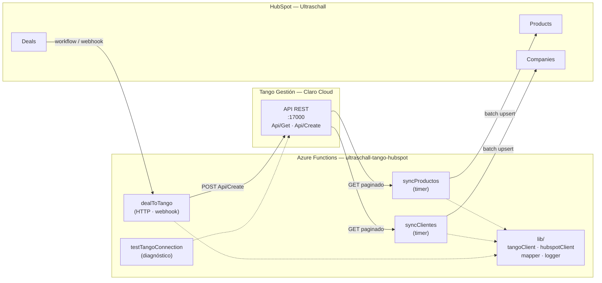

# Arquitectura — Integración Tango ERP ↔ HubSpot (Ultraschall)

> **Estado del documento:** borrador vivo. Es la fuente de verdad de la integración.
> Todo lo marcado con 🟡 **PENDIENTE** está esperando definición o dato de Ultraschall / Matías.
> Todo lo marcado con ⚠️ es una inferencia mía que hay que confirmar contra Tango.
>
> Última actualización: 2026-08-14 — incorpora el relevamiento contra el ERP (§5.4 resuelto, §5.6 nueva).

---

## 1. Objetivo y alcance

Sincronizar la información maestra y transaccional entre **Tango Gestión** (ERP de Ultraschall, hosteado en Claro Cloud) y **HubSpot** (CRM), de modo que:

- Comercial trabaje en HubSpot con la cartera de clientes y el catálogo reales del ERP.
- Lo que se cierra en HubSpot impacte en Tango sin recarga manual.

### Alcance por fase

| Fase | Flujo | Origen → Destino | Estado |
|---|---|---|---|
| 0 | Conectividad y proxy a Tango | — | ✅ Hecho |
| 1 | Artículos → catálogo | Tango `STA11` → HubSpot **Products** | 🔨 Sync construido el 2026-08-25, **sin precio**: `process=87` no lo trae y el process de precios sigue sin conseguirse (826 art.) |
| 2 | Clientes → cuentas | Tango `GVA14` → HubSpot **Companies** | 🔨 A construir (5.670 reg.) |
| 3 | Contactos | Tango `GVA27` → HubSpot **Contacts** | ⛔ **FUERA DE ALCANCE** (decidido 2026-08-24, §7.3). El relevamiento y `config/mapeo.contactos.json` se conservan. |
| 4 | Pedidos | HubSpot **Deal** ganado → Tango `Api/Create` (`process=19845`) | 🔨 Circuito construido el 2026-08-25 (§9). ⛔ Los renglones esperan el catálogo de productos (Fase 1) |

🟡 **PENDIENTE:** confirmar si el alcance real es éste o si hay que sumar comprobantes/saldos de cuenta corriente.

---

## 2. Estado actual (qué existe hoy)

Repo `HubSpot-Tango/` — Azure Functions Node.js, modelo de programación v4.

```
HubSpot-Tango/
├─ src/
│  ├─ index.js                      → app.setup({ enableHttpStream: true })
│  └─ functions/
│     └─ testTangoConnection.js     → proxy genérico HTTP → Tango
├─ host.json
├─ local.settings.json              → secretos locales (NO commitear)
└─ .github/workflows/               → deploy a Azure en push a main
```

**`testTangoConnection`** era un proxy pass-through; desde el 2026-08-25 filtra por `lib/politicaProxy` (§10.0):
- `GET` → por defecto pega a `Api/Get`; `POST` → por defecto a `Api/Create`.
- Se puede forzar la ruta con el query param `?tangoPath=...` (se elimina antes de reenviar).
- Los query params se reenvían **por allowlist**, reconstruidos: lo que no está permitido se rechaza. Los headers de Tango los pone el proxy.
- Devuelve la respuesta de Tango envuelta en `{ status, proxyTarget, method, latencyMs, totalFunctionTimeMs, result }`.

Sirvió para validar conectividad y relevar datos. **No es la función de producción**: en la arquitectura final queda como herramienta de diagnóstico (ver §4).

### Deuda técnica detectada

| # | Problema | Archivo | Acción | Estado |
|---|---|---|---|---|
| D1 | `local.settings.json` define `TANGO_API_TOKEN`, pero el código lee `TANGO_API_KEY`. Además falta `TANGO_COMPANY`. | `local.settings.json` | Unificar a `TANGO_API_KEY` y agregar `TANGO_COMPANY`. | ✅ 2026-08-14. Se sumaron `HUBSPOT_TOKEN` y `SYNC_DRY_RUN` como placeholders. ⚠️ **Falta replicar el rename en las Application Settings de Azure.** |
| D2 | `authLevel: 'anonymous'` en un proxy que expone el ERP entero a internet, incluido el `POST → Api/Create`. | `testTangoConnection.js` | El `authLevel` no se toca (decisión de Matías). Contener por política de acceso. Ver §10.0. | ✅ 2026-08-25 con `lib/politicaProxy`: allowlist de ruta, método, params y `process`; escritura y `filtroSql` apagados por defecto. Queda abierto el transporte `http://` (§10.1), que no depende de nosotros. |
| D3 | `pdfkit` está en `dependencies` sin uso aparente. | `package.json` | Confirmar si se usa; si no, sacar. | ✅ 2026-08-14. Sin usos; removido y lock regenerado. Queda `@azure/functions` como única dependencia. |
| D4 | README vacío ("First commit"). | `README.md` | Completar con setup local + deploy. | ✅ 2026-08-14. |
| D5 | `.gitignore` ignoraba `.funcignore`, así que nunca llegaba al repo. | `.gitignore` | Sacarlo de la sección de empaquetados. | ✅ 2026-08-14. |
| D6 | `config/` y `docs/` estaban **untracked**: mapeos, payloads y esta arquitectura sólo existían en la máquina de Matías. | — | Commitear al repo. | ✅ 2026-08-14. |

---

## 3. Diagrama de arquitectura



---

## 4. Componentes a construir

| Componente | Tipo | Responsabilidad | Estado |
|---|---|---|---|
| `lib/tangoClient.js` | módulo | Los 4 endpoints (§5.8), reintentos con backoff, timeout. Único lugar que conoce la URL del ERP. | ✅ 2026-08-14 |
| `lib/lookups.js` | módulo | **Resolución `código → ID interno`** contra las 6 tablas auxiliares. Es lo que evita la corrupción silenciosa de §5.4. | ✅ 2026-08-14 |
| `lib/mapper.js` | módulo | Aplica `config/mapeo.*.json`: renombra, castea, corre transforms, resuelve lookups y calcula el hash del sync diferencial. | ✅ 2026-08-14 |
| `lib/logger.js` | módulo | Formato de log unificado (el estilo con `[REQ-xxx]` que ya usás). | ✅ 2026-08-14 |
| `lib/hubspotClient.js` | módulo | Auth con private app token, batch upsert, respeto de rate limits. | 🔨 Bloqueado: falta el token |
| `lib/numeracion.js` | módulo | Elige el `COD_GVA14` del cliente nuevo. Dos estrategias, sin red. | ✅ 2026-08-24 |
| `lib/altaCliente.js` | módulo | **Escritura de vuelta**: ata la company al cliente que Tango acaba de crear. | ✅ 2026-08-24 |
| `lib/verificarEmpresa.js` | módulo | Verificación previa del alta: qué falta, quién lo resuelve, y el payload ya resuelto. | ✅ 2026-08-25 |
| `lib/firmaHubSpot.js` | módulo | Firma v3: la única autenticación del webhook de negocios ganados. | ✅ 2026-08-21 |
| `lib/politicaProxy.js` | módulo | Contención del proxy anónimo de diagnóstico. | ✅ 2026-08-25 |
| `lib/etapas.js` | módulo | Qué etapa cuenta como negocio ganado. Los dos embudos, sin red. | ✅ 2026-08-25 |
| `lib/verificarPedido.js` | módulo | Verificación del pedido y armado del payload, cabecera y renglones. | ✅ 2026-08-25 |
| `lib/dealToTango.js` | módulo | El circuito de la Fase 4, testeable con dobles. | ✅ 2026-08-25 |

**Tests:** `npm test` (runner nativo de Node, sin dependencias). 232 tests sobre **datos reales del ERP** guardados en `test/fixtures/`. Corren sin red — importante, porque Tango no es accesible desde local (§5.6).

Verificación sobre el padrón completo: los 5.670 clientes se mapean en 176 ms, con 5.670 hashes distintos y 0 problemas de resolución.
| `functions/syncProductos.js` | Timer | Fase 1. Tango `process=87` → HubSpot Products, dos veces por día. ✅ 2026-08-25, apagado por defecto. |
| `functions/syncClientes.js` | Timer | Fase 2. Tango `process=2117` → HubSpot Companies. |
| `functions/dealToTango.js` | HTTP | Fase 4. Recibe el Deal desde HubSpot y crea el pedido en Tango. ✅ 2026-08-25, apagada por defecto (`DEAL_TO_TANGO_ENABLED`). |
| `functions/testTangoConnection.js` | HTTP | Ya existe. Queda como diagnóstico, anónimo pero contenido por `lib/politicaProxy` (§10.0). |

**Criterio:** ninguna función habla directo con `fetch`. Todo pasa por `lib/`, así el mapeo y los reintentos se testean y se cambian en un solo lugar.

---

## 5. Sistemas y endpoints

### 5.1 Tango ERP

| Ítem | Valor |
|---|---|
| Base URL | `http://138.99.6.77:17000` ⚠️ HTTP plano + IP fija, ver §10 |
| Endpoint lectura | `GET /Api/Get?process={id}&pages={n}&pageSize={n}` |
| Endpoint escritura | `POST /Api/Create` |
| Header auth | `ApiAuthorization: {TANGO_API_KEY}` |
| Header empresa | `company: {TANGO_COMPANY}` (hoy default `1`) |
| Formato respuesta | `{ resultData: { list[], pageIndex, pageSize, totalCount, totalPages, hasPreviousPage, hasNextPage } }` |

**Procesos relevados:**

| `process` | Tabla | Contenido | Uso | Registros (medido 2026-08-14) |
|---|---|---|---|---|
| `2117` | `GVA14` | Clientes | Lectura **y alta** | **5.670** (116 campos) |
| `87` | `STA11` | Artículos | Lectura **y alta** | **826** (141 campos) |
| `2151` | `GVA01` | Condiciones de venta | Lectura (lookup) | **86** (18 campos) — ✅ descubierto 2026-08-14 |
| `19845` | `GVA21` ⚠️ | Pedidos | **Alta** | — |

**Comportamiento del endpoint (verificado contra el ERP):**

| Hallazgo | Detalle |
|---|---|
| `Api/Get` ignora los query params que no conoce | Se probaron `id`, `filter`, `where`, `search`: los descarta y devuelve todo. **Pero eso no significa que no haya filtrado** — hay endpoints dedicados, ver §5.8. |
| `process` inválido | Devuelve `{"exceptionInfo":{"messages":["Action not found"]}}` en ~180 ms. Permite descubrir processes por sondeo. |
| Espacio de `process` | **Disperso** (87, 2117, 2151, 19845). Barrerlo entero contra producción no es viable: varios processes tardan >60 s y algunos tiran `An exception was thrown while activating ViewsFacade`. |
| `pageSize` | No tiene tope práctico: `pageSize=6000` trajo los 5.670 clientes en una sola llamada. |

**Volumen y tiempos medidos** (a través del proxy de Azure, que es la única vía — §5.6):

| Lectura | Tiempo | Payload |
|---|---|---|
| Clientes completos (5.670) | **107 s** | 15,7 MB |
| Artículos completos (826) | **12 s** | 2,9 MB |
| Tabla auxiliar `GVA01` (86) | 1,4 s | — |
| Latencia de una consulta chica | ~180-580 ms | — |

⚠️ Los 107 s de la lectura de clientes son **casi la mitad del timeout HTTP por defecto de Azure (230 s)**. Refuerza la decisión de §8.3: el sync de clientes va por **timer trigger**, no por HTTP.

El `process` va como query param y el payload en el body — el puente de Azure lo reenvía tal cual:

```
POST https://{function-app}/api/testTangoConnection?process=2117
  → POST http://138.99.6.77:17000/Api/Create?process=2117
```

🟡 **PENDIENTE — completar procesos faltantes:**

| Necesidad | `process` | Estado |
|---|---|---|
| Listas de precios | `____` | ⛔ **Bloqueante Fase 1.** Confirmado 2026-08-14: `process=87` **no tiene ningún campo de precio** (se revisaron los 141). |
| Stock por depósito | `____` | Confirmado: los campos `STOCK*` de `STA11` son todos parametría (`STOCK_MAXI`, `STOCK_MINI`, unidades de medida). Ninguno es la existencia real. |
| `GVA01` Condiciones de venta | ✅ **`2151`** | Descubierto por sondeo. |
| `GVA23` Vendedores | ✅ **`952`** | 27 registros. |
| `GVA24` Transportes | ✅ **`960`** | 41 registros. |
| `GVA18` Provincias | ✅ **`852`** | 40 registros. |
| `GVA05` Zonas | ✅ **`842`** | 9 registros. |
| `GVA41` Alícuotas de IVA | ✅ **`3010`** | 9 registros. |
| `GVA10` Listas de precios | `____` | ⛔ Bloqueante Fase 4. |
| `STA22` Depósitos | `____` | ⛔ Bloqueante Fase 4. No aparece en el menú del ERP. |
| `GVA43` Talonarios | `____` | ⛔ Bloqueante Fase 4. No aparece en el menú del ERP. |
| `CATEGORIA_IVA` | `____` | ⛔ Bloqueante: es alfabética (§5.4). |

> El catálogo completo y actualizado vive en **`config/tango.processes.json`**. Los que faltan se consiguen con el método de §5.7.

✅ **RESUELTO — filtros del ERP:** `Api/Get` **no acepta ningún filtro** (ver tabla de comportamiento arriba). El sync **tiene que ser full read**. Esto cierra la duda de §8.2 a favor de la propuesta de hash.

### 5.3 ⚠️ Regla crítica: lectura por código, escritura por ID interno

Los payloads de alta relevados (`docs/payloads/`) **no usan códigos, usan los IDs internos numéricos de Tango**:

| Lectura devuelve | Escritura exige |
|---|---|
| `COD_GVA14` = `"000003"` | `ID_GVA14` = `2590` |
| `COD_STA11` = `"APY"` | `ID_STA11` = `394` |
| `GVA10_NRO_DE_LIS` | `ID_GVA10` |

**Consecuencia de arquitectura:** el sync de clientes y de productos **debe persistir el ID interno** en HubSpot (`tango_id_gva14`, `tango_id_sta11`), aunque no le sirva a comercial. Sin eso, la Fase 4 no puede armar el pedido y habría que resolver un lookup contra Tango en cada creación.

Estos IDs ya vienen en las respuestas de lectura (`ID_GVA14` e `ID_STA11` están al 100% en ambos dumps), así que no requiere llamadas extra.

### 5.4 ⛔ RESUELTO (2026-08-14): el código **NO** es el ID interno

Para las entidades principales el ID viene explícito (`ID_GVA14`, `ID_STA11`). **Para las tablas auxiliares no.**

Los payloads de alta piden `ID_GVA01`, `ID_GVA05`, `ID_GVA10`, `ID_GVA18`, `ID_GVA23`, `ID_GVA24`, `ID_CATEGORIA_IVA`, `ID_TIPO_DOCUMENTO_GV`, `ID_STA22`, `ID_MEDIDA_*`, `ID_GVA41_*`.
Pero la lectura de clientes devuelve **códigos**: `GVA01_COND_VTA`, `GVA05_CODIGO`, `GVA10_NRO_DE_LIS`, `GVA23_CODIGO`, `GVA24_CODIGO`, `COD_CATEGORIA_IVA`…

**Verificado contra el ERP: divergen.** Se leyó la tabla `GVA01` completa (`process=2151`, 86 registros), que expone las dos columnas juntas — `ID_GVA01` (interno) y `COND_VTA` (código):

| Medición | Resultado |
|---|---|
| Registros de `GVA01` donde `ID_GVA01 != COND_VTA` | **72 de 86** |
| Rango de `ID_GVA01` | 1-14, después salta a 1014-1102 |
| Rango de `COND_VTA` | 1-99 |
| Clientes (de 5.670) cuyo código coincide con el ID | 4.271 |
| Clientes que **romperían** si mandamos el código como ID | **1.399 (25% de la cartera)** |

Ejemplo: el cliente `000003` tiene `COND_VTA=15` ("CHEQUE 0, 30 DIAS FF"), pero su `ID_GVA01` real es **1014**.

> ⚠️ **Cuidado con la prueba de una sola muestra.** El cliente `ID_GVA14=2590` (el del payload de ejemplo) tiene `COND_VTA=5`, y da MATCH contra el `ID_GVA01=5` del pedido. Es **casualidad**: los IDs 1-14 coinciden con sus códigos porque fueron los primeros creados. Verificar con un solo registro da un falso positivo y lleva a la conclusión opuesta a la correcta.

**Modo de falla en `GVA01`:** de los 1.399, 0 producen corrupción silenciosa — como los códigos 15-99 casi no existen en el espacio de IDs (1-14, 1014-1102), Tango rechaza con error. Es *suerte estructural de esa tabla*.

#### ⛔ Las otras 5 auxiliares: acá sí hay corrupción silenciosa

Con los `process` conseguidos el 2026-08-14 se leyeron las tablas restantes. **Las seis divergen**, y en la mayoría los rangos de código e ID **se solapan**, que es justo el caso peligroso:

| Tabla | Qué es | Divergen | Clientes OK por casualidad | Error ruidoso | 🔴 **Corrupción silenciosa** |
|---|---|---|---|---|---|
| `GVA18` | Provincias | 26/40 | 788 | 860 | **4.022 (71%)** |
| `GVA23` | Vendedores | 17/27 | 4.120 | 366 | **484 (10%)** |
| `GVA24` | Transportes | 35/41 | 3.291 | 1.318 | **278 (6%)** |
| `GVA41` | Alícuotas IVA | 9/9 | — | — | — |
| `GVA01` | Cond. de venta | 72/86 | 4.271 | 1.399 | 0 |
| `GVA05` | Zonas | 1/9 | 4.974 | 696 | 0 |

Ejemplos reales de lo que se grabaría, **sin ningún error**:

| Tabla | Código | Valor real del cliente | Se grabaría como |
|---|---|---|---|
| `GVA18` | 1 | Buenos Aires | **Capital Federal** |
| `GVA23` | 24 | Juan Butorac | **Natali Vazquez** |
| `GVA24` | 10 | A CONVENIR | **RETIRA BICENTENARIO (REM)** |

**7 de cada 10 pedidos se grabarían con la provincia equivocada** y nadie se enteraría hasta que un despacho llegue mal. Esto liquida cualquier atajo: **la resolución `código → ID` por tabla auxiliar es obligatoria, sin excepción.**

**Consecuencia de arquitectura (firme):** hace falta **leer y cachear cada tabla auxiliar** para resolver `código → ID interno`. No hay atajo. Esto convierte el pedido de los `process` de las auxiliares (§5.1) en **bloqueante de la Fase 4 y del alta de clientes**.

**Patrón de resolución:** cada tabla auxiliar expone ambas columnas (interno + código), así que un solo `GET` por tabla alcanza para armar el diccionario en memoria. Son tablas chicas (`GVA01` = 86 registros) y estables: se cachean al inicio de cada corrida.

#### Qué es cada tabla auxiliar (identificado 2026-08-14)

Las tablas se identificaron leyendo los **valores reales** del padrón de clientes, no por el nombre. Dos estaban mal supuestas en versiones previas de este documento:

| Tabla | Qué es | Valores | Cargado | Nota |
|---|---|---|---|---|
| `GVA01` | **Condiciones de venta** | 86 | 100% | ✅ `process=2151`. Ver §5.4. |
| `GVA10` | **Listas de precios** | 5 | 87% | `SIN IVA EN $`, `CON IVA EN $` (3.830 clientes), `MEDICO SIN IVA $`, `SIN IVA EN U$S`, `CON IVA EN U$S` |
| `GVA23` | **Vendedores** | 24 | 88% | ⛔ El doc lo daba como incógnita. Ver §7.4. |
| `GVA24` | **Transporte / forma de envío** | 33 | 86% | ⛔ Era incógnita. `BUSPACK`, `RETIRA CLIENTE`, `CORREO OCA`, `MOTO (REM)`, `CADETE (REM)`… |
| `GVA05` | **Zonas geográficas** | 9 | 100% | ⛔ Estaba mal identificada como "vendedores". Ver §7.4. |
| `GVA18` | **Provincias** | 38 | 100% | Misiones, Buenos Aires, CABA, San Juan… |
| `GVA133` | **Países** | 6 | — | ARGENTINA, URUGUAY, PERU, PARAGUAY, ECUADOR, BOLIVIA |
| `GVA62` | Agrupaciones de clientes ⚠️ | 11 | — | Parecen grupos empresarios / cuentas vinculadas. Confirmar. |
| `GVA41` | Alícuotas de IVA | — | 0% en padrón | Sólo aparece `GVA41_NO_CAT_*`, vacío. |
| `GVA44` | Talonarios de exportación | — | — | |

**Lo que esto habilita:** las descripciones ya las tenemos, así que los mapeos a HubSpot se pueden escribir ahora. **Lo que sigue faltando es el `process` de cada tabla**, que es lo único que da el `ID` interno (§5.4). Sin eso se puede sincronizar *hacia* HubSpot mostrando descripciones, pero no se puede escribir *hacia* Tango.

#### Caso aparte: `CATEGORIA_IVA` es alfabética

`COD_CATEGORIA_IVA` no es numérico: sus 5 valores son `RI`, `RS`, `EX`, `CF`, `EXE` (100% cargado). Acá ni siquiera existe la ilusión de que código == ID: se necesita sí o sí la tabla de equivalencia para resolver `ID_CATEGORIA_IVA`.

### 5.5 Campos de parametría en el alta

Los tres payloads de alta muestran un patrón: además de los datos del negocio, Tango exige un bloque de parametría que HubSpot no conoce ni debería conocer (`SOBRE_IVA`, `TYP_FEX`, `COBRA_LUNES`…`COBRA_DOMINGO`, `IDIOMA_CTE`, `PRODUCTO_TERMINADO_COT`, etc.).

**Decisión:** esos valores viven en **`config/defaults.tango.json`**, y el payload se arma como:

```js
payload = { ...defaults[entidad], ...camposMapeadosDesdeHubSpot }
```

Así el mapeo (`config/mapeo.*.json`) queda limpio: sólo lo que realmente viaja entre los dos sistemas.

⚠️ Los valores actuales de `defaults.tango.json` salieron de los ejemplos de Postman. **Antes de producción los tiene que validar administración**, sobre todo talonario, depósito, alícuotas de IVA y clasificaciones SIAP.

El mismo archivo declara, en `clientes.alta`, **qué campos exige Tango y de dónde sale cada uno**. Eso es lo que lee la verificación previa de §7.12, y también lo que hay que corregir cuando se sondee el ERP: la lista de obligatorios de hoy es una suposición tomada del payload de ejemplo.

### 5.9 🟢 El entorno de Tango es una COPIA, no producción

Confirmado por Matías el 2026-08-19: **la instancia contra la que trabajamos es una copia del ERP, no el sistema productivo.**

Buena parte de las precauciones de este documento se tomaron asumiendo producción. Con la copia:

- Escribir registros de prueba es barato: se crean, se miden y se borran.
- Los 8 clientes `999902`-`999909` del relevamiento de tipos de documento se borran sin ceremonia (§5.4).
- El sondeo de `process` y las consultas pesadas dejan de ser un riesgo operativo.
- **D2 (proxy anónimo) baja de severidad mientras apunte acá.** Sigue siendo bloqueante antes de apuntar a producción: ver §10.0, que no cambia como diseño, sólo como urgencia.

⚠️ Lo que **no** cambia: los datos son reales (5.670 clientes con razón social, CUIT y contactos). Sigue aplicando el cuidado con datos personales — ver §10 y la nota sobre `test/fixtures/`.

### 5.6 ⚠️ Tango sólo es accesible desde Azure

El ERP está **restringido por IP: sólo acepta tráfico desde la Function App**. No se puede pegarle a Tango desde una máquina de desarrollo, ni desde Postman apuntando directo a `138.99.6.77:17000`.

Toda consulta al ERP pasa por la app desplegada:

```
https://ultraschall-tango-hubspot-cjcpbug0g4fxgehg.canadacentral-01.azurewebsites.net/api/testTangoConnection?process=2117
```

**Consecuencias:**

1. **No hay ciclo de desarrollo local contra Tango.** Probar implica commit → push a `main` → GitHub Actions → deploy. Conviene agrupar cambios en vez de un deploy por prueba.
2. **La lógica pura tiene que ser testeable sin red.** Mapeo, armado de payloads y hashing van en `lib/` como funciones puras, con la capa de I/O aislada. Es la única forma de iterar rápido.
3. **Esto es lo que hoy justifica dejar D2 abierta**: `testTangoConnection` en `anonymous` es la única vía de relevamiento. Cerrarlo antes de terminar el relevamiento obliga a manejar la function key en cada consulta.
4. Como beneficio lateral, el ERP no está expuesto a internet en general — la superficie de ataque es la Function App, no Tango. Eso **no** compensa D2: el proxy anónimo reabre el agujero, con el agravante de que ya viene autenticado contra el ERP.

Si hace falta verificar algo en la interfaz de Tango (parametría, talonarios, depósitos), Matías tiene **acceso remoto** al ERP.

### 5.8 Endpoints reales de la API (2026-08-14)

> ⚠️ **Corrección.** Una versión previa de este documento afirmaba que "`Api/Get` no acepta ningún filtro, el sync tiene que ser full read". **Era incorrecto**: se probaron filtros como *query params* de `Api/Get`, pero el filtrado vive en **endpoints dedicados**. La conclusión de fondo (full read para el sync) sigue en pie, pero por otro motivo — ver §8.2.

| Endpoint | Forma que funciona | Devuelve |
|---|---|---|
| Consulta | `GET Api/Get?process={p}&pages={n}&pageSize={n}` | `{ resultData: { list, totalCount, … } }` |
| **Por ID** | `GET Api/GetById?process={p}&id={id}` | `{ value: {…} }` ⚠️ forma distinta |
| **Por filtro** | `GET Api/GetByFilter?process={p}&filtroSql=WHERE {condición}` | `{ list: [...] }` ⚠️ forma distinta |
| Alta | `POST Api/Create?process={p}` | |
| Baja / Modificación | `Api/Delete`, `Api/Update` | **No probados**: son destructivos y esto es producción. |

**Dos detalles que cuestan tiempo si no se saben:**

1. **Las rutas *path-style* no existen en esta instalación.** El listado oficial de Tango documenta `Api/Get/{process}/{pageSize}/{pageIndex}/{view}`, pero todas esas rutas caen al fallback HTML de la SPA. **Todo va por query params.**
2. **`filtroSql` tiene que incluir la palabra `WHERE`.** Sin ella SQL Server devuelve `Incorrect syntax near '='`. Vacío devuelve todo.

```
# Un cliente puntual: 484 ms  (vs. 107 s de la lectura completa)
Api/GetByFilter?process=2117&filtroSql=WHERE COD_GVA14='000003'
```

**Impacto en el diseño (§9):** para la Fase 4 no hace falta cachear las 5.670 companies para resolver un pedido. Se puede resolver el cliente puntual en <1 s. Las tablas auxiliares **sí** conviene cachearlas (son chicas y se usan en cada renglón).

> 🔴 **`filtroSql` es SQL crudo concatenado.** Se verificó (sólo lectura) que acepta subconsultas arbitrarias contra **cualquier tabla** del ERP, no sólo la del `process`. Ver §10: esto cambia la severidad de D2.

### 5.7 Cómo descubrir los `process` faltantes

**No existe documentación de esta API.** Confirmado con soporte de Tango (2026-08-14): no hay nada publicado. Los `process` hay que descubrirlos.

Se descartaron dos caminos automáticos:

| Intento | Resultado |
|---|---|
| Sondear el espacio de `process` | Funciona (un ID inválido devuelve `"Action not found"`), pero el espacio es disperso y grande. Varios processes tardan >60 s contra **producción**. Así se encontró `2151`, pero no escala. |
| Leer el bundle JS de la SPA | `http://138.99.6.77:17000` sirve el cliente web de Tango (AxCloud/Angular). Se bajó `main-NR5TOSF7.js` (34 MB): **no contiene el mapeo**. Los `processId` se resuelven en runtime y el menú lo sirve el backend según permisos del usuario. Tampoco hay endpoint de catálogo (`Api/Menu`, `Api/Modules`, etc. caen al fallback de la SPA). |

**✅ Camino que sí funciona: mirar el tráfico de red del propio ERP.**

La SPA de Tango consume **exactamente el mismo endpoint** que nosotros (`Api/Get?process=NNNN`). Entonces:

1. Abrir el cliente web de Tango en Chrome (por el acceso remoto).
2. `F12` → pestaña **Network** → filtro `Api/Get`.
3. Navegar a la pantalla que interesa.
4. Leer el `process=NNNN` de la request que se dispara.

Pantallas a visitar y qué se busca:

| Pantalla en Tango | Tabla | Para qué |
|---|---|---|
| **Precios de artículos / actualización de precios** | — | ⛔ Desbloquea la Fase 1 entera |
| Listas de precios | `GVA10` | ⛔ Fase 4 |
| Vendedores | `GVA23` | ⛔ Fase 4 + owners |
| Transportes / formas de envío | `GVA24` | ⛔ Fase 4 |
| Depósitos | `STA22` | ⛔ Fase 4 |
| Zonas | `GVA05` | Segmentación |
| Provincias | `GVA18` | Alta de clientes |
| Categorías / alícuotas de IVA | `GVA41`, `CATEGORIA_IVA` | Alta de clientes |
| Talonarios | `GVA43` | Fase 4 |
| Stock / existencias por depósito | — | Optimización |

Alcanza con anotar el número: con el `process` en mano, la tabla se lee sola y se arma el diccionario `código → ID` (§5.4).

### 5.2 HubSpot

| Ítem | Valor |
|---|---|
| Portal / Hub ID | `51311915` (cuenta STANDARD) |
| Tipo de auth | Private app del proyecto `IdPartners/` (`auth.type: static`), token `pat-...` |
| Dónde se declaran los scopes | `IdPartners/src/app/app-hsmeta.json` → `config.auth.requiredScopes` |
| API base | `https://api.hubapi.com` |
| Endpoints batch | `POST /crm/v3/objects/{objectType}/batch/upsert` (100 registros por request) |

Pendiente cerrado: la integración corre como **private app dentro del proyecto `IdPartners/`**, no como Private App suelta del portal. Los scopes se versionan con el código y cambiarlos exige `hs project upload` + aprobar los permisos en el portal.

#### ⛔ Scopes — el bloqueante del proyecto (verificado 2026-08-20)

El token del portal devuelve hoy: `crm.objects.companies.read`, `crm.objects.contacts.read/write`, `crm.objects.deals.read/write`, `crm.objects.line_items.read/write`, `crm.objects.quotes.read`, `e-commerce`, `oauth`.

**Faltan cuatro**, ya declarados en `app-hsmeta.json` pero sin aprobar en el portal:

| Scope | Sin él |
|---|---|
| `crm.objects.companies.write` | ⛔ Fase 2 entera |
| `crm.schemas.companies.write` | ⛔ no se pueden crear ni corregir propiedades |
| `crm.schemas.contacts.write` | ⛔ Fase 3: no se puede crear `tango_id_gva27` |
| `crm.objects.owners.read` | vendedor → owner |

Los de contactos se agregaron el 2026-08-20 **antes** de subir la app, para no repetir el ciclo `upload → aprobar → token nuevo`, que exige intervención manual en el navegador.

👉 Paso a paso: **`docs/RUNBOOK-SCOPES.md`**.

---

## 6. Convenciones

### 6.0 La planilla de Ultraschall es la fuente de verdad de los nombres

Ultraschall mantiene la planilla **"Tablero de informacion HubSpot - Empresas TANGO"** (copia en `config/`). Define los **nombres internos** de las propiedades de HubSpot y a qué campo de Tango corresponde cada una.

**Reparto de responsabilidades:**

| Documento | Manda en |
|---|---|
| La planilla | Nombres internos, etiquetas, qué campo va a dónde, qué propiedades son sólo de HubSpot |
| `config/mapeo.*.json` | Lo que la planilla no puede expresar: tipos, transforms y la **resolución `código → ID interno`** |

Ante un conflicto de nombres, gana la planilla.

**Decisiones tomadas el 2026-08-18:**

1. **`name` = nombre de fantasía (`NOM_COM`)**, y la razón social va a `razon_social`. Antes el mapeo técnico ponía `RAZON_SOCI` en `name`; para comercial es más útil ver la fantasía.
2. **El documento se guarda como TEXTO con guiones**, un solo formato. La planilla lo tenía como tipo *número*, pero Tango exige los guiones en el alta y un campo numérico no los soporta.
3. **Dirección de sincronización:** se mantiene la convención del proyecto — el maestro de clientes y artículos va **Tango → HubSpot** (Fases 1 y 2), y la dirección inversa es la Fase 4. Por campo se expresa con `autoritativoTango`.

**Dos correcciones aplicadas a lo que traía la planilla:**

- **Fila 16 estaba corrida:** mapeaba `TELEFONO_1` a `domicilio_fiscal`. El teléfono habría terminado en un campo de dirección. Corregido a `phone`. 🟡 **Corregir también en el Google Sheet**, que es el original.
- **Filas 30-35:** los valores de ejemplo de los campos `ID_GVA*` son **códigos, no IDs internos** (`24 (Juan Butorac)` es el código; el ID es 26). Ver §5.4. El código ya lo resuelve `lib/lookups.js`, pero **quien implemente a mano siguiendo esa tabla corrompe datos en silencio**.

**Lo que la planilla aportó y estaba pendiente:**

- **Equivalencia de categoría de IVA**: `1` Resp. Inscripto, `4` Exento, `5` Cons. Final, `6` Monotributo. 🟡 Los datos reales tienen 5 códigos (`RI`, `RS`, `EX`, `CF`, `EXE`): falta confirmar a qué ID corresponden **`RS` y `EXE`**.
- **Validación de `defaults.tango.json`**: las 16 filas de parametría de alta de la planilla **coinciden todas** con el archivo. Pendiente cerrado.
- `ID_TIPO_DOCUMENTO_GV = 1` para C.U.I.T. ⚠️ En la lectura ese tipo viene con código `80` — otra confirmación de que código ≠ ID. Y **el 54% de los clientes tiene código `0` ("C.I. POLICIA FEDERAL"), que en los hechos significa "sin definir"**: 132 de ellos tienen un CUIT bien formado. Para el alta hay que inferir el tipo del formato del documento.


- **Prefijo de propiedades custom:** `tango_` (ej. `tango_cod_cliente`). Evita colisiones y hace obvio el origen del dato.
- **Grupo de propiedades en HubSpot:** `tango_erp` ("Datos Tango ERP"), para que el equipo comercial las vea agrupadas.
- **Nunca pisar campos editados a mano en HubSpot** salvo los que el mapeo marque como `autoritativoTango: true`.
- **Idioma:** propiedades y labels en español; código y nombres de archivo en inglés.

---

## 7. Modelo de datos y correspondencias

### 7.1 Artículos → Products (Fase 1)

- **Clave de idempotencia:** `COD_STA11` → `hs_sku`.
- Mapeo detallado: **`config/mapeo.productos.json`**.
- ⛔ **Bloqueante:** HubSpot Products necesita `price`, y `process=87` no lo trae. Sin el proceso de listas de precios, los productos entran con precio 0 o sin precio.

### 7.2 Clientes → Companies (Fase 2)

- **Clave de idempotencia:** `COD_GVA14` → propiedad `codigo_tango`, marcada como *unique*. (El nombre lo define la planilla de Ultraschall, §6.0; versiones viejas de este doc decían `tango_cod_cliente`.)
- Mapeo detallado: **`config/mapeo.clientes.json`**.

#### ⚠️ Los desplegables rechazan los códigos de Tango (detectado 2026-08-20)

`condicion_iva` y `tipo_de_documento` estaban creadas a mano en el portal como desplegables **con etiquetas en castellano**, pero el mapeo les mandaba el código crudo de Tango:

| Propiedad | Opciones en el portal | Lo que salía del mapper |
|---|---|---|
| `condicion_iva` | Responsable Inscripto · Monotributista · Consumidor Final | `RI`, `RS`, `EX`, `CF`, `EXE` |
| `tipo_de_documento` | DNI · CUIT | `0`, `80`, `86`, `91`, `96`, `99` |

HubSpot **rechaza** un valor que no esté entre las opciones de una `enumeration`, y en `/batch/upsert` el rechazo voltea la **tanda de 100 entera**, no el registro. Tal como estaba, la primera corrida con permiso de escritura habría fallado al 100% — y el síntoma (un 400 por tanda) no señala al campo culpable.

No se veía antes porque el bloqueo de scopes impidió que se ejecutara una sola escritura.

**Cómo quedó resuelto:**

1. `mapper` soporta `opciones` en el mapeo: código de Tango → valor de la opción de HubSpot. Un código sin opción definida **se omite y se reporta**, en vez de escribir algo que voltea la tanda.
2. `mapper` soporta `transformRegistro`, transforms que reciben el registro completo. `tipo_de_documento` lo usa para resolverse con `lib/documento` en vez de copiar el código: el `0` que tiene el 54% de la muestra no es "C.I. Policía Federal", es un campo sin cargar.
3. `lib/propiedades.js` compara el mapeo contra el portal y clasifica en *crear / parchear / rehacer*. Es lógica pura, testeada sin red.
4. `scripts/crearPropiedades.js` agrega las opciones que faltan (`Exento`, `CUIL`, `C.I. Extranjera`).

**Las etiquetas no son inventadas.** Tango se autodescribe: `DESC_CATEGORIA_IVA` viene junto al código en la misma respuesta, y la correspondencia es 1 a 1 en la muestra de 300 (`RI`=Responsable inscripto, `RS`=Responsable monotributista, `EX`=Exento, `CF`=Consumidor final). Hay un test que lo verifica.

🟡 **`EXE` queda a propósito sin mapear**: no aparece en la muestra, así que no conocemos su descripción. Esos clientes se sincronizan sin `condicion_iva` y el sync lo reporta — pero **el dato no se pierde**: `DESC_CATEGORIA_IVA` va igual a `tango_categoria_iva` como texto libre.

Para resolverlo **no hace falta preguntarle a Ultraschall qué significa**: alcanza con leer `DESC_CATEGORIA_IVA` de un cliente con `COD_CATEGORIA_IVA = 'EXE'` contra el ERP. A Ultraschall sólo hay que pedirle el `ID_CATEGORIA_IVA`, que hace falta para el **alta** (Fase 4), no para la lectura.

#### Propiedades mal creadas en el portal

Dos propiedades preexistentes no se pueden corregir con un PATCH — `type` y `hasUniqueValue` son inmutables en HubSpot:

| Propiedad | Estado | Por qué hay que borrarla y recrearla |
|---|---|---|
| `codigo_tango` | `string/text`, **sin** `hasUniqueValue` | Es el `idProperty` del batch upsert. Vacía en las 65 companies: no se pierde nada. |
| `cuit` | `number/number` | El formato acordado es texto con guiones. 3 valores cargados. |

Lo hace `scripts/repararPropiedades.js`, que **guarda los valores en un archivo antes de borrar** y después los reescribe pasándolos por el transform del mapeo. El backup está gitignoreado: trae CUITs reales.

#### 🔑 Una sola llave de identidad (decidido 2026-08-24)

**HubSpot tiene dos mecanismos de matcheo para companies, no uno:** el `idProperty` que elegimos nosotros para el batch upsert (`codigo_tango`) y **`domain`, que HubSpot aplica solo, sin que se lo pidamos** — dos companies que comparten dominio **se fusionan**.

Mientras el sync escribía `domain` había que defenderse de eso filtrando por unicidad sobre el padrón entero (`calcularDominiosUnicos`). Funcionaba, pero dejaba una segunda llave fuera de nuestro control. **Decisión de Matías: el sync deja de escribir `domain`.** La identidad queda reducida a `codigo_tango`.

| | |
|---|---|
| Alcanzaba a | el **6%** de las companies (`WEB` está cargado en el 7% del padrón, y de ahí se descartan los compartidos) |
| Caso real que motivaba el filtro | `arrayamed.com`, declarado por "ARCANA SRL" y por "ARCANA SRL (Medinor SRL / Armando Arraya)" — dos códigos de Tango distintos |
| No se pierde | el sitio web sigue yendo a **`website`**, que es inerte; el dominio derivado de los mails sigue en **`tango_dominio_sugerido`** para que comercial lo promueva a mano |
| Sí se pierde | la asociación automática contacto → empresa por dominio, y el enriquecimiento de HubSpot (logo, industria) |

El modo de falla que esto elimina no era cosmético: dos clientes fusionados en una company dejan un `codigo_tango` afuera, el timer no lo encuentra, lo vuelve a crear, y se vuelve a fusionar. **Un loop de crear-fusionar en cada corrida, sin error visible.**

✅ **Claves verificadas sobre los 5.670 clientes (2026-08-14):**

| Campo | Cargado | Únicos | Veredicto |
|---|---|---|---|
| `COD_GVA14` | 100% | 5.670 | ✅ Clave primaria. Cero duplicados. |
| `ID_GVA14` | 100% | 5.670 | ✅ Único. Se persiste igual por §5.3. |
| `CUIT` | 100% | 5.401 | ⚠️ **267 duplicados.** No puede ser clave primaria. Los duplicados **no son sucursales** (eso se creyó y se refutó el 2026-08-19): son placeholders — `11111111` lo usan 44 clientes — e instituciones grandes con varias cuentas. Sirve sólo para conciliar a mano. |
| `E_MAIL` | 26% | 1.465 | ❌ Inservible como clave. Ver §7.3. |

### 7.3 Contacts (Fase 3) — ⛔ FUERA DE ALCANCE (decidido 2026-08-24)

> **Decisión de Matías: no se sincronizan contactos.** El alcance es empresas ← clientes de Tango, nada más. Todo lo que sigue en esta sección es **relevamiento, no plan de trabajo**: se deja porque costó conseguirlo y porque si algún día se retoma, el mapeo ya está hecho en `config/mapeo.contactos.json`.
>
> **Qué simplifica esta decisión, y no es poco:**
>
> - **Se cae el crawl de `Api/GetById`.** Los contactos sólo llegan por ahí, 1 request por cliente, ~7,5 min para los 5.670 con concurrencia 16. Sin contactos, el sync se resuelve con `Api/Get` y listo.
> - **Se cae el problema del email compartido**, que era el mismo riesgo que `domain` una fase más adelante: HubSpot trata el email como clave natural de Contacts y **fusiona** dos contactos que lo comparten. Quedaba sin resolver; ahora no hay que resolverlo.
> - **`crm.schemas.contacts.write` deja de hacer falta.** Es uno de los 4 scopes pendientes y estaba ahí sólo para `tango_id_gva27`. 🟡 Ver la nota en `docs/RUNBOOK-SCOPES.md`.
> - `scripts/crearPropiedades.js contactos` **no hay que correrlo**. El script exige la entidad por argumento, así que no se dispara solo.

#### Relevamiento (2026-08-19), conservado como referencia


> **Mi recomendación previa era no generar Contacts, y estaba basada en una fuente equivocada.** Yo miré `E_MAIL` de `GVA14` (26% cargado) y concluí que no había datos de personas. **Los contactos existen y están en otra tabla**: `GVA27`, que llega en el array `CONTACTOS` de `Api/GetById`. `GVA14` efectivamente no tiene personas — pero `GVA27` sí.

**Relevado el 2026-08-19 sobre los 5.670 clientes:**

| Dato | Valor |
|---|---|
| Contactos totales | **5.875** |
| Clientes con al menos un contacto | **3.428 (60,5%)** |
| `NOMBRE` cargado | **100%** |
| `E_MAIL_CONTACTO` | 74% (vs. 26% en `GVA14`) |
| `TELEFONO` | 73% |
| `CARGO` | 27% |
| `TELEFONO_MOVIL` | 0% — no se usa |

**Cómo se obtienen:** sólo por `GET Api/GetById?process=2117&id={ID_GVA14}`. Ni `Api/Get` ni `Api/GetByFilter` los devuelven: esos usan una vista reducida de 116 campos, mientras `GetById` proyecta 147. Cuesta **1 request por cliente**: los 5.670 tardan ~7,5 min con concurrencia 16 (12,6 req/s), sin errores.

Mapeo detallado: **`config/mapeo.contactos.json`**.

#### ⚠️ El email no sirve como clave

HubSpot trata el email como clave natural de Contacts: dos contactos con el mismo email **se fusionan**.

- 1.518 contactos (26%) **no tienen** email.
- **288 direcciones se repiten en 679 contactos.**
- 58 tienen formato inválido.

Lo importante es *por qué* se repiten: **no son la misma persona cargada dos veces, son personas distintas compartiendo una casilla genérica** (`ventas@`, `info@`). Ejemplo real: `ventas@conmil.com.ar` lo comparten "Ceitlin Lucas" y "Lucila Tornadore" del mismo cliente. De los 288 casos, 173 son dentro del mismo cliente y 115 entre clientes distintos.

Si se asigna el email compartido a todos, **HubSpot los fusiona y se pierden personas**.

**Estrategia:** la clave de idempotencia es `tango_id_gva27` (5.875 valores, todos únicos). El `email` se asigna a **un solo contacto por dirección** — el que tenga `DEFECTO='S'`, y si ninguno, el de menor `ID_GVA27`. Al resto se le deja `email` vacío y la dirección va a `tango_email_contacto`, que no es clave y por lo tanto no fusiona.

#### ⚠️ `NOMBRE` no se puede partir en nombre y apellido

Tango tiene un solo campo y el orden es inconsistente: `"Carolina Molina"` (nombre apellido) y `"Levy Patricia"` (apellido nombre) conviven. Además hay 596 contactos de una sola palabra y varios que son razones sociales (`"CIRAMED - Electromedicina"`).

**Propuesta:** volcar el nombre completo a `lastname` y dejar `firstname` vacío. HubSpot muestra el nombre completo igual, y no se inventa un split que se equivoca en silencio. 🟡 Confirmar.

### 7.4 Vendedor → Owner

> ⛔ **CORRECCIÓN (2026-08-14): `GVA05` NO es la tabla de vendedores.** Era una inferencia equivocada. Al leer los valores reales del padrón, `GVA05` resultó ser **zonas geográficas** (CABA, NEA, NOA, CUYO…). **La tabla de vendedores es `GVA23`.**

**`GVA23` = Vendedores** (88% cargado, 24 valores):

| cód | Vendedor | Clientes | | cód | Vendedor | Clientes |
|---|---|---|---|---|---|---|
| 10 | FACUNDO | **3.569** | | 18 | VANESA | 26 |
| 01 | FERNANDO | 344 | | 02 | DAVID | 27 |
| 24 | Juan Butorac | 312 | | 19 | MANGER | 22 |
| 25 | Julian Gomez | 252 | | 22 | Narkys Garmendia | 18 |
| 11 | MELINA | 114 | | 14 | PAIRA | 13 |
| 07 | LUCAS | 94 | | 16 | DADOMO | 9 |
| 13 | LICITACIONES | 63 | | 05 | CAMINA MARIA ISABEL | 6 |
| 03 | DOMENECH ROMINA | 41 | | 20 | BONANO | 6 |
| 08 | MARIA LAURA | 32 | | resto | 8 vendedores más | ≤5 c/u |

⚠️ **FACUNDO tiene el 63% de la cartera.** Antes de mapear a owners de HubSpot conviene confirmar si es un vendedor real o un cajón de sastre / vendedor por defecto. Si es lo segundo, asignar 3.569 companies a esa persona sería un error.

**`GVA05` = Zonas** (100% cargado, 9 valores): CABA (1.016), NEA (894), NOA (855), PROVINCIA DE BS AS (851), ZONA NO DEFINIDA (696), GRAN BUENOS AIRES (565), ZONA SUR (427), CUYO (306), LATINOAMERICA (60).
Es un buen candidato a propiedad de segmentación en HubSpot, no a owner.

🟡 **PENDIENTE:** armar la equivalencia vendedor `GVA23` ↔ usuario de HubSpot. Propuesta: JSON de configuración a mano (son 24, y sólo ~8 tienen volumen real).

---

### 7.5 Convivencia con la migración manual de Ultraschall (2026-08-21)

Ultraschall migró su cartera a HubSpot **a mano** desde CRM GO. El archivo de trabajo es `Ultra Saneamiento DB - CLIENTES CRM.csv`: **7.585 clientes con `Cod_Tango`** sobre 41.154 filas, con 4 filas de encabezado (fila 2 = label de destino en HubSpot, fila 3 = legend, fila 4 = columna de origen).

El sync tiene que **convivir** con eso, no pisarlo. Lo que se alineó:

| Qué | Antes | Ahora |
|---|---|---|
| Provincia | `state` (estándar) | **`provincia`**, la custom que crearon, con las 24 opciones en snake_case |
| `name` | `autoritativoTango: true` | **`false`** — normalizaron a Title Case y corrigieron 5 de 299 a mano |
| `domain` | no se escribía | ⛔ **REVERTIDO el 2026-08-24: NO se escribe.** Se alineó el 21 con la migración manual (decisión de Matías) y se dio marcha atrás por la razón de §7.2. `website` sí se sigue escribiendo. |
| Labels | `Condicion de venta`, `Mails de comprobantes` | **`Condiciones de Pago`**, **`Mail Factura`** — los nombres de su CSV, para que sea una sola propiedad y no dos |

#### 🔴 `autoritativoTango` estaba documentado pero NO implementado

`_meta.convenciones` dice desde el principio: *"false = solo se escribe si el campo está vacío"*. `mapper.camposAutoritativos()` existía pero **ningún módulo lo llamaba**: el sync pisaba las 39 propiedades en cada corrida.

Con la migración cargada, la primera corrida habría devuelto `name`, `localidad`, `zip`, `correo_electronico`, `phone`, `website`, `domain` y `provincia` a lo que dice Tango — borrando el saneamiento manual de 7.585 registros.

Implementado el 2026-08-21: `syncClientes` lee el valor actual de los campos no autoritativos y sólo escribe los que están vacíos. El resumen informa `respetados`.

#### La codificación de su CSV no es la de sus propias propiedades

Su archivo trae **códigos numéricos** donde HubSpot espera el `value` de una opción:

| Columna | Valores en el CSV | Opciones de la propiedad |
|---|---|---|
| `Tipo IVA` → `condicion_iva` | `0`, `1`, `2`, `3`, `5` | Responsable Inscripto · Monotributista · Consumidor Final |
| `TIPO_DOC` → `tipo_de_documento` | `80`, `96`, `86`, `0`, `91`, `99` | DNI · CUIT |

Verificado el 2026-08-21: en las dos propiedades `value` es **idéntico** al `label`, no hay opciones archivadas ni códigos internos numéricos, y no coincide con `displayOrder`. Además, las companies que un humano cargó a mano tienen `condicion_iva = 'Responsable Inscripto'` y `tipo_de_documento = 'CUIT'` — o sea, la etiqueta. En `provincia` sí usan un value distinto del label (`buenos_aires`), y ahí también cargaron el value.

**Conclusión: los números del CSV son los códigos crudos de origen, y la fila 3 del propio archivo (`80: CUIT / 96: DNI / 86: CUIL`) es la tabla de traducción a aplicar al importar.** El sync escribe las etiquetas; Ultraschall tiene que traducir su columna antes de importar.

#### Descifrado: `Tipo IVA` es una tercera codificación

Cruzando el CSV contra 299 clientes reales de Tango, la correspondencia es 1 a 1 y perfecta:

| Tango `COD_CATEGORIA_IVA` | CSV `Tipo IVA` | Etiqueta |
|---|---|---|
| `RI` | `0` | Responsable Inscripto |
| `CF` | `1` | Consumidor Final |
| `RS` | `3` | Monotributista |
| `EX` | `5` | Exento |
| — | `2` (22 reg.) | **por descarte, `EXE`** |

Es una codificación **distinta** de la de Tango (alfabética) y de la de la planilla (`ID_CATEGORIA_IVA`: 1/4/5/6). No confundirlas: la del alta en Tango sigue siendo la de la planilla.

#### 🔴 Tres problemas del CSV que rompen la importación

| Problema | Alcance |
|---|---|
| **8 `Cod_Tango` duplicados** | Y no son la misma empresa: `000821` lo comparten "Ministerio de Salud PBA" e "Italia Radio Imagenes SRL"; `001524`, "Asoc. Cooperadora Hosp. Balcarce" y "Diaz Viviana". Con la propiedad marcada como única, el import falla o los fusiona. |
| **1.914 códigos que no existen en Tango** | El 25% del archivo (`000118`, `000127`…) apunta a clientes que Tango no tiene. No rompen nada — el timer sólo toca lo que existe en el ERP — pero esas companies **nunca van a mantenerse solas**. 🟡 Confirmar con Ultraschall si son clientes dados de baja. A la inversa, 7 clientes de Tango no están en el archivo. |
| **Valores fuera de las opciones** | `Transporte` en `tipo_de_cliente` (opciones: Cliente/Competidor/Proveedor); `Comercio`, `Drogueria`, `Farmacia`, `Soc Medica` en `subtipo_de_cliente`; y los dos checkboxes con texto libre ("Si, pero envian equipos", direcciones de mail). Mismo problema que §7.2, del otro lado. |

#### ⛔ CORRECCIÓN (2026-08-21): los códigos de 5 dígitos NO están truncados

Una versión anterior de este documento decía que **752 `Cod_Tango` de largo 5 eran un daño de Excel** y había que agregarles el cero. **Es falso, y actuar sobre eso habría roto 752 registros.**

Verificado contra el ERP: Tango tiene **750 códigos de largo 5** y 4.920 de largo 6, sobre 5.670. Los 752 del CSV existen **exactos** en Tango; **ninguno** de ellos aparecería si se le agregara un cero.

Peor todavía: **el código es una cadena, no un número, y las dos formas conviven como clientes distintos.**

| Código | ID_GVA14 | Son dos clientes distintos |
|---|---|---|
| `04078` / `004078` | distintos | ✔ |
| `04079` / `004079` | distintos | ✔ |
| `04080` / `004080` | distintos | ✔ |

**Regla:** `codigo_tango` se copia tal cual viene de Tango. Nunca se normaliza, ni se rellena con ceros, ni se convierte a número — eso fusionaría esos tres pares. `mapper.clave()` ya hace `String(v).trim()` y está bien así.

---

### 7.6 Numeración de clientes nuevos (verificado contra el ERP 2026-08-21)

**Tango NO autoasigna el código.** Probado con el oráculo de clave foránea, sin crear ningún registro:

```
sin COD_GVA14 → "El código es requerido. La codificación automática
                 no está disponible para este tipo de apertura."
con COD_GVA14 → avanza hasta validar las FK
```

O sea: **el número lo elige la integración.** La respuesta de Tango confirma lo que mandamos, no lo genera.

**Cómo está poblado el espacio de códigos:**

| | |
|---|---|
| Cartera real | `000003` … `007610` (ID_GVA14 máximo: 6315) |
| Huecos libres entre 1 y 7610 | 1.943 |
| Códigos de largo 5 | 750 |
| Registros de prueba | `999998` y `999999` — "Empresa de Prueba API S.A.", del relevamiento del 2026-08-18. 🟡 Borrarlos antes de producción. |

**Dos estrategias posibles:**

1. **Correlativo** — siguiente libre después de `007610`. Respeta la convención que usa administración. Riesgo: si un operador da de alta un cliente en Tango en el mismo momento, los dos van por el mismo número. La colisión **falla**, no corrompe, así que el manejo es reintentar con el siguiente.
2. **Rango reservado** — por ejemplo desde `900001`. No colisiona nunca y deja a la vista en el ERP qué vino del CRM. Ya hay precedente informal: los `999998`/`999999`.

🟡 **Es una decisión de administración de Ultraschall**, no técnica. Las dos se implementan igual de fácil.

**Costo de la escritura de vuelta:** una lectura puntual por código (`Api/GetByFilter` con `WHERE COD_GVA14 = '...'`) tarda **1,6 s** y devuelve el `ID_GVA14`. Así que aunque el alta no devuelva el ID interno, recuperarlo es barato y determinístico.

---

### 7.7 🔴 `ID_CATEGORIA_IVA`: la planilla estaba equivocada (2026-08-21)

Pendiente cerrado, y con una sorpresa fea. Se resolvió **sin escribir nada**, filtrando `GVA14` por su columna interna `ID_CATEGORIA_IVA` — que existe en la tabla aunque la proyección de lectura no la devuelva, igual que pasó con `ID_TIPO_DOCUMENTO_GV`:

```
Api/GetByFilter?process=2117&filtroSql=WHERE ID_CATEGORIA_IVA = N
```

| ID | Código | Descripción en Tango | Decía la planilla |
|---|---|---|---|
| 1 | `RI` | Responsable inscripto | ✅ 1 Resp. Inscripto |
| 2 | `CF` | Consumidor final | ❌ decía 5 |
| 4 | `RS` | Responsable monotributista | ❌ decía 6 |
| 5 | `EX` | Exento | ❌ decía 4 |
| 9 | `EXE` | **Iva exento operación de exportación** | ❌ no figuraba |

Los IDs 3, 6, 7, 8 y 10 no tienen ningún cliente.

**Sólo `RI` coincidía.** La planilla daba `4 Exento`, `5 Cons. Final` y `6 Monotributo`, y las tres están mal: 4 es Monotributo, 5 es Exento y 6 no existe. Haber confiado en la planilla habría dado de alta clientes con la **categoría impositiva equivocada** — un campo que sale en la factura.

Además aparece qué es **`EXE`**: *Iva exento operación de exportación*, la incógnita que arrastrábamos desde el 19. ✅ **Agregado al desplegable `condicion_iva` el 2026-08-24.** Había quedado sin agregar entre el 21 y el 24: en esa ventana los clientes `EXE` llegaban a HubSpot **sin condición de IVA**, en silencio salvo por una línea de log — el mapper omite y reporta el valor sin opción en vez de mandarlo, porque mandarlo haría rechazar la tanda entera de 100.

✅ **Prueba de falsación hecha el 2026-08-24. CONFIRMADO, cero contraejemplos.** Para cada par se corrió `WHERE ID_CATEGORIA_IVA = N AND COD_CATEGORIA_IVA <> '<cod>'` y las cinco devolvieron **0 filas**. Además los conteos cierran contra el padrón completo:

| ID | Código | Descripción exacta en Tango | Clientes | Contraejemplos |
|---|---|---|---|---|
| 1 | `RI` | Responsable inscripto | 2.805 | 0 |
| 2 | `CF` | Consumidor final | 993 | 0 |
| 4 | `RS` | Responsable monotributista | 1.543 | 0 |
| 5 | `EX` | Exento | 308 | 0 |
| 9 | `EXE` | Iva exento operación de exportación | 21 | 0 |

**Suman 5.670 — el padrón entero.** El mapeo los resuelve en `tango_id_categoria_iva`, con 100% de cobertura medida.

#### El catálogo tiene 11 categorías, no 5 (completado el 2026-08-24)

`CATEGORIA_IVA` tiene **11 filas**. Las otras seis no tienen ningún cliente, así que no aparecían al mirar el padrón — pero un alta sí puede usarlas, y por eso se completaron.

Como no hay `process` legible para esa tabla, se extrajeron con el **oráculo booleano** de §7.9: el largo del código con `LEN`, cada carácter con `ASCII(SUBSTRING(...))` y búsqueda binaria, y después la descripción se confirmó con igualdad exacta contra el ERP.

| ID | Código | Descripción | Clientes |
|---|---|---|---|
| 1 | `RI` | Responsable inscripto | 2.805 |
| 2 | `CF` | Consumidor final | 993 |
| 3 | `INR` | No responsable | 0 |
| 4 | `RS` | Responsable monotributista | 1.543 |
| 5 | `EX` | Exento | 308 |
| 6 | `PCE` | Pequeño contribuyente eventual | 0 |
| 7 | `RSS` | Monotributista social | 0 |
| 8 | `PCS` | Pequeño contribuyente eventual social | 0 |
| 9 | `EXE` | Iva exento operación de exportación | 21 |
| 10 | `SNC` | Sujeto no categorizado | 0 |
| 11 | `INA` | Iva no alcanzado | 0 |

⚠️ **Las etiquetas de `RI`, `CF` y `RS` en el desplegable son las que ya tiene el portal** — *Responsable Inscripto*, *Consumidor Final*, *Monotributista* — y **no se tocan**. El PATCH de opciones **agrega, no renombra**: cambiarlas por la descripción exacta de Tango dejaría las dos versiones conviviendo en el mismo desplegable. Manda la planilla de Ultraschall (§6.0), no el texto del ERP.

#### Tipo de documento: ya estaba completo

`TIPO_DOCUMENTO_GV` tiene 41 filas, pero **sólo 6 códigos aparecen en el padrón** y `lib/documento` los cubre a los seis. Los tipos lógicos que puede emitir el sync son cuatro — `CUIT`, `DNI`, `CUIL`, `C.I. Extranjera` — y los cuatro tienen opción.

Los otros dos códigos **no producen etiqueta a propósito**: el `0` (681 clientes) Tango lo rotula *"C.I. POLICIA FEDERAL"* pero es el default de un campo sin cargar, y el `99` es *"SIN IDENTIFICAR"*. En los dos casos se infiere del número, y si no se puede, la propiedad se omite. Son **13 clientes (0,2%)** los que quedan sin tipo: nueve tienen código `0` con un CUIT de dígito verificador inválido, dos son los registros de prueba `999998`/`999999`, y dos no tienen número.

Las 35 filas restantes de `TIPO_DOCUMENTO_GV` no las usa ningún cliente. Se agregan si algún día hacen falta.

**Cómo aplica esto en general:** cualquier tabla auxiliar cuyo `process` no tengamos se puede resolver así, filtrando `GVA14` por la columna `ID_*` correspondiente y leyendo la descripción que ya viene en la proyección.

> ⛔ **CORRECCIÓN (2026-08-24): esto NO servía para `GVA10`, como afirmaba este documento.** `GVA14` **no tiene** columna `ID_GVA10` — el ERP responde `Invalid column name`. `GVA21` tampoco. La generalización estaba mal: que una tabla se referencie desde `GVA14` no implica que su FK esté expuesta con el nombre `ID_<tabla>`. Ver §7.9.

No sirve para `STA22` ni `GVA43`, que no se referencian desde `GVA14`.

---

### 7.8 Escritura de vuelta del alta (construido 2026-08-24)

**Es lo que cierra el riesgo 1 del circuito.** Sin escritura de vuelta, la company que crea comercial en HubSpot queda sin `codigo_tango`; el timer nocturno lee el padrón, no la encuentra por su clave de idempotencia y crea una **segunda** company para el mismo cliente. El alta y el sync se pisan.

**El módulo es `lib/altaCliente.js`, y su idea es una sola:** la escritura de vuelta no copia dos campos a mano, sino que **corre sobre el cliente recién creado exactamente el mismo mapeo que corre el timer**. Se lee de Tango con la misma proyección (`process=2117`), se mapea con `lib/mapper` y se guarda también el hash. La primera pasada del timer encuentra el registro por su clave, ve el mismo hash y no hace nada.

Que la no-duplicación no dependa de mantener dos listas de campos sincronizadas a mano es el punto: si el mapeo cambia, cambian los dos lados juntos. El test `el timer no duplica: encuentra la company por su clave y ve el mismo hash` fija ese invariante.

**Por qué se lee de vuelta en vez de reusar el payload que mandamos:** Tango completa y normaliza al grabar — `ID_GVA14` arranca ahí, y las descripciones de las auxiliares vienen ya resueltas. Cuesta 1,6 s por cliente (§7.6) y es determinístico.

| Decisión | Por qué |
|---|---|
| **La sugerencia de dominio no se escribe desde el alta** | Sólo vale si pertenece a un único cliente, y eso se juzga mirando el padrón entero (`calcularDominiosUnicos`). Desde un registro suelto esa verificación no existe. Consecuencia asumida: si resulta única, la primera corrida del timer la completa — **una reescritura de más, nunca un duplicado**. `domain` no entra en esta discusión: desde el 2026-08-24 no lo escribe nadie (§7.2). |
| Los campos no autoritativos ya cargados no se pisan | Misma regla que el timer (§7.5). Acá pesa más: el dato de HubSpot lo escribió una persona hace segundos y Tango lo tiene en MAYÚSCULAS. |
| El hash se calcula **antes** de respetar lo cargado a mano | Si se calculara después, un campo protegido haría que el hash cambiara en cada corrida y la company nunca cerraría. |
| Una company ya vinculada a **otro** código corta con error | Re-atarla dejaría al cliente anterior huérfano y el timer volvería a crear una company para él: justo el duplicado que esto evita. |
| El código se valida contra `/^[A-Za-z0-9]{1,15}$/` antes de armar el filtro | El código puede venir de un webhook y `filtroSql` es SQL concatenado del lado del ERP (§10.0). Es el cinturón que hace cumplir la regla aunque el dato sea externo. |
| Si el cliente no aparece tras el alta, se reintenta y después se corta fuerte | Dar el alta por perdida y dejar la company sin código es el peor final posible: el cliente queda creado en el ERP y nadie lo sabe. |

**Numeración — `lib/numeracion.js`.** Las dos estrategias de §7.6 están implementadas y son el mismo algoritmo con distinto piso: primer número libre hacia arriba. `correlativo` arranca después del máximo de la cartera real; `reservado`, en `900001`. Devuelve varios candidatos para poder reintentar una colisión sin releer el padrón.

Dos detalles que no son obvios y están cubiertos por tests:

- **El índice de ocupados va por valor numérico, no por texto.** Conviven códigos de largo 5 y 6 (§7.6), así que `07611` y `007611` son dos strings que Tango aceptaría como dos clientes distintos. Para *elegir* cuentan como el mismo. (Para *escribir* en HubSpot sigue valiendo §7.5: `codigo_tango` se copia tal cual, sin normalizar.)
- **Los registros de prueba `999998`/`999999` no arrastran el correlativo.** Si el máximo se calculara sobre todo el padrón, el siguiente código sería `1000000` — siete dígitos, fuera de formato — por dos registros del relevamiento.

Ninguna de las dos rellena los 1.943 huecos entre 1 y 7610: un hueco es un código que administración dio de baja, y reusarlo mezclaría el historial de dos clientes.

🟡 **La estrategia no tiene default.** `planificar` exige que se la pasen y el error nombra la decisión pendiente. Es de administración de Ultraschall (§7.6), no técnica.

**Lo que falta para tener el alta entera:** la función HTTP del hook y el `POST Api/Create`. La verificación previa y el armado del payload se construyeron el 2026-08-25 (§7.12).

---

### 7.9 Listas de precios `GVA10` — resuelto, y qué lista usan de verdad (2026-08-24)

**El `process=10348` que pasó administración no sirve.** `Api/Get`, `Api/GetByFilter` y `Api/GetById` fallan los tres con `An exception was thrown while activating AxCloud.Core.Process.Facade.Implementation.ViewsFacade`. No es un problema de parámetros: es que ese número no corresponde a una vista legible.

Tampoco se pudo por el método de §7.7: **ni `GVA14` ni `GVA21` tienen columna `ID_GVA10`** (`Invalid column name`). Se probaron nueve nombres candidatos en `GVA14` y ninguno existe.

**Cómo se resolvió:** con un oráculo booleano. `Api/GetByFilter` acepta subconsultas contra cualquier tabla (§10.0), así que `WHERE … AND EXISTS (SELECT 1 FROM GVA10 WHERE NRO_DE_LIS = c AND ID_GVA10 BETWEEN a AND b)` devuelve filas o no, y con eso se hace **búsqueda binaria sobre `ID_GVA10`**. Para cada código se verificó además que no exista otro ID con el mismo código.

| `ID_GVA10` | `NRO_DE_LIS` | Nombre | Clientes con esa lista | Pedidos 2026 |
|---|---|---|---|---|
| 1 | 1 | SIN IVA EN $ | 675 (11,9%) | **332 (31,2%)** |
| 2 | 2 | SIN IVA EN U$S | 27 (0,5%) | 34 (3,2%) |
| 3 | 3 | **CON IVA EN $** | **3.830 (67,5%)** | **573 (53,8%)** |
| 4 | 4 | MEDICO SIN IVA $ | 384 (6,8%) | **0** |
| 5 | 5 | CON IVA EN U$S | 7 (0,1%) | **126 (11,8%)** |
| — | (sin lista) | — | 747 (13,2%) | — |

⚠️ Acá **código == ID**, pero es **suerte estructural** de una tabla chica y temprana, igual que `GVA05`. No asumir que se mantiene: si Ultraschall crea una sexta lista hay que re-verificar. Por eso queda como tabla estática con lookup, no como copia directa del código.

#### 🔴 La lista del pedido NO se hereda de la ficha del cliente

Es el hallazgo que más pesa para la Fase 4, y sale de cruzar las dos columnas de arriba:

- **`CON IVA EN U$S`: 7 clientes la tienen en la ficha, pero 126 pedidos de 2026 la usan** — y son 86 clientes distintos. Doce veces más pedidos que clientes asignados.
- **`SIN IVA EN $`: 11,9% de las fichas contra 31,2% de los pedidos.**
- **`MEDICO SIN IVA $`: 384 clientes la tienen asignada y no generó un solo pedido en 2026.** Es una lista muerta en la ficha.

**Consecuencia:** armar el pedido de la Fase 4 tomando `tango_id_gva10` de la company sería equivocarse seguido, sobre todo en dólares. La lista es una decisión **por pedido**, no un atributo del cliente.

✅ **Decidido el 2026-08-24 (Matías):**

1. **El sync sigue migrando la lista del cliente a la company.** Es el default que le corresponde a ese cliente y sirve como referencia para comercial. Se escribe en `tango_id_gva10`, con lookup contra la tabla estática.
2. **El pedido NO la hereda de la company: la toma de una propiedad del Deal.** `dealToTango` lee la lista del negocio de HubSpot, no del cliente.

🟡 Falta crear esa propiedad del Deal y decidir su default al abrir el negocio — la candidata natural es la de la ficha del cliente, que es justamente para lo que se migra.

⚠️ **La copia del ERP está congelada alrededor del 2026-07-02.** Los 1.065 pedidos de 2026 van del 02/01 al 02/07, y julio tiene 12 contra un promedio de ~175 mensuales. No leer nada de esa caída: es la fecha en que se sacó la copia (§5.9).

---

### 7.10 Provincias: el desplegable completo y la dirección inversa (2026-08-24)

El desplegable `provincia` tenía sólo las 24 jurisdicciones argentinas, y **85 clientes (1,5%) quedaban sin provincia**. Medido contra la tabla `GVA18` completa (40 filas), alcanzaba con agregar **12 opciones**:

| Se agregaron | Clientes |
|---|---|
| Asuncion · Montevideo · Quito · La paz · S. Cruz de la Sierra · Lima · Guayaquil · Ciudad del este · Cochabamba · Peru | 48 |
| Encarnacion · Madrid | 0 hoy, pero existen en `GVA18` y un alta podría usarlas |

**Quedan afuera a propósito `0` y `Desconocido`** — 37 clientes. No son provincias: son el default de un campo que nadie cargó. Con eso los problemas de mapeo bajan de **85 a 37 sobre 5.670 (0,65%)**, y todos son ese placeholder.

#### La dirección inversa, para el alta

Una company creada a mano en HubSpot **no tiene `tango_id_gva18`**: lo único que hay es lo que comercial eligió en el desplegable. Para darla de alta en Tango hay que ir al revés, y eso es `mapper.desdeOpcion()`.

**Guarda el código de Tango, no el ID interno.** El ID lo resuelve `lookups` contra la tabla viva, así no queda hardcodeado. No es un detalle cosmético — el código y el ID divergen justo en las que se agregaron:

| Opción | `COD_GVA18` | `ID_GVA18` |
|---|---|---|
| `montevideo` | 30 | **31** |
| `quito` | 37 | **40** |
| `s_cruz_de_la_sierra` | 40 | **44** |

#### ⚠️ Dos opciones tenían dos filas de GVA18 detrás

Es el mismo modo de falla de §5.4 y hay que decidirlo, no adivinarlo:

| Opción | Candidatos | Elegido |
|---|---|---|
| `caba` | `Capital Federal` (ID 1, **812 clientes**) · `CABA` (ID 33, 237) | **ID 1** |
| `buenos_aires` | `Buenos Aires` (ID 2, **1.667**) · `Gran Buenos Aires` (ID 36, 6) | **ID 2** |

Se resolvió por cantidad de clientes reales y quedó escrito en `opcionesInversas` del mapeo. Un test verifica que la elección siga siendo esa: si alguien la cambia sin querer, salta.

Las 36 opciones resuelven a un `ID_GVA18` real — verificado contra las 40 filas de la tabla.

---

### 7.11 Revisión del alcance de campos (2026-08-24)

Repasadas las propiedades una por una contra la carga real de los 5.670 clientes. **Quedan 21 a crear**, 10 que ya están, 3 a parchear y 2 a rehacer.

**Decisiones de Matías:**

| Campo | Qué se hizo | Por qué |
|---|---|---|
| `OBSERVACIONES` | **Va a `description`**, el texto libre estándar de la company. No se crea `tango_observaciones`. | 🔴 El mapeo apuntaba a la columna equivocada: `OBSERVACIONES` está al **0%** y la que tiene datos es **`OBSERVACIO`** (ej. *"DEJAR EN TRASNPORTE"*). Ahora se toman las dos con `derivadoDe`, así no depende de cuál llene Tango. Con eso pasan 3 clientes en vez de 0. **No autoritativo:** si comercial escribió algo ahí, no se pisa. |
| `CUPO_CREDI` → `tango_cupo_credito` | **Eliminado** | 17 clientes (0,3%). No justifica una propiedad. |
| `PORC_DESC` → `tango_porc_descuento` | **Eliminado** | 6 clientes (0,1%). Idem. |
| Parametría (`COBRA_*`, `SOBRE_IVA`, `TYP_*`, `IDIOMA_CTE`, `II_L/II_D`…) | **No se trae**, confirmado | Está al 100% pero es configuración del ERP, no dato de negocio. Va a `defaults.tango.json` para el alta (§5.5). HubSpot no debería conocerla. |

**Campos con datos que quedan afuera por ahora** — la decisión es explícita: no se pasan, y si algún día hacen falta es agregar el campo al mapeo y la propiedad en HubSpot, nada más.

| Campo Tango | Qué es | Clientes |
|---|---|---|
| `CLASIFICACION` | Segmentación: Todos/Medicos · Todos/Comercios · Todos/Instituciones | 211 |
| `N_IMPUESTO` | Números de impuesto | 156 |
| `APLICA_MORA` | Aplica intereses por mora | 148 |
| `EXPORTA` | Marca de exportador | 53 |
| `SUCURSAL_NRO` / `SUCURSAL_DESC` | Sucursal | 53 |
| `COD/DESC_TIPO_DOCUMENTO_EXTERIOR` + `NUMERO_DOCUMENTO_EXTERIOR` | Documento del exterior (CNPJ) | 23–26 |
| `GVA62_CODIGO` / `GVA62_DESCRIPCION` | Agrupación de clientes — parecen grupos empresarios | 24 |
| `TELEFONO_2` / `TELEFONO_MOVIL` | Teléfonos adicionales | 24 / 1 |
| `FECHA_INHA` | Fecha de inhabilitación | 10 |

De las 116 columnas que devuelve la lectura, el mapeo usa 34.

---

### 7.12 Verificación previa del alta (construido 2026-08-25)

**Es el riesgo 3 del circuito.** "Verificar empresa" no es preguntar si existe el `COD_GVA14`: es contestar si esta company **se puede** dar de alta y, si no, **qué falta**. La alternativa es mandar el alta y comerse el rechazo del ERP, que llega como un mensaje suelto sin decir cuál de los 18 campos falló — y para entonces el número de la numeración ya se gastó.

El módulo es `lib/verificarEmpresa.js` y devuelve tres cosas. La distinción entre las dos primeras es el punto:

| | Qué es | Quién lo resuelve |
|---|---|---|
| `problemas` | Falta la razón social, falta el domicilio, el documento no tiene un solo dígito, la condición de IVA elegida no existe en Tango | Comercial, en HubSpot, ahora mismo |
| `pendientes` | Un campo de parametría que nadie definió todavía | **Administración.** Hoy está vacío: los cinco que había se resolvieron el 2026-08-25 |
| `valores` | Los campos de Tango ya resueltos, listos para mezclar sobre los defaults de §5.5 | — |

Mezclar las dos primeras mandaría a comercial a buscar un dato que no existe. Por eso van separadas, aunque hoy la segunda esté vacía: el catálogo sigue admitiendo `origen: "sinDefinir"` para el próximo campo que aparezca.
**Verificar y armar el payload son la misma pasada.** Si fueran dos módulos se desincronizarían, y el modo de falla sería el peor: verifica bien y manda otra cosa.

**Qué exige Tango vive en `config/defaults.tango.json` → `clientes.alta`, no en el código.** Cada campo declara de dónde sale (`hubspot`, `numeracion`, `sinDefinir`), cómo se resuelve y **con qué evidencia** se lo marcó obligatorio.

🟡 **`_verificadoContraElERP: false`.** Hoy la lista de obligatorios sale del payload de ejemplo (`docs/payloads/cliente-create.json`), que dice ser "los campos mínimos indispensables" pero nunca se contrastó. Confirmarlo es sondear con el **oráculo de clave foránea** de §7.6 — se manda el alta incompleta y Tango contesta qué falta **sin crear el registro** — y corregir el JSON. Requiere Azure (§5.6).

**Resoluciones que hace, y por qué ninguna es copiar y pegar:**

- **Los desplegables vuelven al ID interno**, no al código: `provincia` → `opcionesInversas` → `COD_GVA18` → tabla viva → `ID_GVA18`. Es §5.4 en la dirección contraria.
- **El tipo de documento se infiere si no está elegido**, con `lib/documento`. El 54% del padrón lo tiene sin definir (§7.2): frenar el alta por eso sería pedirle a comercial un dato que el propio ERP no tiene. Queda constancia de que fue inferido.
- **Sin nombre de fantasía se cae a la razón social.** `NOM_COM` es obligatorio para Tango, pero no es un dato que comercial tenga que inventar.
- **Teléfono y mail no frenan el alta**, aunque figuren en el payload mínimo.


#### Qué frena el alta, medido contra 300 clientes reales

Con la primera versión, **142 de 300 (47%) no se podían crear**. Después de las decisiones del 2026-08-25 son **0 de 300**, y quedan 2 marcados para que alguien los mire. La diferencia no fue arreglar datos: fue que la lista de obligatorios estaba mal.

| Regla (decidida el 2026-08-25) | Qué pasaba antes | Por qué |
|---|---|---|
| **Código postal y localidad no son obligatorios.** Si vienen vacíos va `" "` | 137 y 9 de 300 frenaban el alta | El ERP tiene esos clientes guardados con `null` o `" "` — ULTRASCHALL S.A. entre ellos. Si Tango los exigiera, no podrían existir. El neutro no se inventó: es el valor que el propio ERP tiene ahí |
| **Provincia sin equivalencia → `Desconocido`** | 1 de 300 frenaba | `COD_GVA18 = 31` es una fila propia de GVA18 (`ID_GVA18` 32), no un valor inventado |
| **Documento mal tipeado viaja tal cual**, y el tipo va `SIN_IDENTIFICAR` (ID 41) | 2 de 300 frenaban | Normalizarlo sería inventar un documento que nadie cargó, y taparía el error justo cuando conviene que se vea |

⚠️ **El documento va en la dirección contraria a `transforms.documentoConGuiones`**, que sí normaliza. No es una inconsistencia: esa transformación corre en la **lectura**, donde el dato ya es de Tango. En el alta el dato lo tipeó una persona hace un minuto. Un documento de 11 dígitos igual sale con guiones — Tango los exige (§7.2) — pero cualquier otra cosa se manda como la escribieron y queda señalada en `resueltos.documentoARevisar`, para poder revisarla después sin salir a buscarla. Un DNI de 7 u 8 dígitos **no** se marca: es normal.

Los dos casos reales de la muestra son `000576 Angeloni, Italo Domingo` (CUIT `20-17627556-7`: 11 dígitos, prefijo válido, **dígito verificador que no cierra**) y `000928 Asoc Cooperadora Hospital San Francisco Solano` (CUIT `30-6959420-3`: **10 dígitos, le falta uno**).

#### Los cinco campos de parametría que faltaba definir

Decisión de Matías: usar la **moda del padrón** — el valor que más se repite entre los clientes que ya existen.

| Campo | Default | Cómo salió |
|---|---|---|
| `ID_GVA01` condición de venta | `1` CONTADO | 270 de 300 (90%) |
| `ID_GVA10` lista de precios | `3` CON IVA EN $ | Moda **de los que tienen valor** (83 de 124). Se manda igual aunque el pedido después elija la suya (§7.9) |
| `ID_GVA24` transporte | `01` RETIRA CLIENTE | Moda de los que tienen valor (51 de 124) |
| `ID_GVA05` zona | `09` ZONA NO DEFINIDA | 138 de 300 (46%). Es la zona neutra del propio ERP |
| `ID_GVA23` vendedor | Del **owner** de la company; si no matchea, `10` FACUNDO | FACUNDO es un vendedor real (confirmado 2026-08-25) y tiene el 63% de la cartera |

En dos de los cinco la moda verdadera es **"vacío"** (176 de 300 no tienen lista de precios ni transporte). Un default vacío no sirve de default, así que se toma la moda de los que sí tienen valor — y el informe del script muestra cuántos vacíos hay para que la decisión quede a la vista.

En el catálogo se guarda el **código**, no el ID: el ID se resuelve contra la tabla viva en cada corrida (§5.4). `zonas` es el recordatorio de por qué — el código `09` es el `ID_GVA05` `10`.

🔴 **Los cuatro primeros son provisorios.** Se calcularon sobre `test/fixtures/clientes-muestra.json`, que **no es una muestra representativa**: 300 clientes de código `000003` a `002311`, la parte más vieja del padrón, ninguno por encima de 3000. Se nota en el vendedor — ahí FACUNDO sale 42 de 300 (14%) cuando en el padrón entero tiene el 63%. Recalcular es `node scripts/defaultsPorModa.js` (dry-run por defecto; `--aplicar` reescribe el JSON). Necesita Azure (§5.6).

#### El vendedor no se puede matchear por mail contra Tango

`GVA23.E_MAIL` está **vacío en 26 de los 27 vendedores** — el único cargado es `gerencia@pairasrl.com`, que parece un distribuidor externo, no un comercial de Ultraschall. Así que la equivalencia no se puede leer del ERP: vive en el catálogo (`porOwner`), armada cruzando `NOMBRE_VEN` con los 18 owners del portal.

| Vendedor en Tango | Owner en HubSpot |
|---|---|
| `08` MARIA LAURA | `mlguelerman@ultraschall.com.ar` |
| `10` FACUNDO | `farancibia@ultraschall.com.ar` |
| `24` Juan Butorac | `jbutorac@ultraschall.com.ar` |
| `25` Julian Gomez | `jgomez@ultraschall.com.ar` |

🟡 **Sólo cerraron 4 de 27.** Los otros 23 (FERNANDO, DAVID, DOMENECH ROMINA, MELINA, VANESA, Narkys Garmendia, Natali Vazquez…) no tienen un owner con nombre parecido, y quedan 8 owners `@ultraschall.com.ar` sin vendedor (`pthaler`, `emiccelli`, `jquiroga`, `agaston`, `ggarcia`, `cgscaputo`…). Hay que completar la tabla a mano. Mientras tanto esos casos caen en FACUNDO, y queda registrado en `resueltos.ID_GVA23.ownerSinEquivalencia` de qué mail se trataba — para no confundir el default con un dato real del owner.


#### Duplicados

**Por código Y por documento.** Mirar sólo el código deja pasar el duplicado justo en el caso que importa — la company que cargó comercial a mano **no tiene** código. El CUIT es el único dato del negocio que se puede cruzar.

⚠️ Pero **el CUIT no es clave**: 142 valores se repiten en 267 clientes (placeholders como `11111111`, instituciones con varias cuentas). Por eso `buscarDuplicados` devuelve las coincidencias **para que decida una persona**, nunca un veredicto automático.

Los dos valores entran a `filtroSql`** —SQL concatenado del lado del ERP (§10.0)— y pueden venir de un webhook, así que se valida su forma antes de concatenar: código `/^[A-Za-z0-9]{1,15}$/`, documento `/^[0-9-]{7,15}$/`. Lo que no tiene esa forma no se consulta.

**Lo que falta para tener el alta entera:** la función HTTP del hook y el `POST Api/Create` en sí. La verificación, la numeración (§7.6) y la escritura de vuelta (§7.8) ya están.

---

## 8. Estrategia de sincronización

### 8.1 Frecuencia

🟡 **PENDIENTE — definir:**

| Entidad | Frecuencia propuesta | Justificación |
|---|---|---|
| Productos | 1× por día (madrugada) | Catálogo estable, 825 registros. |
| Clientes | 1× por día (madrugada) | Alta de clientes no es urgente en el CRM. |
| Precios | según §5.1 | Depende de cuánto cambian. |

### 8.2 Full vs. incremental

> ⛔ **CORRECCIÓN (2026-08-19). Este documento afirmó dos veces que no existe fecha de modificación. Es falso: existe `GVA14.FECHA_MODI`.**
>
> El error fue mío y de método: sondeé `FECHA_MODIF`, `FEC_MODIF`, `FECHA_ULT_MODIF` y `ULT_MODIF`, y las cuatro dieron `Invalid column name`. El campo real es **`FECHA_MODI`, sin la F final**. Apareció solo, en la proyección de 147 campos de `Api/GetById` (§7.3). Cuatro variantes probadas no son una prueba de inexistencia.

✅ **El sync incremental SÍ es posible.** Verificado el 2026-08-19:

| Consulta | Resultado | Tiempo |
|---|---|---|
| Lectura full (sin filtro) | 5.678 clientes | **107 s** |
| `FECHA_MODI > '2026-01-01'` | 558 clientes | **9 s** |
| `FECHA_MODI > '2026-08-01'` | 1 cliente | 7 s |

**Detalle importante:** `FECHA_MODI` **no está en la vista** que consulta `Api/GetByFilter` (filtrar por él directo da `Invalid column name`). Hay que ir contra la tabla base con una subconsulta:

```sql
WHERE ID_GVA14 IN (SELECT ID_GVA14 FROM GVA14 WHERE FECHA_MODI > '{ultimaCorrida}')
```

**Estrategia propuesta:**

- **Incremental** en cada corrida: sólo los modificados desde la última. De 107 s a ~9 s.
- **Full de reconciliación** periódica (semanal), porque no está verificado que Tango actualice `FECHA_MODI` en todos los casos. El hash sigue siendo la red de seguridad: aunque el incremental traiga de más, sólo se escribe lo que cambió.
- El hash en `tango_sync_hash` se mantiene: es lo que evita reescribir 5.670 companies por corrida.

⚠️ El incremental depende de la subconsulta SQL, que es un mecanismo no documentado y frágil. Si algún día deja de funcionar, el full read sigue siendo el camino de respaldo.

> Donde `Api/GetByFilter` también cambia el diseño es en la Fase 4: resolver un cliente puntual tarda <1 s, así que `dealToTango` no necesita ningún cache de companies (§5.8).

El hash por registro se guarda en `tango_sync_hash`; sólo se manda a HubSpot lo que cambió. Sin eso, cada corrida escribiría 5.670 companies y quemaría la cuota de API de HubSpot al pedo.

**Costo real de la lectura full** (medido): 107 s y 15,7 MB para clientes, 12 s y 2,9 MB para artículos. Cabe en una sola llamada con `pageSize=6000` — no hace falta paginar, pero **sí hace falta que sea timer trigger** (§8.3).

### 8.3 Paginado y límites de ejecución

- Tango: `pageSize=500` (validado), recorrer con `hasNextPage`.
- HubSpot: batch de **100** registros por request.
- ⚠️ **Riesgo:** en plan Consumption, una Function HTTP corta a los 5 min (configurable hasta 10). 5.668 clientes + latencias de ~6 s por página de Tango puede acercarse al límite.
  **Mitigación propuesta:** timer trigger (sin límite de request) + procesamiento por chunks, o pasar a Durable Functions si el volumen crece.

### 8.4 Errores y observabilidad

- Reintento con backoff exponencial (3 intentos) ante 429 y 5xx, de ambos lados.
- Un registro que falla **no corta la corrida**: se acumula y se reporta al final.
- Cada corrida loguea: registros leídos, creados, actualizados, sin cambios, fallidos, y duración.
- 🟡 **PENDIENTE:** ¿dónde se notifica una corrida fallida? (mail, Teams, Slack, o sólo Application Insights)

---

## 9. Fase 4 — Deal ganado → Pedido en Tango

Se crea un **pedido** (no una factura), vía `POST /Api/Create` con `process=19845`.
Payload de referencia validado: **`docs/payloads/pedido-create.json`**.

### 9.1 Flujo (construido 2026-08-25)

El circuito entero está en `lib/dealToTango.js`, y `functions/dealToTango.js` sólo lo cablea a Azure. La lógica vive en `lib/` para poder testear el recorrido completo con dobles, sin levantar la Function App ni tocar el ERP.

| # | Paso | Si falla |
|---|---|---|
| 1 | Firma v3 válida (`lib/firmaHubSpot`) | `401` seco, sin detalle |
| 2 | Timestamp dentro de los 5 minutos | `401`. Anti-replay |
| 3 | La etapa es *ganada* (`lib/etapas`) | `204`. Es el caso mayoritario |
| 4 | El negocio no tiene ya `tango_nro_pedido` | `204`. Idempotencia (§9.3) |
| 5 | Leer company + line items + productos | — |
| 6 | Si la empresa no está en Tango, **darla de alta** (§7.12) | Se anota en el Deal |
| 7 | Verificar el pedido (`lib/verificarPedido`) | Se anota en el Deal |
| 8 | `POST Api/Create` con `process=19845` | Se propaga: conviene que HubSpot reintente |
| 9 | Escribir `tango_nro_pedido` en el Deal | — |

Los pasos 1 a 4 no hacen **ninguna** llamada de red: rechazar una petición que no corresponde cuesta un HMAC. El paso 3 filtra el volumen antes de gastar en lecturas — llegan peticiones por *todo* cambio de etapa.

#### ⚠️ Hay dos embudos, y cada uno tiene su propio "Cierre ganado"

Verificado contra el portal el 2026-08-25:

| Embudo | Etapa ganada |
|---|---|
| Embudo de Ventas Ultraschall | `closedwon` |
| Embudo de Licitaciones | `1376134021` |

Comparar contra el string `closedwon` **dejaría afuera todos los ganados de licitaciones, y en silencio**: no hay error, simplemente no pasa nada. `lib/etapas` conoce las dos y además sabe deducirlas de los pipelines (`isClosed` + probabilidad 1), así que un embudo nuevo entra solo.

Detalle que cuesta caro: `isClosed` llega como **string**. Tratarlo como booleano da verdadero también para `'false'`, y entonces *todas* las etapas parecen ganadas. (De paso: en este portal las etapas "Cierre perdido" están cargadas con `isClosed=false` en los dos embudos. Está mal, pero no nos afecta.)

#### El disparador

`IdPartners/src/app/webhooks/webhooks-hsmeta.json` — suscripción `object.propertyChange` sobre `deal.dealstage`, activa. El `targetUrl` apuntaba a `https://witty-rain-02.webhook.cool/`, un balde de pruebas descartable; corregido el 2026-08-25 a la Function App. **Requiere `hs project upload` para que tome efecto.**

⚠️ La URL va **sin query params**: la firma cubre la URI completa (§10.2).

### 9.2 De dónde sale cada campo del pedido

**Cabecera:**

| Campo Tango | Origen | Notas |
|---|---|---|
| `ID_GVA14` | Company → `tango_id_gva14` | Cliente. Si está vacío ⇒ error de negocio (§9.3). |
| `ID_GVA01` | Company → `tango_id_gva01` | Condición de venta del cliente (`GVA01_COND_VTA`, 100% cargado). |
| `ID_GVA10` | Company → `tango_id_gva10` | Lista de precios. **87% cargado** (medido 2026-08-14, no 30% como se estimó). Igual necesita default para el 13% restante. |
| `ID_GVA23` | Company → `tango_id_gva23` | ✅ **Vendedor** (88% cargado). Identificado 2026-08-14, §5.4. |
| `ID_GVA24` | Company → `tango_id_gva24` | ✅ **Transporte / forma de envío** (86% cargado). Identificado 2026-08-14, §5.4. |
| `ID_MONEDA` | fijo `1` | 🟡 confirmar si siempre ARS. |
| `ID_GVA43_TALON_PED` | config | Talonario de pedidos. 🟡 confirmar cuál usa Ultraschall. |
| `ID_STA22` | config | Depósito. 🟡 confirmar cuál. |
| `FECHA_PEDIDO` | fecha de cierre del Deal | |
| `FECHA_ENTREGA` | 🟡 propiedad del Deal a definir | |
| `NRO_ORDEN_COMPRA` | 🟡 propiedad del Deal a definir | |
| `LEYENDA_1..5` | trazabilidad | Propuesta: dejar el ID del Deal de HubSpot en una leyenda para auditoría. |
| `VALIDA_STOCK` | config | ⚠️ el ejemplo va en `false`; definir si producción debe validar. |
| `PORCENTAJE_DESCUENTO_GENERAL` | Deal | |
| `APLICA_DESCUENTO_CLIENTE` / `CALCULA_PROMOCIONES` | config | Definir política. |

**Renglones (`RENGLON_DTO[]`), uno por line item del Deal:**

| Campo Tango | Origen |
|---|---|
| `ID_STA11` | Line item → Product → `tango_id_sta11` |
| `CANTIDAD_PEDIDA` | `quantity` |
| `PRECIO` | `price` |
| `PORCENTAJE_BONIFICACION` | `discount` |
| `ID_STA22` | depósito (mismo default de cabecera) |

### 9.3 Casos de error — resueltos el 2026-08-25

| Caso | Qué hace |
|---|---|
| Company sin `tango_id_gva14` | **Se da de alta el cliente en Tango** y se le escribe el código a la company (§7.12 + §7.8). No es un error: es un cliente que todavía no existe. Y como la company queda con su `codigo_tango`, la próxima vez ya no se crea nada |
| Line item sin `tango_id_sta11` | Se anota el problema en el Deal y **no se manda el pedido**. Es el bloqueo esperado hasta que corra el sync de productos |
| Línea escrita a mano, sin producto del catálogo | Igual: se anota y no se manda. Sin producto no hay `ID_STA11` que resolver |
| Cliente sin lista de precios | Va el default del catálogo (§7.12). No frena nada |
| Reintento de un Deal ya enviado | `tango_nro_pedido` con valor ⇒ `204` y no se toca el ERP. Es lo primero que se mira |

**Los problemas se escriben en el Deal, no sólo en los logs.** `tango_pedido_problema` dice qué falta y en qué línea. Sin eso, el único rastro de una falla queda en Application Insights, donde comercial no entra — y el negocio se quedaría "ganado" sin pedido y sin que nadie se entere.

**Un negocio que falla no se lleva puestos a los otros.** HubSpot puede mandar varios eventos en la misma tanda; cada uno se procesa aparte. Y la respuesta es `200` aunque alguno haya fallado: devolver un error haría que HubSpot reintente la tanda **entera**, incluidos los pedidos que sí se crearon.

### 9.4 Lo que falta

| Qué | Quién |
|---|---|
| ⛔ **El catálogo de productos.** Ningún product de HubSpot tiene `tango_id_sta11` (verificado 2026-08-25: cero propiedades `tango_*` en products). Sin eso los renglones no se pueden armar, y el sync de productos sigue bloqueado porque falta el `process` de precios | Ultraschall |
| 🟡 Talonario `GVA43` y depósito `STA22`: hoy van en `1`, un valor **provisorio**. No se pueden elegir bien porque ni siquiera se consiguieron sus `process` | Ultraschall |
| 🟡 `FECHA_ENTREGA` y `NRO_ORDEN_COMPRA`: no hay propiedad de Deal que las lleve. El pedido va sin ellas | Definir |
| 🟡 **Riesgo 5 — el hook tiene que responder rápido.** Hoy contesta después de trabajar; un alta de cliente más el pedido pueden pasarse del tiempo que HubSpot espera. Lo cubre la idempotencia (el reintento ve `tango_nro_pedido` y no hace nada), pero la solución de fondo es contestar `200` y encolar | Sin discutir |
| 🟡 `hs project upload` para que el webhook apunte de verdad a la Function App | Matías |
| 🟡 `DEAL_TO_TANGO_ENABLED=true` y `SYNC_DRY_RUN=false` en Azure. Ambos apagados por defecto | Matías |

---

## 10. Seguridad

### 🔴 10.0 URGENTE — el proxy anónimo expone SQL arbitrario del ERP a internet

Descubierto el 2026-08-14 al relevar los endpoints (§5.8). **Sube la severidad de D2 de "deuda a saldar antes de producción" a "arreglar ya".**

**La cadena:**

1. `testTangoConnection` está en `authLevel: 'anonymous'` → la URL de la Function App es pública, sin credencial.
2. El proxy reenvía **cualquier** `tangoPath` y **todos** los query params, agregando él mismo las credenciales del ERP.
3. Tango expone `Api/GetByFilter?process={p}&filtroSql=WHERE …`, que es **SQL crudo concatenado**.

**Verificado (sólo lectura):** el filtro acepta subconsultas contra **cualquier tabla** de la base, no sólo la del `process` consultado:

```
filtroSql=WHERE ID_GVA05 IN (SELECT TOP 1 ID_GVA14 FROM GVA14)   -> 200 OK
```

**Consecuencia:** cualquiera que conozca la URL tiene **lectura SQL arbitraria sobre toda la base del ERP** — clientes, CUITs, precios, ventas — y además el `POST → Api/Create` para escribir. La restricción por IP de Tango (§5.6) no protege nada acá: el proxy *es* la IP autorizada.

No se probaron `Api/Delete` ni `Api/Update` (destructivos, producción), pero figuran en el listado de endpoints de Tango y no hay razón para suponer que el proxy no los reenviaría igual.

**Acciones, y en qué quedó cada una:**

| # | Acción | Estado |
|---|---|---|
| 1 | Pasar `testTangoConnection` a `authLevel: 'function'` | ⛔ **Descartado.** Decisión de Matías: el proxy queda anónimo. No re-litigar. |
| 2 | No dejar el proxy pass-through en producción | ✅ **Ya no es pass-through** (2026-08-25). Las funciones de sync tampoco lo usan: hablan con `lib/tangoClient` directo. |
| 3 | Allowlist de `tangoPath` y de `process` | ✅ **`lib/politicaProxy.js`, 23 tests** (2026-08-25). |
| 4 | Nunca exponer `filtroSql` a entrada externa | ✅ En el proxy: prohibido salvo en modo relevamiento. En `tangoClient.getByFilter` la condición se arma siempre en código. |

#### `lib/politicaProxy` — la contención de un endpoint que va a seguir siendo anónimo

Como el punto 1 está descartado, la autenticación no contiene nada y **toda** la contención vive en este módulo. Decide, petición por petición, si se reenvía y con qué parámetros:

| Control | Regla |
|---|---|
| Ruta | Allowlist de 6: `Api/Get`, `Api/GetById`, `Api/GetByFilter`, `Api/Create`, `Api/Update`, `Api/Delete`. Se normaliza (barras, mayúsculas) y se reenvía la forma canónica, no la que llegó. |
| Método | Cada ruta acepta **uno solo**. Tango mira la ruta y no el verbo: sin esto, un `GET Api/Delete` borra. |
| Query params | Allowlist por ruta. Lo que sobra se **rechaza**, no se descarta en silencio — un proxy que come parámetros hace mentir al diagnóstico. `company` no está: la pone el proxy desde `TANGO_COMPANY`. |
| `process` | Entero, y en el catálogo de `config/tango.processes.json`. |
| `filtroSql` | Prohibido en modo cerrado. En relevamiento: tiene que empezar con `WHERE`, y se rechaza `;`, `--`, `/* */`, verbos de escritura/DDL y `xp_`/`sp_`. |

Dos interruptores, los dos **apagados por defecto**:

| Variable | Abre |
|---|---|
| `TANGO_PROXY_MODO=relevamiento` | `process` fuera del catálogo (método de §5.7) y `filtroSql`. |
| `TANGO_PROXY_ESCRITURA=true` | `Api/Create`, `Api/Update`, `Api/Delete`. |

Son independientes: relevamiento no habilita el alta, y escritura no habilita `process` desconocidos.

⚠️ **Lo que esto NO cierra, y hay que saberlo:** en modo relevamiento el `filtroSql` sigue aceptando subconsultas — o sea lectura de cualquier tabla del ERP. Es a propósito: el oráculo booleano que resolvió `GVA10` y `CATEGORIA_IVA` (§7.9, §7.7) es exactamente eso, y todavía faltan los `process` de precios, `STA22` y `GVA43`. Por eso el modo es opt-in y el default es cerrado: **el día que esto apunte a producción, la configuración segura es la de no hacer nada**. Cuando se termine el relevamiento, sacar la Application Setting.

### 10.2 Autenticación del webhook de negocios ganados (decidido 2026-08-21)

**Decisión de Matías:** el disparador son **webhooks de la app de HubSpot sobre cambio de etapa**, no una acción de workflow. Se versionan con el código y no dependen de que nadie toque un workflow. Llegan peticiones por **todo** cambio de etapa y la función filtra apenas entra.

Eso define la seguridad: HubSpot no puede mandar API keys ni headers propios, así que la función tiene que ser **anónima** y la autenticación real es **la firma v3**.

**Orden de la función. Importa, y es de más barato a más caro:**

| # | Control | Si falla |
|---|---|---|
| 1 | Firma v3 válida (`lib/firmaHubSpot`) | `401` seco, sin detalle. El motivo se loguea de nuestro lado. |
| 2 | Timestamp dentro de los 5 minutos | `401`. Anti-replay. |
| 3 | La etapa del negocio es *ganado* | `204`. Es el caso mayoritario: no se toca ni HubSpot ni Tango. |
| 4 | El negocio no tiene ya número de pedido | `204`. Guarda de idempotencia (§9.3). |
| 5 | Recién acá empieza el trabajo real | |

Los pasos 1 y 2 no hacen ninguna llamada de red: rechazar una petición falsa cuesta un HMAC. El paso 3 filtra el volumen antes de gastar en lecturas.

✅ **`lib/firmaHubSpot.js` construido y testeado el 2026-08-21** — 14 tests, sin red. Cubre cuerpo alterado, URI reapuntada, secreto distinto, petición vencida, timestamp adelantado, timestamp "actualizado" para revivir una firma, y entradas malformadas. Falla cerrado: sin `HUBSPOT_CLIENT_SECRET` configurado no valida nada.

**Detalles que hacen falta y todavía no están:**

- `HUBSPOT_CLIENT_SECRET` en las Application Settings de Azure. Es el **client secret de la app**, no el token de private app: son dos credenciales distintas.
- La URL del webhook se mantiene **sin query params**. La firma cubre la URI completa y cualquier parámetro agregado por el camino la rompe.
- El cuerpo se firma **crudo**: hay que validar sobre el texto tal cual llegó, antes de parsearlo. Parsear y re-serializar cambia el JSON y tira la firma abajo.

### 10.1 Resto

| Tema | Situación | Acción |
|---|---|---|
| Transporte a Tango | `http://` plano contra IP pública (`138.99.6.77:17000`), con la API key en el header `ApiAuthorization` | 🔴 **Sin resolver, y no lo resuelve el código.** La credencial del ERP y los datos de los 5.670 clientes viajan en claro por internet. El ERP no expone HTTPS: hay que pedírselo a Tango/Claro Cloud, o meter el tráfico en una VNet/VPN. **Es pregunta para el proveedor, no tarea de este repo.** |
| Auth del proxy | `anonymous`, por decisión | ✅ Contenido por `lib/politicaProxy` (§10.0). No se cambia el `authLevel`. |
| Secretos | `local.settings.json` local + Application Settings en Azure | ✅ `local.settings.json` está en `.gitignore` y nunca se commiteó (verificado 2026-08-25 contra el historial). 🟡 Falta cargar en Azure: `HUBSPOT_TOKEN`, `HUBSPOT_CLIENT_SECRET` y los dos `TANGO_PROXY_*`. |
| Logs | El proxy loguea la API key enmascarada (✅) | ✅ El preview del body (hasta 300 bytes, trae CUIT/dirección/teléfono de una persona real) quedó atado al modo relevamiento. En cerrado sólo se loguea el tamaño. |

---

## 11. Entornos y despliegue

| Entorno | Function App | Portal HubSpot | Empresa Tango |
|---|---|---|---|
| Producción | `ultraschall-tango-hubspot` | 🟡 `____` | `company=1` |
| Desarrollo | 🟡 ¿existe? | 🟡 ¿sandbox? | 🟡 ¿empresa de prueba? |

Deploy: push a `main` → GitHub Actions → Azure.

🟡 **PENDIENTE:** ¿hay portal sandbox de HubSpot y/o empresa de prueba en Tango para no escribir sobre producción durante el desarrollo?

### Variables de entorno

| Variable | Descripción |
|---|---|
| `TANGO_API_URL` | Base URL del ERP |
| `TANGO_API_KEY` | Valor del header `ApiAuthorization` (corregir D1) |
| `TANGO_COMPANY` | Código de empresa, default `1` |
| `HUBSPOT_TOKEN` | Private app token 🟡 a crear |
| `SYNC_DRY_RUN` | `true` = calcula y loguea pero no escribe en HubSpot |
| `TANGO_NUMERACION` | `correlativo` \| `reservado` (§7.6, §7.8). 🟡 Sin default: lo define administración. |
| `HUBSPOT_CLIENT_SECRET` | Client secret de la app, para la firma v3 del webhook (§10.2). **No** es `HUBSPOT_TOKEN`. 🟡 Falta cargarlo. |
| `TANGO_PROXY_MODO` | `cerrado` (default) \| `relevamiento`. Abre `process` fuera del catálogo y `filtroSql` en el proxy (§10.0). |
| `TANGO_PROXY_ESCRITURA` | `true` habilita `Api/Create`/`Update`/`Delete` en el proxy. Default apagado (§10.0). |
| `DEAL_TO_TANGO_ENABLED` | `true` activa el webhook de negocios ganados (§9). Apagado por defecto: desplegar y activar son dos decisiones distintas. |
| `SYNC_PRODUCTOS_ENABLED` | `true` activa el timer de artículos. Apagado por defecto. |
| `SYNC_PRODUCTOS_CRON` | Default `0 0 6,18 * * *` — dos veces por día, 06:00 y 18:00. |
| `SYNC_PRODUCTOS_SOLO` | Lista de `COD_STA11` separados por coma. Vacío = todos. **Hoy: `BAT250`** — la prueba punta a punta va con un solo artículo (decisión de Matías 2026-08-25). |

---

## 12. Lo que necesito de tu lado

Para cerrar el diseño y empezar a codear, en orden de importancia:

| # | Qué | Bloquea |
|---|---|---|
| 0 | 🔴 **Aprobar los scopes de HubSpot.** Es el camino crítico de todo el proyecto. Paso a paso en `docs/RUNBOOK-SCOPES.md`; exige `hs account auth` en el navegador, así que no se puede automatizar. | ⛔ Fases 2 y 3 enteras |
| 1 | **`process` de precios de artículos** — la pantalla de precios / actualización de precios | ⛔ Fase 1 entera |
| 2 | **`process` de listas de precios (`GVA10`), depósitos (`STA22`) y talonarios (`GVA43`)**. Matías no encontró depósitos ni talonarios en el menú: puede que estén dentro de otra pantalla o requieran permiso. | ⛔ Fase 4 |
| 3 | **`ID_CATEGORIA_IVA` de `RS` y `EXE`.** Sólo hace falta para el **alta**; para la lectura ya se resuelve con `opciones` (§7.2). Qué significa `EXE` **no hay que preguntarlo**: sale de leer `DESC_CATEGORIA_IVA` contra el ERP. | Alta de clientes |
| 4 | **Variables de entorno en Azure**: token nuevo de HubSpot + deuda D1 (`TANGO_API_KEY`, `TANGO_COMPANY`) | Toda corrida real |
| 5 | **Revisar los mapeos propuestos** en `config/mapeo.*.json` | Fases 1 y 2 |
| 6 | **Validar `config/defaults.tango.json`** con administración (talonario, depósito, alícuotas, SIAP) | Toda escritura a Tango |
| 7 | ✅ **Resuelto 2026-08-25: `FACUNDO` es un vendedor real.** Queda pendiente completar a mano la tabla `porOwner` (§7.12): sólo 4 de 27 vendedores tienen owner, porque `GVA23.E_MAIL` está vacío en 26. | Mapeo de owners |
| 8 | `process` de stock, frecuencia de sync, ambiente de pruebas | Optimizaciones |

**Cerrado el 2026-08-20:** el modelo de auth y el Hub ID (§5.2) — private app del proyecto `IdPartners/`, portal `51311915`. Y Contacts **entra** en alcance (§7.3): los scopes ya están declarados para no repetir el ciclo de aprobación.

### Resuelto en el relevamiento del 2026-08-14

| Pregunta | Respuesta |
|---|---|
| ¿El código es el ID interno? | **No.** Divergen en 72 de 86 registros de `GVA01`; 25% de la cartera rompería. Hacen falta las tablas auxiliares (§5.4). |
| ¿`Api/Get` acepta filtros? | **No**, ninguno. El sync tiene que ser full read (§8.2). |
| ¿Hay fecha de modificación? | **No.** Sólo `FECHA_ALTA`. Confirma la estrategia de hash (§8.2). |
| ¿`process=87` trae precio? | **No**, ninguno de sus 141 campos. Fase 1 sigue bloqueada. |
| ¿`COD_GVA14` sirve como clave? | **Sí**, 100% cargado y sin duplicados. `CUIT` no (267 duplicados). |
| ¿Cuánto tarda una lectura full? | 107 s clientes, 12 s artículos. Obliga a timer trigger (§8.3). |

### Archivos de referencia

| Archivo | Contenido |
|---|---|
| `docs/ARQUITECTURA.md` | Este documento. Diseño y decisiones. |
| `docs/RUNBOOK-SCOPES.md` | Paso a paso para destrabar los scopes y dejar el portal de HubSpot listo. |
| `src/lib/propiedades.js` | Compara el mapeo contra el portal: qué crear, qué parchear, qué rehacer. |
| `scripts/crearPropiedades.js` | Crea el grupo y las propiedades que faltan; parchea las opciones de los desplegables. Dry-run por defecto. |
| `scripts/repararPropiedades.js` | ⚠️ Destructivo. Borra y recrea las propiedades mal definidas, con backup previo. Dry-run por defecto. |
| `src/lib/verificarEmpresa.js` | Verificación previa del alta (§7.12): qué falta, quién lo resuelve, y el payload ya resuelto. |
| `scripts/defaultsPorModa.js` | Recalcula los defaults de parametría con la moda del padrón real. Dry-run por defecto. Necesita Azure. |
| `config/mapeo.pedidos.json` | Propiedades de Deal donde se guarda el resultado de mandar el negocio al ERP (§9). |
| `src/lib/dealToTango.js` | El circuito de la Fase 4. |
| `docs/payloads/cliente-create.json` | Payload de alta de cliente (`process=2117`). |
| `docs/payloads/producto-create.json` | Payload de alta de artículo (`process=87`). |
| `docs/payloads/pedido-create.json` | Payload de alta de pedido (`process=19845`). |
| `config/mapeo.clientes.json` | Mapeo campo a campo GVA14 ↔ Companies. |
| `config/mapeo.productos.json` | Mapeo campo a campo STA11 ↔ Products. |
| `config/defaults.tango.json` | Parametría fija para el alta en Tango (§5.5). |
