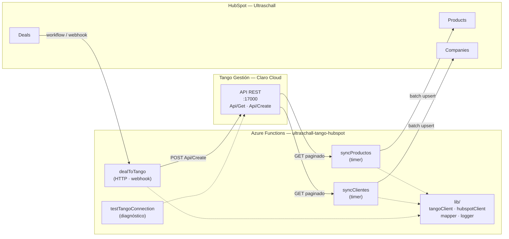

# Arquitectura — Integración Tango ERP ↔ HubSpot (Ultraschall)

> **Estado del documento:** borrador vivo. Es la fuente de verdad de la integración.
> Todo lo marcado con 🟡 **PENDIENTE** está esperando definición o dato de Ultraschall / Matías.
> Todo lo marcado con ⚠️ es una inferencia mía que hay que confirmar contra Tango.
>
> Última actualización: 2026-08-14 — incorpora el relevamiento contra el ERP (§5.4 resuelto, §5.6 nueva).

---

## 1. Objetivo y alcance

Sincronizar la información maestra y transaccional entre **Tango Gestión** (ERP de Ultraschall, hosteado en Claro Cloud) y **HubSpot** (CRM), de modo que:

- Comercial trabaje en HubSpot con la cartera de clientes y el catálogo reales del ERP.
- Lo que se cierra en HubSpot impacte en Tango sin recarga manual.

### Alcance por fase

| Fase | Flujo | Origen → Destino | Estado |
|---|---|---|---|
| 0 | Conectividad y proxy a Tango | — | ✅ Hecho |
| 1 | Artículos → catálogo | Tango `STA11` → HubSpot **Products** | ⛔ Bloqueada: `process=87` no trae precio (826 reg.) |
| 2 | Clientes → cuentas | Tango `GVA14` → HubSpot **Companies** | 🔨 A construir (5.670 reg.) |
| 3 | Contactos | Tango `GVA14` (email) → HubSpot **Contacts** | 🟡 PENDIENTE definir (ver §7.3) |
| 4 | Pedidos | HubSpot **Deal** ganado → Tango `Api/Create` (`process=19845`) | 🔨 A construir — payload ya relevado (§9) |

🟡 **PENDIENTE:** confirmar si el alcance real es éste o si hay que sumar comprobantes/saldos de cuenta corriente.

---

## 2. Estado actual (qué existe hoy)

Repo `HubSpot-Tango/` — Azure Functions Node.js, modelo de programación v4.

```
HubSpot-Tango/
├─ src/
│  ├─ index.js                      → app.setup({ enableHttpStream: true })
│  └─ functions/
│     └─ testTangoConnection.js     → proxy genérico HTTP → Tango
├─ host.json
├─ local.settings.json              → secretos locales (NO commitear)
└─ .github/workflows/               → deploy a Azure en push a main
```

**`testTangoConnection`** es un proxy pass-through:
- `GET` → por defecto pega a `Api/Get`; `POST` → por defecto a `Api/Create`.
- Se puede forzar la ruta con el query param `?tangoPath=...` (se elimina antes de reenviar).
- Reenvía todos los demás query params tal cual y agrega los headers de Tango.
- Devuelve la respuesta de Tango envuelta en `{ status, proxyTarget, method, latencyMs, totalFunctionTimeMs, result }`.

Sirvió para validar conectividad y relevar datos. **No es la función de producción**: en la arquitectura final queda como herramienta de diagnóstico (ver §4).

### Deuda técnica detectada

| # | Problema | Archivo | Acción | Estado |
|---|---|---|---|---|
| D1 | `local.settings.json` define `TANGO_API_TOKEN`, pero el código lee `TANGO_API_KEY`. Además falta `TANGO_COMPANY`. | `local.settings.json` | Unificar a `TANGO_API_KEY` y agregar `TANGO_COMPANY`. | ✅ 2026-08-14. Se sumaron `HUBSPOT_TOKEN` y `SYNC_DRY_RUN` como placeholders. ⚠️ **Falta replicar el rename en las Application Settings de Azure.** |
| D2 | `authLevel: 'anonymous'` en un proxy que expone el ERP entero a internet, incluido el `POST → Api/Create`. | `testTangoConnection.js` | Pasar a `function` (API key) o restringir por red. Ver §10. | ⏸️ **Abierta a propósito.** Se mantiene `anonymous` mientras dura el relevamiento (§5.6). Cerrar antes de producción. |
| D3 | `pdfkit` está en `dependencies` sin uso aparente. | `package.json` | Confirmar si se usa; si no, sacar. | ✅ 2026-08-14. Sin usos; removido y lock regenerado. Queda `@azure/functions` como única dependencia. |
| D4 | README vacío ("First commit"). | `README.md` | Completar con setup local + deploy. | ✅ 2026-08-14. |
| D5 | `.gitignore` ignoraba `.funcignore`, así que nunca llegaba al repo. | `.gitignore` | Sacarlo de la sección de empaquetados. | ✅ 2026-08-14. |
| D6 | `config/` y `docs/` estaban **untracked**: mapeos, payloads y esta arquitectura sólo existían en la máquina de Matías. | — | Commitear al repo. | ✅ 2026-08-14. |

---

## 3. Diagrama de arquitectura



---

## 4. Componentes a construir

| Componente | Tipo | Responsabilidad | Estado |
|---|---|---|---|
| `lib/tangoClient.js` | módulo | Los 4 endpoints (§5.8), reintentos con backoff, timeout. Único lugar que conoce la URL del ERP. | ✅ 2026-08-14 |
| `lib/lookups.js` | módulo | **Resolución `código → ID interno`** contra las 6 tablas auxiliares. Es lo que evita la corrupción silenciosa de §5.4. | ✅ 2026-08-14 |
| `lib/mapper.js` | módulo | Aplica `config/mapeo.*.json`: renombra, castea, corre transforms, resuelve lookups y calcula el hash del sync diferencial. | ✅ 2026-08-14 |
| `lib/logger.js` | módulo | Formato de log unificado (el estilo con `[REQ-xxx]` que ya usás). | ✅ 2026-08-14 |
| `lib/hubspotClient.js` | módulo | Auth con private app token, batch upsert, respeto de rate limits. | 🔨 Bloqueado: falta el token |

**Tests:** `npm test` (runner nativo de Node, sin dependencias). 23 tests sobre **datos reales del ERP** guardados en `test/fixtures/`. Corren sin red — importante, porque Tango no es accesible desde local (§5.6).

Verificación sobre el padrón completo: los 5.670 clientes se mapean en 176 ms, con 5.670 hashes distintos y 0 problemas de resolución.
| `functions/syncProductos.js` | Timer | Fase 1. Tango `process=87` → HubSpot Products. |
| `functions/syncClientes.js` | Timer | Fase 2. Tango `process=2117` → HubSpot Companies. |
| `functions/dealToTango.js` | HTTP | Fase 4. Recibe el Deal desde HubSpot y crea el comprobante en Tango. |
| `functions/testTangoConnection.js` | HTTP | Ya existe. Queda como diagnóstico, con auth restringida (D2). |

**Criterio:** ninguna función habla directo con `fetch`. Todo pasa por `lib/`, así el mapeo y los reintentos se testean y se cambian en un solo lugar.

---

## 5. Sistemas y endpoints

### 5.1 Tango ERP

| Ítem | Valor |
|---|---|
| Base URL | `http://138.99.6.77:17000` ⚠️ HTTP plano + IP fija, ver §10 |
| Endpoint lectura | `GET /Api/Get?process={id}&pages={n}&pageSize={n}` |
| Endpoint escritura | `POST /Api/Create` |
| Header auth | `ApiAuthorization: {TANGO_API_KEY}` |
| Header empresa | `company: {TANGO_COMPANY}` (hoy default `1`) |
| Formato respuesta | `{ resultData: { list[], pageIndex, pageSize, totalCount, totalPages, hasPreviousPage, hasNextPage } }` |

**Procesos relevados:**

| `process` | Tabla | Contenido | Uso | Registros (medido 2026-08-14) |
|---|---|---|---|---|
| `2117` | `GVA14` | Clientes | Lectura **y alta** | **5.670** (116 campos) |
| `87` | `STA11` | Artículos | Lectura **y alta** | **826** (141 campos) |
| `2151` | `GVA01` | Condiciones de venta | Lectura (lookup) | **86** (18 campos) — ✅ descubierto 2026-08-14 |
| `19845` | `GVA21` ⚠️ | Pedidos | **Alta** | — |

**Comportamiento del endpoint (verificado contra el ERP):**

| Hallazgo | Detalle |
|---|---|
| `Api/Get` ignora los query params que no conoce | Se probaron `id`, `filter`, `where`, `search`: los descarta y devuelve todo. **Pero eso no significa que no haya filtrado** — hay endpoints dedicados, ver §5.8. |
| `process` inválido | Devuelve `{"exceptionInfo":{"messages":["Action not found"]}}` en ~180 ms. Permite descubrir processes por sondeo. |
| Espacio de `process` | **Disperso** (87, 2117, 2151, 19845). Barrerlo entero contra producción no es viable: varios processes tardan >60 s y algunos tiran `An exception was thrown while activating ViewsFacade`. |
| `pageSize` | No tiene tope práctico: `pageSize=6000` trajo los 5.670 clientes en una sola llamada. |

**Volumen y tiempos medidos** (a través del proxy de Azure, que es la única vía — §5.6):

| Lectura | Tiempo | Payload |
|---|---|---|
| Clientes completos (5.670) | **107 s** | 15,7 MB |
| Artículos completos (826) | **12 s** | 2,9 MB |
| Tabla auxiliar `GVA01` (86) | 1,4 s | — |
| Latencia de una consulta chica | ~180-580 ms | — |

⚠️ Los 107 s de la lectura de clientes son **casi la mitad del timeout HTTP por defecto de Azure (230 s)**. Refuerza la decisión de §8.3: el sync de clientes va por **timer trigger**, no por HTTP.

El `process` va como query param y el payload en el body — el puente de Azure lo reenvía tal cual:

```
POST https://{function-app}/api/testTangoConnection?process=2117
  → POST http://138.99.6.77:17000/Api/Create?process=2117
```

🟡 **PENDIENTE — completar procesos faltantes:**

| Necesidad | `process` | Estado |
|---|---|---|
| Listas de precios | `____` | ⛔ **Bloqueante Fase 1.** Confirmado 2026-08-14: `process=87` **no tiene ningún campo de precio** (se revisaron los 141). |
| Stock por depósito | `____` | Confirmado: los campos `STOCK*` de `STA11` son todos parametría (`STOCK_MAXI`, `STOCK_MINI`, unidades de medida). Ninguno es la existencia real. |
| `GVA01` Condiciones de venta | ✅ **`2151`** | Descubierto por sondeo. |
| `GVA23` Vendedores | ✅ **`952`** | 27 registros. |
| `GVA24` Transportes | ✅ **`960`** | 41 registros. |
| `GVA18` Provincias | ✅ **`852`** | 40 registros. |
| `GVA05` Zonas | ✅ **`842`** | 9 registros. |
| `GVA41` Alícuotas de IVA | ✅ **`3010`** | 9 registros. |
| `GVA10` Listas de precios | `____` | ⛔ Bloqueante Fase 4. |
| `STA22` Depósitos | `____` | ⛔ Bloqueante Fase 4. No aparece en el menú del ERP. |
| `GVA43` Talonarios | `____` | ⛔ Bloqueante Fase 4. No aparece en el menú del ERP. |
| `CATEGORIA_IVA` | `____` | ⛔ Bloqueante: es alfabética (§5.4). |

> El catálogo completo y actualizado vive en **`config/tango.processes.json`**. Los que faltan se consiguen con el método de §5.7.

✅ **RESUELTO — filtros del ERP:** `Api/Get` **no acepta ningún filtro** (ver tabla de comportamiento arriba). El sync **tiene que ser full read**. Esto cierra la duda de §8.2 a favor de la propuesta de hash.

### 5.3 ⚠️ Regla crítica: lectura por código, escritura por ID interno

Los payloads de alta relevados (`docs/payloads/`) **no usan códigos, usan los IDs internos numéricos de Tango**:

| Lectura devuelve | Escritura exige |
|---|---|
| `COD_GVA14` = `"000003"` | `ID_GVA14` = `2590` |
| `COD_STA11` = `"APY"` | `ID_STA11` = `394` |
| `GVA10_NRO_DE_LIS` | `ID_GVA10` |

**Consecuencia de arquitectura:** el sync de clientes y de productos **debe persistir el ID interno** en HubSpot (`tango_id_gva14`, `tango_id_sta11`), aunque no le sirva a comercial. Sin eso, la Fase 4 no puede armar el pedido y habría que resolver un lookup contra Tango en cada creación.

Estos IDs ya vienen en las respuestas de lectura (`ID_GVA14` e `ID_STA11` están al 100% en ambos dumps), así que no requiere llamadas extra.

### 5.4 ⛔ RESUELTO (2026-08-14): el código **NO** es el ID interno

Para las entidades principales el ID viene explícito (`ID_GVA14`, `ID_STA11`). **Para las tablas auxiliares no.**

Los payloads de alta piden `ID_GVA01`, `ID_GVA05`, `ID_GVA10`, `ID_GVA18`, `ID_GVA23`, `ID_GVA24`, `ID_CATEGORIA_IVA`, `ID_TIPO_DOCUMENTO_GV`, `ID_STA22`, `ID_MEDIDA_*`, `ID_GVA41_*`.
Pero la lectura de clientes devuelve **códigos**: `GVA01_COND_VTA`, `GVA05_CODIGO`, `GVA10_NRO_DE_LIS`, `GVA23_CODIGO`, `GVA24_CODIGO`, `COD_CATEGORIA_IVA`…

**Verificado contra el ERP: divergen.** Se leyó la tabla `GVA01` completa (`process=2151`, 86 registros), que expone las dos columnas juntas — `ID_GVA01` (interno) y `COND_VTA` (código):

| Medición | Resultado |
|---|---|
| Registros de `GVA01` donde `ID_GVA01 != COND_VTA` | **72 de 86** |
| Rango de `ID_GVA01` | 1-14, después salta a 1014-1102 |
| Rango de `COND_VTA` | 1-99 |
| Clientes (de 5.670) cuyo código coincide con el ID | 4.271 |
| Clientes que **romperían** si mandamos el código como ID | **1.399 (25% de la cartera)** |

Ejemplo: el cliente `000003` tiene `COND_VTA=15` ("CHEQUE 0, 30 DIAS FF"), pero su `ID_GVA01` real es **1014**.

> ⚠️ **Cuidado con la prueba de una sola muestra.** El cliente `ID_GVA14=2590` (el del payload de ejemplo) tiene `COND_VTA=5`, y da MATCH contra el `ID_GVA01=5` del pedido. Es **casualidad**: los IDs 1-14 coinciden con sus códigos porque fueron los primeros creados. Verificar con un solo registro da un falso positivo y lleva a la conclusión opuesta a la correcta.

**Modo de falla en `GVA01`:** de los 1.399, 0 producen corrupción silenciosa — como los códigos 15-99 casi no existen en el espacio de IDs (1-14, 1014-1102), Tango rechaza con error. Es *suerte estructural de esa tabla*.

#### ⛔ Las otras 5 auxiliares: acá sí hay corrupción silenciosa

Con los `process` conseguidos el 2026-08-14 se leyeron las tablas restantes. **Las seis divergen**, y en la mayoría los rangos de código e ID **se solapan**, que es justo el caso peligroso:

| Tabla | Qué es | Divergen | Clientes OK por casualidad | Error ruidoso | 🔴 **Corrupción silenciosa** |
|---|---|---|---|---|---|
| `GVA18` | Provincias | 26/40 | 788 | 860 | **4.022 (71%)** |
| `GVA23` | Vendedores | 17/27 | 4.120 | 366 | **484 (10%)** |
| `GVA24` | Transportes | 35/41 | 3.291 | 1.318 | **278 (6%)** |
| `GVA41` | Alícuotas IVA | 9/9 | — | — | — |
| `GVA01` | Cond. de venta | 72/86 | 4.271 | 1.399 | 0 |
| `GVA05` | Zonas | 1/9 | 4.974 | 696 | 0 |

Ejemplos reales de lo que se grabaría, **sin ningún error**:

| Tabla | Código | Valor real del cliente | Se grabaría como |
|---|---|---|---|
| `GVA18` | 1 | Buenos Aires | **Capital Federal** |
| `GVA23` | 24 | Juan Butorac | **Natali Vazquez** |
| `GVA24` | 10 | A CONVENIR | **RETIRA BICENTENARIO (REM)** |

**7 de cada 10 pedidos se grabarían con la provincia equivocada** y nadie se enteraría hasta que un despacho llegue mal. Esto liquida cualquier atajo: **la resolución `código → ID` por tabla auxiliar es obligatoria, sin excepción.**

**Consecuencia de arquitectura (firme):** hace falta **leer y cachear cada tabla auxiliar** para resolver `código → ID interno`. No hay atajo. Esto convierte el pedido de los `process` de las auxiliares (§5.1) en **bloqueante de la Fase 4 y del alta de clientes**.

**Patrón de resolución:** cada tabla auxiliar expone ambas columnas (interno + código), así que un solo `GET` por tabla alcanza para armar el diccionario en memoria. Son tablas chicas (`GVA01` = 86 registros) y estables: se cachean al inicio de cada corrida.

#### Qué es cada tabla auxiliar (identificado 2026-08-14)

Las tablas se identificaron leyendo los **valores reales** del padrón de clientes, no por el nombre. Dos estaban mal supuestas en versiones previas de este documento:

| Tabla | Qué es | Valores | Cargado | Nota |
|---|---|---|---|---|
| `GVA01` | **Condiciones de venta** | 86 | 100% | ✅ `process=2151`. Ver §5.4. |
| `GVA10` | **Listas de precios** | 5 | 87% | `SIN IVA EN $`, `CON IVA EN $` (3.830 clientes), `MEDICO SIN IVA $`, `SIN IVA EN U$S`, `CON IVA EN U$S` |
| `GVA23` | **Vendedores** | 24 | 88% | ⛔ El doc lo daba como incógnita. Ver §7.4. |
| `GVA24` | **Transporte / forma de envío** | 33 | 86% | ⛔ Era incógnita. `BUSPACK`, `RETIRA CLIENTE`, `CORREO OCA`, `MOTO (REM)`, `CADETE (REM)`… |
| `GVA05` | **Zonas geográficas** | 9 | 100% | ⛔ Estaba mal identificada como "vendedores". Ver §7.4. |
| `GVA18` | **Provincias** | 38 | 100% | Misiones, Buenos Aires, CABA, San Juan… |
| `GVA133` | **Países** | 6 | — | ARGENTINA, URUGUAY, PERU, PARAGUAY, ECUADOR, BOLIVIA |
| `GVA62` | Agrupaciones de clientes ⚠️ | 11 | — | Parecen grupos empresarios / cuentas vinculadas. Confirmar. |
| `GVA41` | Alícuotas de IVA | — | 0% en padrón | Sólo aparece `GVA41_NO_CAT_*`, vacío. |
| `GVA44` | Talonarios de exportación | — | — | |

**Lo que esto habilita:** las descripciones ya las tenemos, así que los mapeos a HubSpot se pueden escribir ahora. **Lo que sigue faltando es el `process` de cada tabla**, que es lo único que da el `ID` interno (§5.4). Sin eso se puede sincronizar *hacia* HubSpot mostrando descripciones, pero no se puede escribir *hacia* Tango.

#### Caso aparte: `CATEGORIA_IVA` es alfabética

`COD_CATEGORIA_IVA` no es numérico: sus 5 valores son `RI`, `RS`, `EX`, `CF`, `EXE` (100% cargado). Acá ni siquiera existe la ilusión de que código == ID: se necesita sí o sí la tabla de equivalencia para resolver `ID_CATEGORIA_IVA`.

### 5.5 Campos de parametría en el alta

Los tres payloads de alta muestran un patrón: además de los datos del negocio, Tango exige un bloque de parametría que HubSpot no conoce ni debería conocer (`SOBRE_IVA`, `TYP_FEX`, `COBRA_LUNES`…`COBRA_DOMINGO`, `IDIOMA_CTE`, `PRODUCTO_TERMINADO_COT`, etc.).

**Decisión:** esos valores viven en **`config/defaults.tango.json`**, y el payload se arma como:

```js
payload = { ...defaults[entidad], ...camposMapeadosDesdeHubSpot }
```

Así el mapeo (`config/mapeo.*.json`) queda limpio: sólo lo que realmente viaja entre los dos sistemas.

⚠️ Los valores actuales de `defaults.tango.json` salieron de los ejemplos de Postman. **Antes de producción los tiene que validar administración**, sobre todo talonario, depósito, alícuotas de IVA y clasificaciones SIAP.

### 5.6 ⚠️ Tango sólo es accesible desde Azure

El ERP está **restringido por IP: sólo acepta tráfico desde la Function App**. No se puede pegarle a Tango desde una máquina de desarrollo, ni desde Postman apuntando directo a `138.99.6.77:17000`.

Toda consulta al ERP pasa por la app desplegada:

```
https://ultraschall-tango-hubspot-cjcpbug0g4fxgehg.canadacentral-01.azurewebsites.net/api/testTangoConnection?process=2117
```

**Consecuencias:**

1. **No hay ciclo de desarrollo local contra Tango.** Probar implica commit → push a `main` → GitHub Actions → deploy. Conviene agrupar cambios en vez de un deploy por prueba.
2. **La lógica pura tiene que ser testeable sin red.** Mapeo, armado de payloads y hashing van en `lib/` como funciones puras, con la capa de I/O aislada. Es la única forma de iterar rápido.
3. **Esto es lo que hoy justifica dejar D2 abierta**: `testTangoConnection` en `anonymous` es la única vía de relevamiento. Cerrarlo antes de terminar el relevamiento obliga a manejar la function key en cada consulta.
4. Como beneficio lateral, el ERP no está expuesto a internet en general — la superficie de ataque es la Function App, no Tango. Eso **no** compensa D2: el proxy anónimo reabre el agujero, con el agravante de que ya viene autenticado contra el ERP.

Si hace falta verificar algo en la interfaz de Tango (parametría, talonarios, depósitos), Matías tiene **acceso remoto** al ERP.

### 5.8 Endpoints reales de la API (2026-08-14)

> ⚠️ **Corrección.** Una versión previa de este documento afirmaba que "`Api/Get` no acepta ningún filtro, el sync tiene que ser full read". **Era incorrecto**: se probaron filtros como *query params* de `Api/Get`, pero el filtrado vive en **endpoints dedicados**. La conclusión de fondo (full read para el sync) sigue en pie, pero por otro motivo — ver §8.2.

| Endpoint | Forma que funciona | Devuelve |
|---|---|---|
| Consulta | `GET Api/Get?process={p}&pages={n}&pageSize={n}` | `{ resultData: { list, totalCount, … } }` |
| **Por ID** | `GET Api/GetById?process={p}&id={id}` | `{ value: {…} }` ⚠️ forma distinta |
| **Por filtro** | `GET Api/GetByFilter?process={p}&filtroSql=WHERE {condición}` | `{ list: [...] }` ⚠️ forma distinta |
| Alta | `POST Api/Create?process={p}` | |
| Baja / Modificación | `Api/Delete`, `Api/Update` | **No probados**: son destructivos y esto es producción. |

**Dos detalles que cuestan tiempo si no se saben:**

1. **Las rutas *path-style* no existen en esta instalación.** El listado oficial de Tango documenta `Api/Get/{process}/{pageSize}/{pageIndex}/{view}`, pero todas esas rutas caen al fallback HTML de la SPA. **Todo va por query params.**
2. **`filtroSql` tiene que incluir la palabra `WHERE`.** Sin ella SQL Server devuelve `Incorrect syntax near '='`. Vacío devuelve todo.

```
# Un cliente puntual: 484 ms  (vs. 107 s de la lectura completa)
Api/GetByFilter?process=2117&filtroSql=WHERE COD_GVA14='000003'
```

**Impacto en el diseño (§9):** para la Fase 4 no hace falta cachear las 5.670 companies para resolver un pedido. Se puede resolver el cliente puntual en <1 s. Las tablas auxiliares **sí** conviene cachearlas (son chicas y se usan en cada renglón).

> 🔴 **`filtroSql` es SQL crudo concatenado.** Se verificó (sólo lectura) que acepta subconsultas arbitrarias contra **cualquier tabla** del ERP, no sólo la del `process`. Ver §10: esto cambia la severidad de D2.

### 5.7 Cómo descubrir los `process` faltantes

**No existe documentación de esta API.** Confirmado con soporte de Tango (2026-08-14): no hay nada publicado. Los `process` hay que descubrirlos.

Se descartaron dos caminos automáticos:

| Intento | Resultado |
|---|---|
| Sondear el espacio de `process` | Funciona (un ID inválido devuelve `"Action not found"`), pero el espacio es disperso y grande. Varios processes tardan >60 s contra **producción**. Así se encontró `2151`, pero no escala. |
| Leer el bundle JS de la SPA | `http://138.99.6.77:17000` sirve el cliente web de Tango (AxCloud/Angular). Se bajó `main-NR5TOSF7.js` (34 MB): **no contiene el mapeo**. Los `processId` se resuelven en runtime y el menú lo sirve el backend según permisos del usuario. Tampoco hay endpoint de catálogo (`Api/Menu`, `Api/Modules`, etc. caen al fallback de la SPA). |

**✅ Camino que sí funciona: mirar el tráfico de red del propio ERP.**

La SPA de Tango consume **exactamente el mismo endpoint** que nosotros (`Api/Get?process=NNNN`). Entonces:

1. Abrir el cliente web de Tango en Chrome (por el acceso remoto).
2. `F12` → pestaña **Network** → filtro `Api/Get`.
3. Navegar a la pantalla que interesa.
4. Leer el `process=NNNN` de la request que se dispara.

Pantallas a visitar y qué se busca:

| Pantalla en Tango | Tabla | Para qué |
|---|---|---|
| **Precios de artículos / actualización de precios** | — | ⛔ Desbloquea la Fase 1 entera |
| Listas de precios | `GVA10` | ⛔ Fase 4 |
| Vendedores | `GVA23` | ⛔ Fase 4 + owners |
| Transportes / formas de envío | `GVA24` | ⛔ Fase 4 |
| Depósitos | `STA22` | ⛔ Fase 4 |
| Zonas | `GVA05` | Segmentación |
| Provincias | `GVA18` | Alta de clientes |
| Categorías / alícuotas de IVA | `GVA41`, `CATEGORIA_IVA` | Alta de clientes |
| Talonarios | `GVA43` | Fase 4 |
| Stock / existencias por depósito | — | Optimización |

Alcanza con anotar el número: con el `process` en mano, la tabla se lee sola y se arma el diccionario `código → ID` (§5.4).

### 5.2 HubSpot

| Ítem | Valor |
|---|---|
| Portal / Hub ID | 🟡 `____` |
| Tipo de auth | 🟡 Private App token / OAuth app — `____` |
| API base | `https://api.hubapi.com` |
| Endpoints batch | `POST /crm/v3/objects/{objectType}/batch/upsert` (100 registros por request) |
| Scopes requeridos | `crm.objects.companies.write`, `crm.objects.companies.read`, `crm.objects.products.write`, `crm.objects.products.read`, `crm.schemas.companies.write`, `crm.objects.deals.read` |

🟡 **PENDIENTE:** ¿la integración corre con Private App del portal de Ultraschall, o va dentro del proyecto `IdPartners/` como app pública? Cambia el modelo de auth y dónde viven los secretos.

---

## 6. Convenciones

- **Prefijo de propiedades custom:** `tango_` (ej. `tango_cod_cliente`). Evita colisiones y hace obvio el origen del dato.
- **Grupo de propiedades en HubSpot:** `tango_erp` ("Datos Tango ERP"), para que el equipo comercial las vea agrupadas.
- **Nunca pisar campos editados a mano en HubSpot** salvo los que el mapeo marque como `autoritativoTango: true`.
- **Idioma:** propiedades y labels en español; código y nombres de archivo en inglés.

---

## 7. Modelo de datos y correspondencias

### 7.1 Artículos → Products (Fase 1)

- **Clave de idempotencia:** `COD_STA11` → `hs_sku`.
- Mapeo detallado: **`config/mapeo.productos.json`**.
- ⛔ **Bloqueante:** HubSpot Products necesita `price`, y `process=87` no lo trae. Sin el proceso de listas de precios, los productos entran con precio 0 o sin precio.

### 7.2 Clientes → Companies (Fase 2)

- **Clave de idempotencia:** `COD_GVA14` → propiedad custom `tango_cod_cliente`, marcada como *unique*.
- Mapeo detallado: **`config/mapeo.clientes.json`**.

✅ **Claves verificadas sobre los 5.670 clientes (2026-08-14):**

| Campo | Cargado | Únicos | Veredicto |
|---|---|---|---|
| `COD_GVA14` | 100% | 5.670 | ✅ Clave primaria. Cero duplicados. |
| `ID_GVA14` | 100% | 5.670 | ✅ Único. Se persiste igual por §5.3. |
| `CUIT` | 100% | 5.401 | ⚠️ **267 duplicados.** Confirma que no puede ser clave primaria (sucursales con mismo CUIT). Sirve sólo como clave secundaria de conciliación. |
| `E_MAIL` | 26% | 1.465 | ❌ Inservible como clave. Ver §7.3. |

### 7.3 ¿Contacts? (Fase 3)

Dato duro del relevamiento: **`E_MAIL` está cargado en apenas el 25% de los clientes** y `TELEFONO_1` en el 64%.

`GVA14` es una tabla de *cuentas*, no de personas: un registro = una empresa, con un mail genérico (`consultas@...`). No hay nombre y apellido de contacto.

**Recomendación:** no generar Contacts desde `GVA14`. Los contactos los carga/capta comercial en HubSpot y se asocian a la Company sincronizada. 🟡 Confirmar.

### 7.4 Vendedor → Owner

> ⛔ **CORRECCIÓN (2026-08-14): `GVA05` NO es la tabla de vendedores.** Era una inferencia equivocada. Al leer los valores reales del padrón, `GVA05` resultó ser **zonas geográficas** (CABA, NEA, NOA, CUYO…). **La tabla de vendedores es `GVA23`.**

**`GVA23` = Vendedores** (88% cargado, 24 valores):

| cód | Vendedor | Clientes | | cód | Vendedor | Clientes |
|---|---|---|---|---|---|---|
| 10 | FACUNDO | **3.569** | | 18 | VANESA | 26 |
| 01 | FERNANDO | 344 | | 02 | DAVID | 27 |
| 24 | Juan Butorac | 312 | | 19 | MANGER | 22 |
| 25 | Julian Gomez | 252 | | 22 | Narkys Garmendia | 18 |
| 11 | MELINA | 114 | | 14 | PAIRA | 13 |
| 07 | LUCAS | 94 | | 16 | DADOMO | 9 |
| 13 | LICITACIONES | 63 | | 05 | CAMINA MARIA ISABEL | 6 |
| 03 | DOMENECH ROMINA | 41 | | 20 | BONANO | 6 |
| 08 | MARIA LAURA | 32 | | resto | 8 vendedores más | ≤5 c/u |

⚠️ **FACUNDO tiene el 63% de la cartera.** Antes de mapear a owners de HubSpot conviene confirmar si es un vendedor real o un cajón de sastre / vendedor por defecto. Si es lo segundo, asignar 3.569 companies a esa persona sería un error.

**`GVA05` = Zonas** (100% cargado, 9 valores): CABA (1.016), NEA (894), NOA (855), PROVINCIA DE BS AS (851), ZONA NO DEFINIDA (696), GRAN BUENOS AIRES (565), ZONA SUR (427), CUYO (306), LATINOAMERICA (60).
Es un buen candidato a propiedad de segmentación en HubSpot, no a owner.

🟡 **PENDIENTE:** armar la equivalencia vendedor `GVA23` ↔ usuario de HubSpot. Propuesta: JSON de configuración a mano (son 24, y sólo ~8 tienen volumen real).

---

## 8. Estrategia de sincronización

### 8.1 Frecuencia

🟡 **PENDIENTE — definir:**

| Entidad | Frecuencia propuesta | Justificación |
|---|---|---|
| Productos | 1× por día (madrugada) | Catálogo estable, 825 registros. |
| Clientes | 1× por día (madrugada) | Alta de clientes no es urgente en el CRM. |
| Precios | según §5.1 | Depende de cuánto cambian. |

### 8.2 Full vs. incremental

✅ **DECIDIDO (2026-08-14). Ojo: la razón cambió respecto de la versión anterior de este documento.**

Sí existe filtrado del lado del servidor (`Api/GetByFilter`, §5.8). Pero eso **no** habilita el sync incremental, porque falta la otra mitad:

1. **No hay fecha de modificación.** Los campos de fecha de `GVA14` son `FECHA_ALTA`, `FECHA_INHA` y `FECHA_VTO`.
2. Como `filtroSql` es SQL crudo contra la tabla, se pudo **sondear si existía una columna oculta** que la vista no expone: se probaron `FECHA_MODIF`, `FEC_MODIF`, `FECHA_ULT_MODIF` y `ULT_MODIF`. SQL Server respondió `Invalid column name` a las cuatro. **La columna no existe, ni oculta.**

Se puede filtrar, pero no hay por qué campo preguntar "¿qué cambió desde ayer?".

**Estrategia: full read desde Tango + escritura diferencial por hash a HubSpot.** Sigue siendo la única opción para el sync masivo.

> Donde `Api/GetByFilter` **sí** cambia el diseño es en la Fase 4: resolver un cliente puntual tarda <1 s, así que `dealToTango` no necesita ningún cache de companies (§5.8).

El hash por registro se guarda en `tango_sync_hash`; sólo se manda a HubSpot lo que cambió. Sin eso, cada corrida escribiría 5.670 companies y quemaría la cuota de API de HubSpot al pedo.

**Costo real de la lectura full** (medido): 107 s y 15,7 MB para clientes, 12 s y 2,9 MB para artículos. Cabe en una sola llamada con `pageSize=6000` — no hace falta paginar, pero **sí hace falta que sea timer trigger** (§8.3).

### 8.3 Paginado y límites de ejecución

- Tango: `pageSize=500` (validado), recorrer con `hasNextPage`.
- HubSpot: batch de **100** registros por request.
- ⚠️ **Riesgo:** en plan Consumption, una Function HTTP corta a los 5 min (configurable hasta 10). 5.668 clientes + latencias de ~6 s por página de Tango puede acercarse al límite.
  **Mitigación propuesta:** timer trigger (sin límite de request) + procesamiento por chunks, o pasar a Durable Functions si el volumen crece.

### 8.4 Errores y observabilidad

- Reintento con backoff exponencial (3 intentos) ante 429 y 5xx, de ambos lados.
- Un registro que falla **no corta la corrida**: se acumula y se reporta al final.
- Cada corrida loguea: registros leídos, creados, actualizados, sin cambios, fallidos, y duración.
- 🟡 **PENDIENTE:** ¿dónde se notifica una corrida fallida? (mail, Teams, Slack, o sólo Application Insights)

---

## 9. Fase 4 — Deal ganado → Pedido en Tango

Se crea un **pedido** (no una factura), vía `POST /Api/Create` con `process=19845`.
Payload de referencia validado: **`docs/payloads/pedido-create.json`**.

### 9.1 Flujo

1. Workflow de HubSpot: Deal pasa a `closedwon` → webhook a `dealToTango`.
2. La función lee el Deal + line items + Company asociada.
3. Arma el payload resolviendo los IDs internos desde las propiedades sincronizadas (§5.3).
4. `POST /Api/Create` y guarda el número de pedido devuelto en `tango_nro_pedido` del Deal.

### 9.2 De dónde sale cada campo del pedido

**Cabecera:**

| Campo Tango | Origen | Notas |
|---|---|---|
| `ID_GVA14` | Company → `tango_id_gva14` | Cliente. Si está vacío ⇒ error de negocio (§9.3). |
| `ID_GVA01` | Company → `tango_id_gva01` | Condición de venta del cliente (`GVA01_COND_VTA`, 100% cargado). |
| `ID_GVA10` | Company → `tango_id_gva10` | Lista de precios. **87% cargado** (medido 2026-08-14, no 30% como se estimó). Igual necesita default para el 13% restante. |
| `ID_GVA23` | Company → `tango_id_gva23` | ✅ **Vendedor** (88% cargado). Identificado 2026-08-14, §5.4. |
| `ID_GVA24` | Company → `tango_id_gva24` | ✅ **Transporte / forma de envío** (86% cargado). Identificado 2026-08-14, §5.4. |
| `ID_MONEDA` | fijo `1` | 🟡 confirmar si siempre ARS. |
| `ID_GVA43_TALON_PED` | config | Talonario de pedidos. 🟡 confirmar cuál usa Ultraschall. |
| `ID_STA22` | config | Depósito. 🟡 confirmar cuál. |
| `FECHA_PEDIDO` | fecha de cierre del Deal | |
| `FECHA_ENTREGA` | 🟡 propiedad del Deal a definir | |
| `NRO_ORDEN_COMPRA` | 🟡 propiedad del Deal a definir | |
| `LEYENDA_1..5` | trazabilidad | Propuesta: dejar el ID del Deal de HubSpot en una leyenda para auditoría. |
| `VALIDA_STOCK` | config | ⚠️ el ejemplo va en `false`; definir si producción debe validar. |
| `PORCENTAJE_DESCUENTO_GENERAL` | Deal | |
| `APLICA_DESCUENTO_CLIENTE` / `CALCULA_PROMOCIONES` | config | Definir política. |

**Renglones (`RENGLON_DTO[]`), uno por line item del Deal:**

| Campo Tango | Origen |
|---|---|
| `ID_STA11` | Line item → Product → `tango_id_sta11` |
| `CANTIDAD_PEDIDA` | `quantity` |
| `PRECIO` | `price` |
| `PORCENTAJE_BONIFICACION` | `discount` |
| `ID_STA22` | depósito (mismo default de cabecera) |

### 9.3 Casos de error a resolver

🟡 **PENDIENTE — definir comportamiento:**
- Company sin `tango_id_gva14` (cliente que no existe en el ERP): ¿se rechaza, se avisa, o se da de alta el cliente en Tango?
- Line item cuyo producto no tiene `tango_id_sta11`.
- Cliente sin lista de precios asignada.
- Reintento de un Deal ya enviado: **¿cómo se evita el pedido duplicado?** Propuesta: no enviar si `tango_nro_pedido` ya tiene valor.

---

## 10. Seguridad

### 🔴 10.0 URGENTE — el proxy anónimo expone SQL arbitrario del ERP a internet

Descubierto el 2026-08-14 al relevar los endpoints (§5.8). **Sube la severidad de D2 de "deuda a saldar antes de producción" a "arreglar ya".**

**La cadena:**

1. `testTangoConnection` está en `authLevel: 'anonymous'` → la URL de la Function App es pública, sin credencial.
2. El proxy reenvía **cualquier** `tangoPath` y **todos** los query params, agregando él mismo las credenciales del ERP.
3. Tango expone `Api/GetByFilter?process={p}&filtroSql=WHERE …`, que es **SQL crudo concatenado**.

**Verificado (sólo lectura):** el filtro acepta subconsultas contra **cualquier tabla** de la base, no sólo la del `process` consultado:

```
filtroSql=WHERE ID_GVA05 IN (SELECT TOP 1 ID_GVA14 FROM GVA14)   -> 200 OK
```

**Consecuencia:** cualquiera que conozca la URL tiene **lectura SQL arbitraria sobre toda la base del ERP** — clientes, CUITs, precios, ventas — y además el `POST → Api/Create` para escribir. La restricción por IP de Tango (§5.6) no protege nada acá: el proxy *es* la IP autorizada.

No se probaron `Api/Delete` ni `Api/Update` (destructivos, producción), pero figuran en el listado de endpoints de Tango y no hay razón para suponer que el proxy no los reenviaría igual.

**Acciones, en orden:**

| # | Acción | Por qué |
|---|---|---|
| 1 | Pasar `testTangoConnection` a `authLevel: 'function'` | Corta el acceso anónimo. Es un cambio de una línea. |
| 2 | No dejar el proxy pass-through en producción | Las funciones de sync no lo necesitan: hablan con `lib/tangoClient` directo. |
| 3 | Si se conserva como diagnóstico: **allowlist de `tangoPath` y de `process`** | Un proxy que reenvía cualquier ruta es un agujero por diseño. |
| 4 | Nunca exponer `filtroSql` a entrada externa | El día que `dealToTango` reciba un webhook, el filtro se arma en el código, jamás con datos del request. |

⚠️ Mientras el relevamiento siguió con `anonymous` (decisión consciente, §5.6), **esa ventana ya no se justifica**: los `process` que faltaban ya se consiguen por el método de §5.7, sin necesidad del proxy abierto.

### 10.1 Resto

| Tema | Situación | Acción |
|---|---|---|
| Transporte a Tango | `http://` plano contra IP pública, con la API key viajando en header | 🟡 Evaluar HTTPS o VPN/IP allowlist. Hoy la credencial del ERP viaja en claro. |
| Auth del proxy | `anonymous` (D2) | Pasar a `function` key o restringir por IP. |
| Secretos | `local.settings.json` local + Application Settings en Azure | Verificar que `local.settings.json` esté en `.gitignore` (✅ está) y que nunca se commitee. |
| Logs | El proxy loguea la API key enmascarada (✅ correcto) y hasta 300 bytes del body | Revisar que no se loguee CUIT/datos personales en producción. |

---

## 11. Entornos y despliegue

| Entorno | Function App | Portal HubSpot | Empresa Tango |
|---|---|---|---|
| Producción | `ultraschall-tango-hubspot` | 🟡 `____` | `company=1` |
| Desarrollo | 🟡 ¿existe? | 🟡 ¿sandbox? | 🟡 ¿empresa de prueba? |

Deploy: push a `main` → GitHub Actions → Azure.

🟡 **PENDIENTE:** ¿hay portal sandbox de HubSpot y/o empresa de prueba en Tango para no escribir sobre producción durante el desarrollo?

### Variables de entorno

| Variable | Descripción |
|---|---|
| `TANGO_API_URL` | Base URL del ERP |
| `TANGO_API_KEY` | Valor del header `ApiAuthorization` (corregir D1) |
| `TANGO_COMPANY` | Código de empresa, default `1` |
| `HUBSPOT_TOKEN` | Private app token 🟡 a crear |
| `SYNC_DRY_RUN` | `true` = calcula y loguea pero no escribe en HubSpot |

---

## 12. Lo que necesito de tu lado

Para cerrar el diseño y empezar a codear, en orden de importancia:

| # | Qué | Bloquea |
|---|---|---|
| 0 | 🔴 **Cerrar el proxy anónimo (§10.0).** Hoy expone lectura SQL arbitraria de todo el ERP a internet. Es un cambio de una línea. | — |
| 1 | **`process` de precios de artículos** — la pantalla de precios / actualización de precios | ⛔ Fase 1 entera |
| 2 | **`process` de listas de precios (`GVA10`), depósitos (`STA22`) y talonarios (`GVA43`)**. Matías no encontró depósitos ni talonarios en el menú: puede que estén dentro de otra pantalla o requieran permiso. | ⛔ Fase 4 |
| 3 | **Equivalencia de `CATEGORIA_IVA`** (`RI`, `RS`, `EX`, `CF`, `EXE` → ID). Es alfabética, no hay atajo. | Alta de clientes |
| 4 | **Credenciales/portal de HubSpot**: Hub ID + Private App token | Todas las fases de escritura |
| 5 | **Revisar los mapeos propuestos** en `config/mapeo.*.json` | Fases 1 y 2 |
| 6 | **Validar `config/defaults.tango.json`** con administración (talonario, depósito, alícuotas, SIAP) | Toda escritura a Tango |
| 7 | `process` de stock, frecuencia de sync, ambiente de pruebas | Optimizaciones |
| 8 | Confirmar que Contacts queda fuera de alcance (§7.3) | Fase 3 |

### Resuelto en el relevamiento del 2026-08-14

| Pregunta | Respuesta |
|---|---|
| ¿El código es el ID interno? | **No.** Divergen en 72 de 86 registros de `GVA01`; 25% de la cartera rompería. Hacen falta las tablas auxiliares (§5.4). |
| ¿`Api/Get` acepta filtros? | **No**, ninguno. El sync tiene que ser full read (§8.2). |
| ¿Hay fecha de modificación? | **No.** Sólo `FECHA_ALTA`. Confirma la estrategia de hash (§8.2). |
| ¿`process=87` trae precio? | **No**, ninguno de sus 141 campos. Fase 1 sigue bloqueada. |
| ¿`COD_GVA14` sirve como clave? | **Sí**, 100% cargado y sin duplicados. `CUIT` no (267 duplicados). |
| ¿Cuánto tarda una lectura full? | 107 s clientes, 12 s artículos. Obliga a timer trigger (§8.3). |

### Archivos de referencia

| Archivo | Contenido |
|---|---|
| `docs/ARQUITECTURA.md` | Este documento. Diseño y decisiones. |
| `docs/payloads/cliente-create.json` | Payload de alta de cliente (`process=2117`). |
| `docs/payloads/producto-create.json` | Payload de alta de artículo (`process=87`). |
| `docs/payloads/pedido-create.json` | Payload de alta de pedido (`process=19845`). |
| `config/mapeo.clientes.json` | Mapeo campo a campo GVA14 ↔ Companies. |
| `config/mapeo.productos.json` | Mapeo campo a campo STA11 ↔ Products. |
| `config/defaults.tango.json` | Parametría fija para el alta en Tango (§5.5). |
