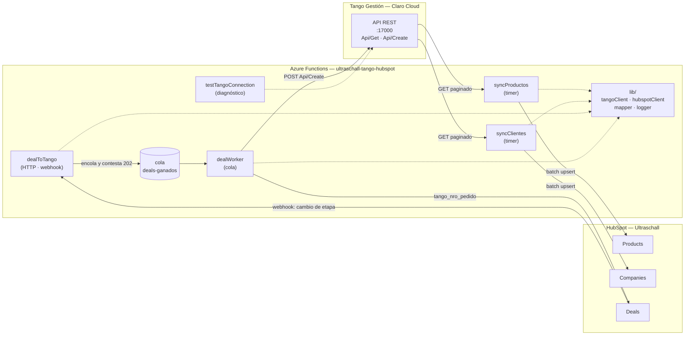

# Arquitectura — Integración Tango ERP ↔ HubSpot (Ultraschall)

> **Estado del documento:** borrador vivo. Es la fuente de verdad de la integración.
> Todo lo marcado con 🟡 **PENDIENTE** está esperando definición o dato de Ultraschall / Matías.
> Todo lo marcado con ⚠️ es una inferencia mía que hay que confirmar contra Tango.
>
> Última actualización: 2026-08-14 — incorpora el relevamiento contra el ERP (§5.4 resuelto, §5.6 nueva).

---

## 1. Objetivo y alcance

Sincronizar la información maestra y transaccional entre **Tango Gestión** (ERP de Ultraschall, hosteado en Claro Cloud) y **HubSpot** (CRM), de modo que:

- Comercial trabaje en HubSpot con la cartera de clientes y el catálogo reales del ERP.
- Lo que se cierra en HubSpot impacte en Tango sin recarga manual.

### Alcance por fase

| Fase | Flujo | Origen → Destino | Estado |
|---|---|---|---|
| 0 | Conectividad y proxy a Tango | — | ✅ Hecho |
| 1 | Artículos → catálogo | Tango `STA11` → HubSpot **Products** | 🔨 Sync construido el 2026-08-25. **Con precio desde el 2026-08-31**: sale de `GVA17` por `Api/GetById` (§9.12). 826 artículos, 776 publicables, 133 con precio |
| 2 | Clientes → cuentas | Tango `GVA14` → HubSpot **Companies** | 🔨 A construir (5.670 reg.) |
| 3 | Contactos | Tango `GVA27` → HubSpot **Contacts** | ⛔ **FUERA DE ALCANCE** (decidido 2026-08-24, §7.3). El relevamiento y `config/mapeo.contactos.json` se conservan. |
| 4 | Pedidos | HubSpot **Deal** ganado → Tango `Api/Create` (`process=19845`) | 🔨 Circuito construido el 2026-08-25 (§9). ⛔ Los renglones esperan el catálogo de productos (Fase 1) |

🟡 **PENDIENTE:** confirmar si el alcance real es éste o si hay que sumar comprobantes/saldos de cuenta corriente.

---

## 2. Estado actual (qué existe hoy)

Repo `HubSpot-Tango/` — Azure Functions Node.js, modelo de programación v4.

```
HubSpot-Tango/
├─ src/
│  ├─ index.js                      → app.setup({ enableHttpStream: true })
│  └─ functions/
│     └─ testTangoConnection.js     → proxy genérico HTTP → Tango
├─ host.json
├─ local.settings.json              → secretos locales (NO commitear)
└─ .github/workflows/               → deploy a Azure en push a main
```

**`testTangoConnection`** era un proxy pass-through; desde el 2026-08-25 filtra por `lib/politicaProxy` (§10.0):
- `GET` → por defecto pega a `Api/Get`; `POST` → por defecto a `Api/Create`.
- Se puede forzar la ruta con el query param `?tangoPath=...` (se elimina antes de reenviar).
- Los query params se reenvían **por allowlist**, reconstruidos: lo que no está permitido se rechaza. Los headers de Tango los pone el proxy.
- Devuelve la respuesta de Tango envuelta en `{ status, proxyTarget, method, latencyMs, totalFunctionTimeMs, result }`.

Sirvió para validar conectividad y relevar datos. **No es la función de producción**: en la arquitectura final queda como herramienta de diagnóstico (ver §4).

### Deuda técnica detectada

| # | Problema | Archivo | Acción | Estado |
|---|---|---|---|---|
| D1 | `local.settings.json` define `TANGO_API_TOKEN`, pero el código lee `TANGO_API_KEY`. Además falta `TANGO_COMPANY`. | `local.settings.json` | Unificar a `TANGO_API_KEY` y agregar `TANGO_COMPANY`. | ✅ 2026-08-14. Se sumaron `HUBSPOT_TOKEN` y `SYNC_DRY_RUN` como placeholders. ⚠️ **Falta replicar el rename en las Application Settings de Azure.** |
| D2 | `authLevel: 'anonymous'` en un proxy que expone el ERP entero a internet, incluido el `POST → Api/Create`. | `testTangoConnection.js` | El `authLevel` no se toca (decisión de Matías). Contener por política de acceso. Ver §10.0. | ✅ 2026-08-25 con `lib/politicaProxy`: allowlist de ruta, método, params y `process`; escritura y `filtroSql` apagados por defecto. Queda abierto el transporte `http://` (§10.1), que no depende de nosotros. |
| D3 | `pdfkit` está en `dependencies` sin uso aparente. | `package.json` | Confirmar si se usa; si no, sacar. | ✅ 2026-08-14. Sin usos; removido y lock regenerado. Queda `@azure/functions` como única dependencia. |
| D4 | README vacío ("First commit"). | `README.md` | Completar con setup local + deploy. | ✅ 2026-08-14. |
| D5 | `.gitignore` ignoraba `.funcignore`, así que nunca llegaba al repo. | `.gitignore` | Sacarlo de la sección de empaquetados. | ✅ 2026-08-14. |
| D6 | `config/` y `docs/` estaban **untracked**: mapeos, payloads y esta arquitectura sólo existían en la máquina de Matías. | — | Commitear al repo. | ✅ 2026-08-14. |

---

## 3. Diagrama de arquitectura



---

## 4. Componentes a construir

| Componente | Tipo | Responsabilidad | Estado |
|---|---|---|---|
| `lib/tangoClient.js` | módulo | Los 4 endpoints (§5.8), reintentos con backoff, timeout. Único lugar que conoce la URL del ERP. | ✅ 2026-08-14 |
| `lib/lookups.js` | módulo | **Resolución `código → ID interno`** contra las 6 tablas auxiliares. Es lo que evita la corrupción silenciosa de §5.4. | ✅ 2026-08-14 |
| `lib/mapper.js` | módulo | Aplica `config/mapeo.*.json`: renombra, castea, corre transforms, resuelve lookups y calcula el hash del sync diferencial. | ✅ 2026-08-14 |
| `lib/logger.js` | módulo | Formato de log unificado (el estilo con `[REQ-xxx]` que ya usás). | ✅ 2026-08-14 |
| `lib/hubspotClient.js` | módulo | Auth con private app token, batch upsert, respeto de rate limits. | 🔨 Bloqueado: falta el token |
| `lib/numeracion.js` | módulo | Elige el `COD_GVA14` del cliente nuevo. Dos estrategias, sin red. | ✅ 2026-08-24 |
| `lib/altaCliente.js` | módulo | **Escritura de vuelta**: ata la company al cliente que Tango acaba de crear. | ✅ 2026-08-24 |
| `lib/verificarEmpresa.js` | módulo | Verificación previa del alta: qué falta, quién lo resuelve, y el payload ya resuelto. | ✅ 2026-08-25 |
| `lib/firmaHubSpot.js` | módulo | Firma v3: la única autenticación del webhook de negocios ganados. | ✅ 2026-08-21 |
| `lib/politicaProxy.js` | módulo | Contención del proxy anónimo de diagnóstico. | ✅ 2026-08-25 |
| `lib/etapas.js` | módulo | Qué etapa cuenta como negocio ganado. Los dos embudos, sin red. | ✅ 2026-08-25 |
| `lib/verificarPedido.js` | módulo | Verificación del pedido y armado del payload, cabecera y renglones. | ✅ 2026-08-25 |
| `lib/dealToTango.js` | módulo | El circuito de la Fase 4, testeable con dobles. | ✅ 2026-08-25 |
| `lib/cola.js` | módulo | El nombre de la cola y la forma del mensaje. Desacopla el webhook del trabajo (§9.5). | ✅ 2026-08-26 |

**Tests:** `npm test` (runner nativo de Node, sin dependencias). 265 tests sobre **datos reales del ERP** guardados en `test/fixtures/`. Corren sin red — importante, porque Tango no es accesible desde local (§5.6).

Verificación sobre el padrón completo: los 5.670 clientes se mapean en 176 ms, con 5.670 hashes distintos y 0 problemas de resolución.
| `functions/syncProductos.js` | Timer | Fase 1. Tango `process=87` → HubSpot Products, dos veces por día. ✅ 2026-08-25, apagado por defecto. |
| `functions/syncClientes.js` | Timer | Fase 2. Tango `process=2117` → HubSpot Companies. |
| `functions/dealToTango.js` | HTTP | Fase 4, **la puerta**. Valida la firma, descarta lo que no es un negocio ganado y encola. No habla con Tango. ✅ 2026-08-26, apagada por defecto (`DEAL_TO_TANGO_ENABLED`). |
| `functions/dealWorker.js` | Cola | Fase 4, **el trabajo**. Un mensaje = un negocio = un pedido en Tango. Incluye `dealVeneno`, la cola de veneno (§9.5). ✅ 2026-08-26. |
| `functions/testTangoConnection.js` | HTTP | Ya existe. Queda como diagnóstico, anónimo pero contenido por `lib/politicaProxy` (§10.0). |

**Criterio:** ninguna función habla directo con `fetch`. Todo pasa por `lib/`, así el mapeo y los reintentos se testean y se cambian en un solo lugar.

---

## 5. Sistemas y endpoints

### 5.1 Tango ERP

| Ítem | Valor |
|---|---|
| Base URL | `http://138.99.6.77:17000` ⚠️ HTTP plano + IP fija, ver §10 |
| Endpoint lectura | `GET /Api/Get?process={id}&pages={n}&pageSize={n}` |
| Endpoint escritura | `POST /Api/Create` |
| Header auth | `ApiAuthorization: {TANGO_API_KEY}` |
| Header empresa | `company: {TANGO_COMPANY}` (hoy default `1`) |
| Formato respuesta | `{ resultData: { list[], pageIndex, pageSize, totalCount, totalPages, hasPreviousPage, hasNextPage } }` |

**Procesos relevados:**

| `process` | Tabla | Contenido | Uso | Registros (medido 2026-08-14) |
|---|---|---|---|---|
| `2117` | `GVA14` | Clientes | Lectura **y alta** | **5.670** (116 campos) |
| `87` | `STA11` | Artículos | Lectura **y alta** | **826** (141 campos) |
| `2151` | `GVA01` | Condiciones de venta | Lectura (lookup) | **86** (18 campos) — ✅ descubierto 2026-08-14 |
| `19845` | `GVA21` ⚠️ | Pedidos | **Alta** | — |

**Comportamiento del endpoint (verificado contra el ERP):**

| Hallazgo | Detalle |
|---|---|
| `Api/Get` ignora los query params que no conoce | Se probaron `id`, `filter`, `where`, `search`: los descarta y devuelve todo. **Pero eso no significa que no haya filtrado** — hay endpoints dedicados, ver §5.8. |
| `process` inválido | Devuelve `{"exceptionInfo":{"messages":["Action not found"]}}` en ~180 ms. Permite descubrir processes por sondeo. |
| Espacio de `process` | **Disperso** (87, 2117, 2151, 19845). Barrerlo entero contra producción no es viable: varios processes tardan >60 s y algunos tiran `An exception was thrown while activating ViewsFacade`. |
| `pageSize` | No tiene tope práctico: `pageSize=6000` trajo los 5.670 clientes en una sola llamada. |

**Volumen y tiempos medidos** (a través del proxy de Azure, que es la única vía — §5.6):

| Lectura | Tiempo | Payload |
|---|---|---|
| Clientes completos (5.670) | **107 s** | 15,7 MB |
| Artículos completos (826) | **12 s** | 2,9 MB |
| Tabla auxiliar `GVA01` (86) | 1,4 s | — |
| Latencia de una consulta chica | ~180-580 ms | — |

⚠️ Los 107 s de la lectura de clientes son **casi la mitad del timeout HTTP por defecto de Azure (230 s)**. Refuerza la decisión de §8.3: el sync de clientes va por **timer trigger**, no por HTTP.

El `process` va como query param y el payload en el body — el puente de Azure lo reenvía tal cual:

```
POST https://{function-app}/api/testTangoConnection?process=2117
  → POST http://138.99.6.77:17000/Api/Create?process=2117
```

🟡 **PENDIENTE — completar procesos faltantes:**

| Necesidad | `process` | Estado |
|---|---|---|
| Listas de precios | `____` | ⛔ **Bloqueante Fase 1.** Confirmado 2026-08-14: `process=87` **no tiene ningún campo de precio** (se revisaron los 141). |
| Stock por depósito | `____` | Confirmado: los campos `STOCK*` de `STA11` son todos parametría (`STOCK_MAXI`, `STOCK_MINI`, unidades de medida). Ninguno es la existencia real. |
| `GVA01` Condiciones de venta | ✅ **`2151`** | Descubierto por sondeo. |
| `GVA23` Vendedores | ✅ **`952`** | 27 registros. |
| `GVA24` Transportes | ✅ **`960`** | 41 registros. |
| `GVA18` Provincias | ✅ **`852`** | 40 registros. |
| `GVA05` Zonas | ✅ **`842`** | 9 registros. |
| `GVA41` Alícuotas de IVA | ✅ **`3010`** | 9 registros. |
| `GVA10` Listas de precios | `____` | ⛔ Bloqueante Fase 4. |
| `STA22` Depósitos | ✅ **2941** | Reconstruida el 2026-08-28 sin él, por la columna `ID_STA22` de `GVA21` (§9.7); el `process` llegó el 2026-08-31 y confirmó las 16 filas derivadas, más 20 que ningún pedido usaba (§9.11). |
| `GVA43` Talonarios | ✅ **no existe, y no hace falta** | Administración confirmó el 2026-08-31 que `GVA43` no tiene `process`. Resuelto el 2026-08-28 por la columna `ID_GVA43_TALON_PED` de `GVA21` (§9.7): el talonario se elige por la mayoría, que es unánime. |
| `CATEGORIA_IVA` | `____` | ⛔ Bloqueante: es alfabética (§5.4). |

> El catálogo completo y actualizado vive en **`config/tango.processes.json`**. Los que faltan se consiguen con el método de §5.7.

✅ **RESUELTO — filtros del ERP:** `Api/Get` **no acepta ningún filtro** (ver tabla de comportamiento arriba). El sync **tiene que ser full read**. Esto cierra la duda de §8.2 a favor de la propuesta de hash.

### 5.3 ⚠️ Regla crítica: lectura por código, escritura por ID interno

Los payloads de alta relevados (`docs/payloads/`) **no usan códigos, usan los IDs internos numéricos de Tango**:

| Lectura devuelve | Escritura exige |
|---|---|
| `COD_GVA14` = `"000003"` | `ID_GVA14` = `2590` |
| `COD_STA11` = `"APY"` | `ID_STA11` = `394` |
| `GVA10_NRO_DE_LIS` | `ID_GVA10` |

**Consecuencia de arquitectura:** el sync de clientes y de productos **debe persistir el ID interno** en HubSpot (`tango_id_gva14`, `tango_id_sta11`), aunque no le sirva a comercial. Sin eso, la Fase 4 no puede armar el pedido y habría que resolver un lookup contra Tango en cada creación.

Estos IDs ya vienen en las respuestas de lectura (`ID_GVA14` e `ID_STA11` están al 100% en ambos dumps), así que no requiere llamadas extra.

### 5.4 ⛔ RESUELTO (2026-08-14): el código **NO** es el ID interno

Para las entidades principales el ID viene explícito (`ID_GVA14`, `ID_STA11`). **Para las tablas auxiliares no.**

Los payloads de alta piden `ID_GVA01`, `ID_GVA05`, `ID_GVA10`, `ID_GVA18`, `ID_GVA23`, `ID_GVA24`, `ID_CATEGORIA_IVA`, `ID_TIPO_DOCUMENTO_GV`, `ID_STA22`, `ID_MEDIDA_*`, `ID_GVA41_*`.
Pero la lectura de clientes devuelve **códigos**: `GVA01_COND_VTA`, `GVA05_CODIGO`, `GVA10_NRO_DE_LIS`, `GVA23_CODIGO`, `GVA24_CODIGO`, `COD_CATEGORIA_IVA`…

**Verificado contra el ERP: divergen.** Se leyó la tabla `GVA01` completa (`process=2151`, 86 registros), que expone las dos columnas juntas — `ID_GVA01` (interno) y `COND_VTA` (código):

| Medición | Resultado |
|---|---|
| Registros de `GVA01` donde `ID_GVA01 != COND_VTA` | **72 de 86** |
| Rango de `ID_GVA01` | 1-14, después salta a 1014-1102 |
| Rango de `COND_VTA` | 1-99 |
| Clientes (de 5.670) cuyo código coincide con el ID | 4.271 |
| Clientes que **romperían** si mandamos el código como ID | **1.399 (25% de la cartera)** |

Ejemplo: el cliente `000003` tiene `COND_VTA=15` ("CHEQUE 0, 30 DIAS FF"), pero su `ID_GVA01` real es **1014**.

> ⚠️ **Cuidado con la prueba de una sola muestra.** El cliente `ID_GVA14=2590` (el del payload de ejemplo) tiene `COND_VTA=5`, y da MATCH contra el `ID_GVA01=5` del pedido. Es **casualidad**: los IDs 1-14 coinciden con sus códigos porque fueron los primeros creados. Verificar con un solo registro da un falso positivo y lleva a la conclusión opuesta a la correcta.

**Modo de falla en `GVA01`:** de los 1.399, 0 producen corrupción silenciosa — como los códigos 15-99 casi no existen en el espacio de IDs (1-14, 1014-1102), Tango rechaza con error. Es *suerte estructural de esa tabla*.

#### ⛔ Las otras 5 auxiliares: acá sí hay corrupción silenciosa

Con los `process` conseguidos el 2026-08-14 se leyeron las tablas restantes. **Las seis divergen**, y en la mayoría los rangos de código e ID **se solapan**, que es justo el caso peligroso:

| Tabla | Qué es | Divergen | Clientes OK por casualidad | Error ruidoso | 🔴 **Corrupción silenciosa** |
|---|---|---|---|---|---|
| `GVA18` | Provincias | 26/40 | 788 | 860 | **4.022 (71%)** |
| `GVA23` | Vendedores | 17/27 | 4.120 | 366 | **484 (10%)** |
| `GVA24` | Transportes | 35/41 | 3.291 | 1.318 | **278 (6%)** |
| `GVA41` | Alícuotas IVA | 9/9 | — | — | — |
| `GVA01` | Cond. de venta | 72/86 | 4.271 | 1.399 | 0 |
| `GVA05` | Zonas | 1/9 | 4.974 | 696 | 0 |

Ejemplos reales de lo que se grabaría, **sin ningún error**:

| Tabla | Código | Valor real del cliente | Se grabaría como |
|---|---|---|---|
| `GVA18` | 1 | Buenos Aires | **Capital Federal** |
| `GVA23` | 24 | Juan Butorac | **Natali Vazquez** |
| `GVA24` | 10 | A CONVENIR | **RETIRA BICENTENARIO (REM)** |

**7 de cada 10 pedidos se grabarían con la provincia equivocada** y nadie se enteraría hasta que un despacho llegue mal. Esto liquida cualquier atajo: **la resolución `código → ID` por tabla auxiliar es obligatoria, sin excepción.**

**Consecuencia de arquitectura (firme):** hace falta **leer y cachear cada tabla auxiliar** para resolver `código → ID interno`. No hay atajo. Esto convierte el pedido de los `process` de las auxiliares (§5.1) en **bloqueante de la Fase 4 y del alta de clientes**.

**Patrón de resolución:** cada tabla auxiliar expone ambas columnas (interno + código), así que un solo `GET` por tabla alcanza para armar el diccionario en memoria. Son tablas chicas (`GVA01` = 86 registros) y estables: se cachean al inicio de cada corrida.

#### Qué es cada tabla auxiliar (identificado 2026-08-14)

Las tablas se identificaron leyendo los **valores reales** del padrón de clientes, no por el nombre. Dos estaban mal supuestas en versiones previas de este documento:

| Tabla | Qué es | Valores | Cargado | Nota |
|---|---|---|---|---|
| `GVA01` | **Condiciones de venta** | 86 | 100% | ✅ `process=2151`. Ver §5.4. |
| `GVA10` | **Listas de precios** | 5 | 87% | `SIN IVA EN $`, `CON IVA EN $` (3.830 clientes), `MEDICO SIN IVA $`, `SIN IVA EN U$S`, `CON IVA EN U$S` |
| `GVA23` | **Vendedores** | 24 | 88% | ⛔ El doc lo daba como incógnita. Ver §7.4. |
| `GVA24` | **Transporte / forma de envío** | 33 | 86% | ⛔ Era incógnita. `BUSPACK`, `RETIRA CLIENTE`, `CORREO OCA`, `MOTO (REM)`, `CADETE (REM)`… |
| `GVA05` | **Zonas geográficas** | 9 | 100% | ⛔ Estaba mal identificada como "vendedores". Ver §7.4. |
| `GVA18` | **Provincias** | 38 | 100% | Misiones, Buenos Aires, CABA, San Juan… |
| `GVA133` | **Países** | 6 | — | ARGENTINA, URUGUAY, PERU, PARAGUAY, ECUADOR, BOLIVIA |
| `GVA62` | Agrupaciones de clientes ⚠️ | 11 | — | Parecen grupos empresarios / cuentas vinculadas. Confirmar. |
| `GVA41` | Alícuotas de IVA | — | 0% en padrón | Sólo aparece `GVA41_NO_CAT_*`, vacío. |
| `GVA44` | Talonarios de exportación | — | — | |

**Lo que esto habilita:** las descripciones ya las tenemos, así que los mapeos a HubSpot se pueden escribir ahora. **Lo que sigue faltando es el `process` de cada tabla**, que es lo único que da el `ID` interno (§5.4). Sin eso se puede sincronizar *hacia* HubSpot mostrando descripciones, pero no se puede escribir *hacia* Tango.

#### Caso aparte: `CATEGORIA_IVA` es alfabética

`COD_CATEGORIA_IVA` no es numérico: sus 5 valores son `RI`, `RS`, `EX`, `CF`, `EXE` (100% cargado). Acá ni siquiera existe la ilusión de que código == ID: se necesita sí o sí la tabla de equivalencia para resolver `ID_CATEGORIA_IVA`.

### 5.5 Campos de parametría en el alta

Los tres payloads de alta muestran un patrón: además de los datos del negocio, Tango exige un bloque de parametría que HubSpot no conoce ni debería conocer (`SOBRE_IVA`, `TYP_FEX`, `COBRA_LUNES`…`COBRA_DOMINGO`, `IDIOMA_CTE`, `PRODUCTO_TERMINADO_COT`, etc.).

**Decisión:** esos valores viven en **`config/defaults.tango.json`**, y el payload se arma como:

```js
payload = { ...defaults[entidad], ...camposMapeadosDesdeHubSpot }
```

Así el mapeo (`config/mapeo.*.json`) queda limpio: sólo lo que realmente viaja entre los dos sistemas.

⚠️ Los valores de `defaults.tango.json` salieron de los ejemplos de Postman y **antes de producción los tiene que validar administración**. Lo que queda de eso son las **alícuotas de IVA y las clasificaciones SIAP** de artículos: talonario, depósito, moneda y lista de precios del pedido dejaron de ser suposiciones el 2026-08-28 (§9.7), y la parametría del alta de clientes sale de la moda del padrón (§7.12).

El mismo archivo declara, en `clientes.alta`, **qué campos exige Tango y de dónde sale cada uno**. Eso es lo que lee la verificación previa de §7.12, y también lo que hay que corregir cuando se sondee el ERP: la lista de obligatorios de hoy es una suposición tomada del payload de ejemplo.

### 5.9 🟢 El entorno de Tango es una COPIA, no producción

Confirmado por Matías el 2026-08-19: **la instancia contra la que trabajamos es una copia del ERP, no el sistema productivo.**

Buena parte de las precauciones de este documento se tomaron asumiendo producción. Con la copia:

- Escribir registros de prueba es barato: se crean, se miden y se borran.
- Los 8 clientes `999902`-`999909` del relevamiento de tipos de documento se borran sin ceremonia (§5.4).
- El sondeo de `process` y las consultas pesadas dejan de ser un riesgo operativo.
- **D2 (proxy anónimo) baja de severidad mientras apunte acá.** Sigue siendo bloqueante antes de apuntar a producción: ver §10.0, que no cambia como diseño, sólo como urgencia.

⚠️ Lo que **no** cambia: los datos son reales (5.670 clientes con razón social, CUIT y contactos). Sigue aplicando el cuidado con datos personales — ver §10 y la nota sobre `test/fixtures/`.

### 5.6 ⚠️ Tango sólo es accesible desde Azure

El ERP está **restringido por IP: sólo acepta tráfico desde la Function App**. No se puede pegarle a Tango desde una máquina de desarrollo, ni desde Postman apuntando directo a `138.99.6.77:17000`.

Toda consulta al ERP pasa por la app desplegada:

```
https://ultraschall-tango-hubspot-cjcpbug0g4fxgehg.canadacentral-01.azurewebsites.net/api/testTangoConnection?process=2117
```

**Consecuencias:**

1. **No hay ciclo de desarrollo local contra Tango.** Probar implica commit → push a `main` → GitHub Actions → deploy. Conviene agrupar cambios en vez de un deploy por prueba.
2. **La lógica pura tiene que ser testeable sin red.** Mapeo, armado de payloads y hashing van en `lib/` como funciones puras, con la capa de I/O aislada. Es la única forma de iterar rápido.
3. **Esto es lo que hoy justifica dejar D2 abierta**: `testTangoConnection` en `anonymous` es la única vía de relevamiento. Cerrarlo antes de terminar el relevamiento obliga a manejar la function key en cada consulta.
4. Como beneficio lateral, el ERP no está expuesto a internet en general — la superficie de ataque es la Function App, no Tango. Eso **no** compensa D2: el proxy anónimo reabre el agujero, con el agravante de que ya viene autenticado contra el ERP.

Si hace falta verificar algo en la interfaz de Tango (parametría, talonarios, depósitos), Matías tiene **acceso remoto** al ERP.

### 5.8 Endpoints reales de la API (2026-08-14)

> ⚠️ **Corrección.** Una versión previa de este documento afirmaba que "`Api/Get` no acepta ningún filtro, el sync tiene que ser full read". **Era incorrecto**: se probaron filtros como *query params* de `Api/Get`, pero el filtrado vive en **endpoints dedicados**. La conclusión de fondo (full read para el sync) sigue en pie, pero por otro motivo — ver §8.2.

| Endpoint | Forma que funciona | Devuelve |
|---|---|---|
| Consulta | `GET Api/Get?process={p}&pages={n}&pageSize={n}` | `{ resultData: { list, totalCount, … } }` |
| **Por ID** | `GET Api/GetById?process={p}&id={id}` | `{ value: {…} }` ⚠️ forma distinta |
| **Por filtro** | `GET Api/GetByFilter?process={p}&filtroSql=WHERE {condición}` | `{ list: [...] }` ⚠️ forma distinta |
| Alta | `POST Api/Create?process={p}` | |
| Baja / Modificación | `Api/Delete`, `Api/Update` | **No probados**: son destructivos y esto es producción. |

**Dos detalles que cuestan tiempo si no se saben:**

1. **Las rutas *path-style* no existen en esta instalación.** El listado oficial de Tango documenta `Api/Get/{process}/{pageSize}/{pageIndex}/{view}`, pero todas esas rutas caen al fallback HTML de la SPA. **Todo va por query params.**
2. **`filtroSql` tiene que incluir la palabra `WHERE`.** Sin ella SQL Server devuelve `Incorrect syntax near '='`. Vacío devuelve todo.

```
# Un cliente puntual: 484 ms  (vs. 107 s de la lectura completa)
Api/GetByFilter?process=2117&filtroSql=WHERE COD_GVA14='000003'
```

**Impacto en el diseño (§9):** para la Fase 4 no hace falta cachear las 5.670 companies para resolver un pedido. Se puede resolver el cliente puntual en <1 s. Las tablas auxiliares **sí** conviene cachearlas (son chicas y se usan en cada renglón).

> 🔴 **`filtroSql` es SQL crudo concatenado.** Se verificó (sólo lectura) que acepta subconsultas arbitrarias contra **cualquier tabla** del ERP, no sólo la del `process`. Ver §10: esto cambia la severidad de D2.

### 5.7 Cómo descubrir los `process` faltantes

**No existe documentación de esta API.** Confirmado con soporte de Tango (2026-08-14): no hay nada publicado. Los `process` hay que descubrirlos.

Se descartaron dos caminos automáticos:

| Intento | Resultado |
|---|---|
| Sondear el espacio de `process` | Funciona (un ID inválido devuelve `"Action not found"`), pero el espacio es disperso y grande. Varios processes tardan >60 s contra **producción**. Así se encontró `2151`, pero no escala. |
| Leer el bundle JS de la SPA | `http://138.99.6.77:17000` sirve el cliente web de Tango (AxCloud/Angular). Se bajó `main-NR5TOSF7.js` (34 MB): **no contiene el mapeo**. Los `processId` se resuelven en runtime y el menú lo sirve el backend según permisos del usuario. Tampoco hay endpoint de catálogo (`Api/Menu`, `Api/Modules`, etc. caen al fallback de la SPA). |

**✅ Camino que sí funciona: mirar el tráfico de red del propio ERP.**

La SPA de Tango consume **exactamente el mismo endpoint** que nosotros (`Api/Get?process=NNNN`). Entonces:

1. Abrir el cliente web de Tango en Chrome (por el acceso remoto).
2. `F12` → pestaña **Network** → filtro `Api/Get`.
3. Navegar a la pantalla que interesa.
4. Leer el `process=NNNN` de la request que se dispara.

Pantallas a visitar y qué se busca:

| Pantalla en Tango | Tabla | Para qué |
|---|---|---|
| **Precios de artículos / actualización de precios** | — | ⛔ Desbloquea la Fase 1 entera |
| Listas de precios | `GVA10` | ⛔ Fase 4 |
| Vendedores | `GVA23` | ⛔ Fase 4 + owners |
| Transportes / formas de envío | `GVA24` | ⛔ Fase 4 |
| ~~Depósitos~~ | `STA22` | ✅ Resuelto 2026-08-28 sin su `process` (§9.7); tabla completa con el `process` 2941 el 2026-08-31 (§9.11) |
| Zonas | `GVA05` | Segmentación |
| Provincias | `GVA18` | Alta de clientes |
| Categorías / alícuotas de IVA | `GVA41`, `CATEGORIA_IVA` | Alta de clientes |
| ~~Talonarios~~ | `GVA43` | ✅ Resuelto 2026-08-28 sin su `process` (§9.7). No tiene `process` y no lo va a tener (§9.11) |
| Stock / existencias por depósito | — | Optimización |

Alcanza con anotar el número: con el `process` en mano, la tabla se lee sola y se arma el diccionario `código → ID` (§5.4).

### 5.2 HubSpot

| Ítem | Valor |
|---|---|
| Portal / Hub ID | `51311915` (cuenta STANDARD) |
| Tipo de auth | Private app del proyecto `IdPartners/` (`auth.type: static`), token `pat-...` |
| Dónde se declaran los scopes | `IdPartners/src/app/app-hsmeta.json` → `config.auth.requiredScopes` |
| API base | `https://api.hubapi.com` |
| Endpoints batch | `POST /crm/v3/objects/{objectType}/batch/upsert` (100 registros por request) |

Pendiente cerrado: la integración corre como **private app dentro del proyecto `IdPartners/`**, no como Private App suelta del portal. Los scopes se versionan con el código y cambiarlos exige `hs project upload` + aprobar los permisos en el portal.

#### ⛔ Scopes — el bloqueante del proyecto (verificado 2026-08-20)

El token del portal devuelve hoy: `crm.objects.companies.read`, `crm.objects.contacts.read/write`, `crm.objects.deals.read/write`, `crm.objects.line_items.read/write`, `crm.objects.quotes.read`, `e-commerce`, `oauth`.

**Faltan cuatro**, ya declarados en `app-hsmeta.json` pero sin aprobar en el portal:

| Scope | Sin él |
|---|---|
| `crm.objects.companies.write` | ⛔ Fase 2 entera |
| `crm.schemas.companies.write` | ⛔ no se pueden crear ni corregir propiedades |
| `crm.schemas.contacts.write` | ⛔ Fase 3: no se puede crear `tango_id_gva27` |
| `crm.objects.owners.read` | vendedor → owner |

Los de contactos se agregaron el 2026-08-20 **antes** de subir la app, para no repetir el ciclo `upload → aprobar → token nuevo`, que exige intervención manual en el navegador.

👉 Paso a paso: **`docs/RUNBOOK-SCOPES.md`**.

---

## 6. Convenciones

### 6.0 La planilla de Ultraschall es la fuente de verdad de los nombres

Ultraschall mantiene la planilla **"Tablero de informacion HubSpot - Empresas TANGO"** (copia en `config/`). Define los **nombres internos** de las propiedades de HubSpot y a qué campo de Tango corresponde cada una.

**Reparto de responsabilidades:**

| Documento | Manda en |
|---|---|
| La planilla | Nombres internos, etiquetas, qué campo va a dónde, qué propiedades son sólo de HubSpot |
| `config/mapeo.*.json` | Lo que la planilla no puede expresar: tipos, transforms y la **resolución `código → ID interno`** |

Ante un conflicto de nombres, gana la planilla.

**Decisiones tomadas el 2026-08-18:**

1. **`name` = nombre de fantasía (`NOM_COM`)**, y la razón social va a `razon_social`. Antes el mapeo técnico ponía `RAZON_SOCI` en `name`; para comercial es más útil ver la fantasía.
2. **El documento se guarda como TEXTO con guiones**, un solo formato. La planilla lo tenía como tipo *número*, pero Tango exige los guiones en el alta y un campo numérico no los soporta.
3. **Dirección de sincronización:** se mantiene la convención del proyecto — el maestro de clientes y artículos va **Tango → HubSpot** (Fases 1 y 2), y la dirección inversa es la Fase 4. Por campo se expresa con `autoritativoTango`.

**Dos correcciones aplicadas a lo que traía la planilla:**

- **Fila 16 estaba corrida:** mapeaba `TELEFONO_1` a `domicilio_fiscal`. El teléfono habría terminado en un campo de dirección. Corregido a `phone`. 🟡 **Corregir también en el Google Sheet**, que es el original.
- **Filas 30-35:** los valores de ejemplo de los campos `ID_GVA*` son **códigos, no IDs internos** (`24 (Juan Butorac)` es el código; el ID es 26). Ver §5.4. El código ya lo resuelve `lib/lookups.js`, pero **quien implemente a mano siguiendo esa tabla corrompe datos en silencio**.

**Lo que la planilla aportó y estaba pendiente:**

- **Equivalencia de categoría de IVA**: `1` Resp. Inscripto, `4` Exento, `5` Cons. Final, `6` Monotributo. 🟡 Los datos reales tienen 5 códigos (`RI`, `RS`, `EX`, `CF`, `EXE`): falta confirmar a qué ID corresponden **`RS` y `EXE`**.
- **Validación de `defaults.tango.json`**: las 16 filas de parametría de alta de la planilla **coinciden todas** con el archivo. Pendiente cerrado.
- `ID_TIPO_DOCUMENTO_GV = 1` para C.U.I.T. ⚠️ En la lectura ese tipo viene con código `80` — otra confirmación de que código ≠ ID. Y **el 54% de los clientes tiene código `0` ("C.I. POLICIA FEDERAL"), que en los hechos significa "sin definir"**: 132 de ellos tienen un CUIT bien formado. Para el alta hay que inferir el tipo del formato del documento.


- **Prefijo de propiedades custom:** `tango_` (ej. `tango_cod_cliente`). Evita colisiones y hace obvio el origen del dato.
- **Grupo de propiedades en HubSpot:** `tango_erp` ("Datos Tango ERP"), para que el equipo comercial las vea agrupadas.
- **Nunca pisar campos editados a mano en HubSpot** salvo los que el mapeo marque como `autoritativoTango: true`.
- **Idioma:** propiedades y labels en español; código y nombres de archivo en inglés.

---

## 7. Modelo de datos y correspondencias

### 7.1 Artículos → Products (Fase 1)

- **Clave de idempotencia:** `COD_STA11` → `hs_sku`.
- Mapeo detallado: **`config/mapeo.productos.json`**.
- ⛔ **Bloqueante:** HubSpot Products necesita `price`, y `process=87` no lo trae. Sin el proceso de listas de precios, los productos entran con precio 0 o sin precio.

### 7.2 Clientes → Companies (Fase 2)

- **Clave de idempotencia:** `COD_GVA14` → propiedad **`tango_codigo_cliente`**, *unique* (mudada el 2026-08-27, ver abajo). El mismo valor se sigue escribiendo en `codigo_tango`, que es el nombre que define la planilla de Ultraschall (§6.0).
- Mapeo detallado: **`config/mapeo.clientes.json`**.

#### ⚠️ Los desplegables rechazan los códigos de Tango (detectado 2026-08-20)

`condicion_iva` y `tipo_de_documento` estaban creadas a mano en el portal como desplegables **con etiquetas en castellano**, pero el mapeo les mandaba el código crudo de Tango:

| Propiedad | Opciones en el portal | Lo que salía del mapper |
|---|---|---|
| `condicion_iva` | Responsable Inscripto · Monotributista · Consumidor Final | `RI`, `RS`, `EX`, `CF`, `EXE` |
| `tipo_de_documento` | DNI · CUIT | `0`, `80`, `86`, `91`, `96`, `99` |

HubSpot **rechaza** un valor que no esté entre las opciones de una `enumeration`, y en `/batch/upsert` el rechazo voltea la **tanda de 100 entera**, no el registro. Tal como estaba, la primera corrida con permiso de escritura habría fallado al 100% — y el síntoma (un 400 por tanda) no señala al campo culpable.

No se veía antes porque el bloqueo de scopes impidió que se ejecutara una sola escritura.

**Cómo quedó resuelto:**

1. `mapper` soporta `opciones` en el mapeo: código de Tango → valor de la opción de HubSpot. Un código sin opción definida **se omite y se reporta**, en vez de escribir algo que voltea la tanda.
2. `mapper` soporta `transformRegistro`, transforms que reciben el registro completo. `tipo_de_documento` lo usa para resolverse con `lib/documento` en vez de copiar el código: el `0` que tiene el 54% de la muestra no es "C.I. Policía Federal", es un campo sin cargar.
3. `lib/propiedades.js` compara el mapeo contra el portal y clasifica en *crear / parchear / rehacer*. Es lógica pura, testeada sin red.
4. `scripts/crearPropiedades.js` agrega las opciones que faltan (`Exento`, `CUIL`, `C.I. Extranjera`).

**Las etiquetas no son inventadas.** Tango se autodescribe: `DESC_CATEGORIA_IVA` viene junto al código en la misma respuesta, y la correspondencia es 1 a 1 en la muestra de 300 (`RI`=Responsable inscripto, `RS`=Responsable monotributista, `EX`=Exento, `CF`=Consumidor final). Hay un test que lo verifica.

🟡 **`EXE` queda a propósito sin mapear**: no aparece en la muestra, así que no conocemos su descripción. Esos clientes se sincronizan sin `condicion_iva` y el sync lo reporta — pero **el dato no se pierde**: `DESC_CATEGORIA_IVA` va igual a `tango_categoria_iva` como texto libre.

Para resolverlo **no hace falta preguntarle a Ultraschall qué significa**: alcanza con leer `DESC_CATEGORIA_IVA` de un cliente con `COD_CATEGORIA_IVA = 'EXE'` contra el ERP. A Ultraschall sólo hay que pedirle el `ID_CATEGORIA_IVA`, que hace falta para el **alta** (Fase 4), no para la lectura.

#### Propiedades mal creadas en el portal

Dos propiedades preexistentes no se pueden corregir con un PATCH — `type` y `hasUniqueValue` son inmutables en HubSpot:

| Propiedad | Estado | Por qué hay que borrarla y recrearla |
|---|---|---|
| `codigo_tango` | `string/text`, **sin** `hasUniqueValue` | Es el `idProperty` del batch upsert. Vacía en las 65 companies: no se pierde nada. |
| `cuit` | `number/number` | El formato acordado es texto con guiones. 3 valores cargados. |

Lo hace `scripts/repararPropiedades.js`, que **guarda los valores en un archivo antes de borrar** y después los reescribe pasándolos por el transform del mapeo. El backup está gitignoreado: trae CUITs reales.

#### Estado del portal, medido y corregido el 2026-08-27

Contra el portal 51311915:

| | companies (antes) | companies (después) | products | deals |
|---|---|---|---|---|
| ya existentes | 10 | **32** | **14** ✅ | **4** ✅ |
| a crear | 21 | **0** ✅ | 0 | 0 |
| a parchear | 3 | **0** ✅ | 0 | 0 |
| a rehacer | 2 | **0** ✅ | 0 | 0 |

Se aplicó `node scripts/crearPropiedades.js clientes --aplicar`: 24 de 24 (21 creadas, 3 parcheadas), y después 1 más (`tango_codigo_cliente`). Ese script **crea y parchea, nunca borra** — la única llamada a `borrarPropiedad` está en `repararPropiedades.js`.

**No quedó nada "a rehacer", y sin borrar una sola propiedad.** Las dos que estaban mal se rodearon (abajo).

#### ⛔ REGLA: no se borra ninguna propiedad de HubSpot (decidido 2026-08-27)

**Decisión de Matías: las propiedades mal definidas se dejan existir.** Crear y parchear, sí; borrar, sólo si él lo pide explícitamente, esa vez. Borrar una propiedad se lleva puesto su valor en todos los registros, y el backup del script cubre los valores pero no lo que dependa de ella (vistas, workflows, listas, informes).

**`scripts/repararPropiedades.js` queda sin correr con `--aplicar`.** En dry-run sirve para ver qué reportaría.

Las dos que quedan mal, medidas el 2026-08-27:

| Propiedad | Cómo está | Qué rompe |
|---|---|---|
| `codigo_tango` | `string/text`, **`hasUniqueValue: false`**, cargada en **0 de 66** companies | Es el `idProperty` del batch upsert, y HubSpot exige que sea unique. El sync de empresas **no puede correr como está** |
| `cuit` | `number/number`, cargada en **4 de 66** | El mapeo escribe texto con guiones (decisión 2026-08-18, Tango los exige). HubSpot rechaza el valor, y en `/batch/upsert` el rechazo voltea **la tanda de 100 entera** |

**Cómo se rodeó cada una** (decidido y aplicado el 2026-08-27):

| Propiedad | Se rodea así | Qué se paga |
|---|---|---|
| `codigo_tango` | La clave del upsert se muda a **`tango_codigo_cliente`**, creada de entrada con `hasUniqueValue`. `codigo_tango` se sigue escribiendo con el mismo valor: es el nombre de la planilla (§6.0) y el que mira la gente | Dos propiedades con el mismo dato. Si algún día `codigo_tango` se rehace bien, la nueva se jubila |
| `cuit` | Se escriben **sólo dígitos**, como número. Los guiones que Tango exige los repone `documento.formatear` en la ida (`verificarEmpresa`, resolución `documento`) | Guardar y mandar dejan de tener el mismo formato. Y un documento con **cero adelante** no entra en un campo numérico: el transform lo **omite y lo reporta** en vez de truncarlo — medido sobre los 300 de la muestra, 0 casos |

En el mapeo, `codigo_tango` pasó a `unique: false` y `cuit` a `number`: es lo que hace que `lib/propiedades` deje de reportarlas como "a rehacer". La propiedad está como está y así se queda.

⚠️ Esto también toca la **Fase 4**: ninguna company tiene código de Tango, así que **todo negocio ganado pasa por el alta al vuelo** (§7.12). Eso ahora funciona —`tango_id_gva14` y `codigo_tango` ya existen y son escribibles—, pero significa que el primer pedido de cada cliente crea el cliente.

#### 🔑 Una sola llave de identidad (decidido 2026-08-24)

**HubSpot tiene dos mecanismos de matcheo para companies, no uno:** el `idProperty` que elegimos nosotros para el batch upsert (`codigo_tango`) y **`domain`, que HubSpot aplica solo, sin que se lo pidamos** — dos companies que comparten dominio **se fusionan**.

Mientras el sync escribía `domain` había que defenderse de eso filtrando por unicidad sobre el padrón entero (`calcularDominiosUnicos`). Funcionaba, pero dejaba una segunda llave fuera de nuestro control. **Decisión de Matías: el sync deja de escribir `domain`.** La identidad queda reducida a `codigo_tango`.

| | |
|---|---|
| Alcanzaba a | el **6%** de las companies (`WEB` está cargado en el 7% del padrón, y de ahí se descartan los compartidos) |
| Caso real que motivaba el filtro | `arrayamed.com`, declarado por "ARCANA SRL" y por "ARCANA SRL (Medinor SRL / Armando Arraya)" — dos códigos de Tango distintos |
| No se pierde | el sitio web sigue yendo a **`website`**, que es inerte; el dominio derivado de los mails sigue en **`tango_dominio_sugerido`** para que comercial lo promueva a mano |
| Sí se pierde | la asociación automática contacto → empresa por dominio, y el enriquecimiento de HubSpot (logo, industria) |

El modo de falla que esto elimina no era cosmético: dos clientes fusionados en una company dejan un `codigo_tango` afuera, el timer no lo encuentra, lo vuelve a crear, y se vuelve a fusionar. **Un loop de crear-fusionar en cada corrida, sin error visible.**

✅ **Claves verificadas sobre los 5.670 clientes (2026-08-14):**

| Campo | Cargado | Únicos | Veredicto |
|---|---|---|---|
| `COD_GVA14` | 100% | 5.670 | ✅ Clave primaria. Cero duplicados. |
| `ID_GVA14` | 100% | 5.670 | ✅ Único. Se persiste igual por §5.3. |
| `CUIT` | 100% | 5.401 | ⚠️ **267 duplicados.** No puede ser clave primaria. Los duplicados **no son sucursales** (eso se creyó y se refutó el 2026-08-19): son placeholders — `11111111` lo usan 44 clientes — e instituciones grandes con varias cuentas. Sirve sólo para conciliar a mano. |
| `E_MAIL` | 26% | 1.465 | ❌ Inservible como clave. Ver §7.3. |

### 7.3 Contacts (Fase 3) — ⛔ FUERA DE ALCANCE (decidido 2026-08-24)

> **Decisión de Matías: no se sincronizan contactos.** El alcance es empresas ← clientes de Tango, nada más. Todo lo que sigue en esta sección es **relevamiento, no plan de trabajo**: se deja porque costó conseguirlo y porque si algún día se retoma, el mapeo ya está hecho en `config/mapeo.contactos.json`.
>
> **Qué simplifica esta decisión, y no es poco:**
>
> - **Se cae el crawl de `Api/GetById`.** Los contactos sólo llegan por ahí, 1 request por cliente, ~7,5 min para los 5.670 con concurrencia 16. Sin contactos, el sync se resuelve con `Api/Get` y listo.
> - **Se cae el problema del email compartido**, que era el mismo riesgo que `domain` una fase más adelante: HubSpot trata el email como clave natural de Contacts y **fusiona** dos contactos que lo comparten. Quedaba sin resolver; ahora no hay que resolverlo.
> - **`crm.schemas.contacts.write` deja de hacer falta.** Es uno de los 4 scopes pendientes y estaba ahí sólo para `tango_id_gva27`. 🟡 Ver la nota en `docs/RUNBOOK-SCOPES.md`.
> - `scripts/crearPropiedades.js contactos` **no hay que correrlo**. El script exige la entidad por argumento, así que no se dispara solo.

#### Relevamiento (2026-08-19), conservado como referencia


> **Mi recomendación previa era no generar Contacts, y estaba basada en una fuente equivocada.** Yo miré `E_MAIL` de `GVA14` (26% cargado) y concluí que no había datos de personas. **Los contactos existen y están en otra tabla**: `GVA27`, que llega en el array `CONTACTOS` de `Api/GetById`. `GVA14` efectivamente no tiene personas — pero `GVA27` sí.

**Relevado el 2026-08-19 sobre los 5.670 clientes:**

| Dato | Valor |
|---|---|
| Contactos totales | **5.875** |
| Clientes con al menos un contacto | **3.428 (60,5%)** |
| `NOMBRE` cargado | **100%** |
| `E_MAIL_CONTACTO` | 74% (vs. 26% en `GVA14`) |
| `TELEFONO` | 73% |
| `CARGO` | 27% |
| `TELEFONO_MOVIL` | 0% — no se usa |

**Cómo se obtienen:** sólo por `GET Api/GetById?process=2117&id={ID_GVA14}`. Ni `Api/Get` ni `Api/GetByFilter` los devuelven: esos usan una vista reducida de 116 campos, mientras `GetById` proyecta 147. Cuesta **1 request por cliente**: los 5.670 tardan ~7,5 min con concurrencia 16 (12,6 req/s), sin errores.

Mapeo detallado: **`config/mapeo.contactos.json`**.

#### ⚠️ El email no sirve como clave

HubSpot trata el email como clave natural de Contacts: dos contactos con el mismo email **se fusionan**.

- 1.518 contactos (26%) **no tienen** email.
- **288 direcciones se repiten en 679 contactos.**
- 58 tienen formato inválido.

Lo importante es *por qué* se repiten: **no son la misma persona cargada dos veces, son personas distintas compartiendo una casilla genérica** (`ventas@`, `info@`). Ejemplo real: `ventas@conmil.com.ar` lo comparten "Ceitlin Lucas" y "Lucila Tornadore" del mismo cliente. De los 288 casos, 173 son dentro del mismo cliente y 115 entre clientes distintos.

Si se asigna el email compartido a todos, **HubSpot los fusiona y se pierden personas**.

**Estrategia:** la clave de idempotencia es `tango_id_gva27` (5.875 valores, todos únicos). El `email` se asigna a **un solo contacto por dirección** — el que tenga `DEFECTO='S'`, y si ninguno, el de menor `ID_GVA27`. Al resto se le deja `email` vacío y la dirección va a `tango_email_contacto`, que no es clave y por lo tanto no fusiona.

#### ⚠️ `NOMBRE` no se puede partir en nombre y apellido

Tango tiene un solo campo y el orden es inconsistente: `"Carolina Molina"` (nombre apellido) y `"Levy Patricia"` (apellido nombre) conviven. Además hay 596 contactos de una sola palabra y varios que son razones sociales (`"CIRAMED - Electromedicina"`).

**Propuesta:** volcar el nombre completo a `lastname` y dejar `firstname` vacío. HubSpot muestra el nombre completo igual, y no se inventa un split que se equivoca en silencio. 🟡 Confirmar.

### 7.4 Vendedor → Owner

> ⛔ **CORRECCIÓN (2026-08-14): `GVA05` NO es la tabla de vendedores.** Era una inferencia equivocada. Al leer los valores reales del padrón, `GVA05` resultó ser **zonas geográficas** (CABA, NEA, NOA, CUYO…). **La tabla de vendedores es `GVA23`.**

**`GVA23` = Vendedores** (88% cargado, 24 valores):

| cód | Vendedor | Clientes | | cód | Vendedor | Clientes |
|---|---|---|---|---|---|---|
| 10 | FACUNDO | **3.569** | | 18 | VANESA | 26 |
| 01 | FERNANDO | 344 | | 02 | DAVID | 27 |
| 24 | Juan Butorac | 312 | | 19 | MANGER | 22 |
| 25 | Julian Gomez | 252 | | 22 | Narkys Garmendia | 18 |
| 11 | MELINA | 114 | | 14 | PAIRA | 13 |
| 07 | LUCAS | 94 | | 16 | DADOMO | 9 |
| 13 | LICITACIONES | 63 | | 05 | CAMINA MARIA ISABEL | 6 |
| 03 | DOMENECH ROMINA | 41 | | 20 | BONANO | 6 |
| 08 | MARIA LAURA | 32 | | resto | 8 vendedores más | ≤5 c/u |

⚠️ **FACUNDO tiene el 63% de la cartera.** Antes de mapear a owners de HubSpot conviene confirmar si es un vendedor real o un cajón de sastre / vendedor por defecto. Si es lo segundo, asignar 3.569 companies a esa persona sería un error.

**`GVA05` = Zonas** (100% cargado, 9 valores): CABA (1.016), NEA (894), NOA (855), PROVINCIA DE BS AS (851), ZONA NO DEFINIDA (696), GRAN BUENOS AIRES (565), ZONA SUR (427), CUYO (306), LATINOAMERICA (60).
Es un buen candidato a propiedad de segmentación en HubSpot, no a owner.

🟡 **PENDIENTE:** armar la equivalencia vendedor `GVA23` ↔ usuario de HubSpot. Propuesta: JSON de configuración a mano (son 24, y sólo ~8 tienen volumen real).

---

### 7.5 Convivencia con la migración manual de Ultraschall (2026-08-21)

Ultraschall migró su cartera a HubSpot **a mano** desde CRM GO. El archivo de trabajo es `Ultra Saneamiento DB - CLIENTES CRM.csv`: **7.585 clientes con `Cod_Tango`** sobre 41.154 filas, con 4 filas de encabezado (fila 2 = label de destino en HubSpot, fila 3 = legend, fila 4 = columna de origen).

El sync tiene que **convivir** con eso, no pisarlo. Lo que se alineó:

| Qué | Antes | Ahora |
|---|---|---|
| Provincia | `state` (estándar) | **`provincia`**, la custom que crearon, con las 24 opciones en snake_case |
| `name` | `autoritativoTango: true` | **`false`** — normalizaron a Title Case y corrigieron 5 de 299 a mano |
| `domain` | no se escribía | ⛔ **REVERTIDO el 2026-08-24: NO se escribe.** Se alineó el 21 con la migración manual (decisión de Matías) y se dio marcha atrás por la razón de §7.2. `website` sí se sigue escribiendo. |
| Labels | `Condicion de venta`, `Mails de comprobantes` | **`Condiciones de Pago`**, **`Mail Factura`** — los nombres de su CSV, para que sea una sola propiedad y no dos |

#### 🔴 `autoritativoTango` estaba documentado pero NO implementado

`_meta.convenciones` dice desde el principio: *"false = solo se escribe si el campo está vacío"*. `mapper.camposAutoritativos()` existía pero **ningún módulo lo llamaba**: el sync pisaba las 39 propiedades en cada corrida.

Con la migración cargada, la primera corrida habría devuelto `name`, `localidad`, `zip`, `correo_electronico`, `phone`, `website`, `domain` y `provincia` a lo que dice Tango — borrando el saneamiento manual de 7.585 registros.

Implementado el 2026-08-21: `syncClientes` lee el valor actual de los campos no autoritativos y sólo escribe los que están vacíos. El resumen informa `respetados`.

#### La codificación de su CSV no es la de sus propias propiedades

Su archivo trae **códigos numéricos** donde HubSpot espera el `value` de una opción:

| Columna | Valores en el CSV | Opciones de la propiedad |
|---|---|---|
| `Tipo IVA` → `condicion_iva` | `0`, `1`, `2`, `3`, `5` | Responsable Inscripto · Monotributista · Consumidor Final |
| `TIPO_DOC` → `tipo_de_documento` | `80`, `96`, `86`, `0`, `91`, `99` | DNI · CUIT |

Verificado el 2026-08-21: en las dos propiedades `value` es **idéntico** al `label`, no hay opciones archivadas ni códigos internos numéricos, y no coincide con `displayOrder`. Además, las companies que un humano cargó a mano tienen `condicion_iva = 'Responsable Inscripto'` y `tipo_de_documento = 'CUIT'` — o sea, la etiqueta. En `provincia` sí usan un value distinto del label (`buenos_aires`), y ahí también cargaron el value.

**Conclusión: los números del CSV son los códigos crudos de origen, y la fila 3 del propio archivo (`80: CUIT / 96: DNI / 86: CUIL`) es la tabla de traducción a aplicar al importar.** El sync escribe las etiquetas; Ultraschall tiene que traducir su columna antes de importar.

#### Descifrado: `Tipo IVA` es una tercera codificación

Cruzando el CSV contra 299 clientes reales de Tango, la correspondencia es 1 a 1 y perfecta:

| Tango `COD_CATEGORIA_IVA` | CSV `Tipo IVA` | Etiqueta |
|---|---|---|
| `RI` | `0` | Responsable Inscripto |
| `CF` | `1` | Consumidor Final |
| `RS` | `3` | Monotributista |
| `EX` | `5` | Exento |
| — | `2` (22 reg.) | **por descarte, `EXE`** |

Es una codificación **distinta** de la de Tango (alfabética) y de la de la planilla (`ID_CATEGORIA_IVA`: 1/4/5/6). No confundirlas: la del alta en Tango sigue siendo la de la planilla.

#### 🔴 Tres problemas del CSV que rompen la importación

| Problema | Alcance |
|---|---|
| **8 `Cod_Tango` duplicados** | Y no son la misma empresa: `000821` lo comparten "Ministerio de Salud PBA" e "Italia Radio Imagenes SRL"; `001524`, "Asoc. Cooperadora Hosp. Balcarce" y "Diaz Viviana". Con la propiedad marcada como única, el import falla o los fusiona. |
| **1.914 códigos que no existen en Tango** | El 25% del archivo (`000118`, `000127`…) apunta a clientes que Tango no tiene. No rompen nada — el timer sólo toca lo que existe en el ERP — pero esas companies **nunca van a mantenerse solas**. 🟡 Confirmar con Ultraschall si son clientes dados de baja. A la inversa, 7 clientes de Tango no están en el archivo. |
| **Valores fuera de las opciones** | `Transporte` en `tipo_de_cliente` (opciones: Cliente/Competidor/Proveedor); `Comercio`, `Drogueria`, `Farmacia`, `Soc Medica` en `subtipo_de_cliente`; y los dos checkboxes con texto libre ("Si, pero envian equipos", direcciones de mail). Mismo problema que §7.2, del otro lado. |

#### ⛔ CORRECCIÓN (2026-08-21): los códigos de 5 dígitos NO están truncados

Una versión anterior de este documento decía que **752 `Cod_Tango` de largo 5 eran un daño de Excel** y había que agregarles el cero. **Es falso, y actuar sobre eso habría roto 752 registros.**

Verificado contra el ERP: Tango tiene **750 códigos de largo 5** y 4.920 de largo 6, sobre 5.670. Los 752 del CSV existen **exactos** en Tango; **ninguno** de ellos aparecería si se le agregara un cero.

Peor todavía: **el código es una cadena, no un número, y las dos formas conviven como clientes distintos.**

| Código | ID_GVA14 | Son dos clientes distintos |
|---|---|---|
| `04078` / `004078` | distintos | ✔ |
| `04079` / `004079` | distintos | ✔ |
| `04080` / `004080` | distintos | ✔ |

**Regla:** `codigo_tango` se copia tal cual viene de Tango. Nunca se normaliza, ni se rellena con ceros, ni se convierte a número — eso fusionaría esos tres pares. `mapper.clave()` ya hace `String(v).trim()` y está bien así.

---

### 7.6 Numeración de clientes nuevos (verificado contra el ERP 2026-08-21)

**Tango NO autoasigna el código.** Probado con el oráculo de clave foránea, sin crear ningún registro:

```
sin COD_GVA14 → "El código es requerido. La codificación automática
                 no está disponible para este tipo de apertura."
con COD_GVA14 → avanza hasta validar las FK
```

O sea: **el número lo elige la integración.** La respuesta de Tango confirma lo que mandamos, no lo genera.

**Cómo está poblado el espacio de códigos:**

| | |
|---|---|
| Cartera real | `000003` … `007610` (ID_GVA14 máximo: 6315) |
| Huecos libres entre 1 y 7610 | 1.943 |
| Códigos de largo 5 | 750 |
| Registros de prueba | `999998` y `999999` — "Empresa de Prueba API S.A.", del relevamiento del 2026-08-18. 🟡 Borrarlos antes de producción. |

**Dos estrategias posibles:**

1. **Correlativo** — siguiente libre después de `007610`. Respeta la convención que usa administración. Riesgo: si un operador da de alta un cliente en Tango en el mismo momento, los dos van por el mismo número. La colisión **falla**, no corrompe, así que el manejo es reintentar con el siguiente.
2. **Rango reservado** — por ejemplo desde `900001`. No colisiona nunca y deja a la vista en el ERP qué vino del CRM. Ya hay precedente informal: los `999998`/`999999`.

✅ **RESUELTO el 2026-08-27 — decisión de Matías: `correlativo`.**

Vive en `config/defaults.tango.json → clientes.numeracion`, que está versionado; `TANGO_NUMERACION` en las Application Settings lo pisa sin desplegar si alguna vez hay que volver a `reservado`. Se eligió correlativo para no partir la numeración en dos: un cliente creado desde HubSpot queda indistinguible de uno hecho a mano.

#### El reintento: "le sumamos uno hasta que entre"

Lo delicado no es sumar uno. Es **no** sumar uno cuando el cliente ya quedó creado — eso duplica clientes en el ERP, y un duplicado en GVA14 no se deshace con un PATCH.

Por eso, cuando `Api/Create` falla, se le pregunta a Tango quién ocupa ese código (`GetByFilter`, 1,6 s, y sólo se paga cuando ya falló). Tres respuestas posibles:

| Lo que contesta el ERP | Qué se hace | Por qué |
|---|---|---|
| **Nadie ocupa el código** | Se propaga el error tal cual | No fue una colisión: fue un campo inválido o el ERP caído. Sumar uno no lo arregla y quemaría 25 códigos para terminar en un error peor |
| **Lo ocupa otro cliente** | Se le suma uno y se reintenta | Es la colisión real: un operador tomó el número entre nuestra lectura del padrón y nuestra escritura |
| **Lo ocupa el cliente que acabamos de mandar** | Se sigue como éxito, sin recrear | El alta entró y se perdió la respuesta. Reintentar dejaría dos clientes idénticos. Se compara por CUIT y, si no, por razón social |

Se preparan **25 candidatos** por adelantado: son strings sobre un padrón que ya está en memoria, y volver a pedirlos cuesta releer el padrón entero (107 s).

🔴 **La escritura de vuelta quedó FUERA del reintento.** Estaba adentro, y era un bug real: si HubSpot rechazaba el PATCH, el `catch` mandaba el alta de nuevo con el código siguiente y dejaba **dos clientes en Tango** para la misma company. Ahora, si falla la escritura de vuelta, el error sale a la superficie — el cliente ya existe y hay que atarlo a mano, no crear otro. Hay un test de regresión.

**Costo de la escritura de vuelta:** una lectura puntual por código (`Api/GetByFilter` con `WHERE COD_GVA14 = '...'`) tarda **1,6 s** y devuelve el `ID_GVA14`. Así que aunque el alta no devuelva el ID interno, recuperarlo es barato y determinístico.

---

### 7.7 🔴 `ID_CATEGORIA_IVA`: la planilla estaba equivocada (2026-08-21)

Pendiente cerrado, y con una sorpresa fea. Se resolvió **sin escribir nada**, filtrando `GVA14` por su columna interna `ID_CATEGORIA_IVA` — que existe en la tabla aunque la proyección de lectura no la devuelva, igual que pasó con `ID_TIPO_DOCUMENTO_GV`:

```
Api/GetByFilter?process=2117&filtroSql=WHERE ID_CATEGORIA_IVA = N
```

| ID | Código | Descripción en Tango | Decía la planilla |
|---|---|---|---|
| 1 | `RI` | Responsable inscripto | ✅ 1 Resp. Inscripto |
| 2 | `CF` | Consumidor final | ❌ decía 5 |
| 4 | `RS` | Responsable monotributista | ❌ decía 6 |
| 5 | `EX` | Exento | ❌ decía 4 |
| 9 | `EXE` | **Iva exento operación de exportación** | ❌ no figuraba |

Los IDs 3, 6, 7, 8 y 10 no tienen ningún cliente.

**Sólo `RI` coincidía.** La planilla daba `4 Exento`, `5 Cons. Final` y `6 Monotributo`, y las tres están mal: 4 es Monotributo, 5 es Exento y 6 no existe. Haber confiado en la planilla habría dado de alta clientes con la **categoría impositiva equivocada** — un campo que sale en la factura.

Además aparece qué es **`EXE`**: *Iva exento operación de exportación*, la incógnita que arrastrábamos desde el 19. ✅ **Agregado al desplegable `condicion_iva` el 2026-08-24.** Había quedado sin agregar entre el 21 y el 24: en esa ventana los clientes `EXE` llegaban a HubSpot **sin condición de IVA**, en silencio salvo por una línea de log — el mapper omite y reporta el valor sin opción en vez de mandarlo, porque mandarlo haría rechazar la tanda entera de 100.

✅ **Prueba de falsación hecha el 2026-08-24. CONFIRMADO, cero contraejemplos.** Para cada par se corrió `WHERE ID_CATEGORIA_IVA = N AND COD_CATEGORIA_IVA <> '<cod>'` y las cinco devolvieron **0 filas**. Además los conteos cierran contra el padrón completo:

| ID | Código | Descripción exacta en Tango | Clientes | Contraejemplos |
|---|---|---|---|---|
| 1 | `RI` | Responsable inscripto | 2.805 | 0 |
| 2 | `CF` | Consumidor final | 993 | 0 |
| 4 | `RS` | Responsable monotributista | 1.543 | 0 |
| 5 | `EX` | Exento | 308 | 0 |
| 9 | `EXE` | Iva exento operación de exportación | 21 | 0 |

**Suman 5.670 — el padrón entero.** El mapeo los resuelve en `tango_id_categoria_iva`, con 100% de cobertura medida.

#### El catálogo tiene 11 categorías, no 5 (completado el 2026-08-24)

`CATEGORIA_IVA` tiene **11 filas**. Las otras seis no tienen ningún cliente, así que no aparecían al mirar el padrón — pero un alta sí puede usarlas, y por eso se completaron.

Como no hay `process` legible para esa tabla, se extrajeron con el **oráculo booleano** de §7.9: el largo del código con `LEN`, cada carácter con `ASCII(SUBSTRING(...))` y búsqueda binaria, y después la descripción se confirmó con igualdad exacta contra el ERP.

| ID | Código | Descripción | Clientes |
|---|---|---|---|
| 1 | `RI` | Responsable inscripto | 2.805 |
| 2 | `CF` | Consumidor final | 993 |
| 3 | `INR` | No responsable | 0 |
| 4 | `RS` | Responsable monotributista | 1.543 |
| 5 | `EX` | Exento | 308 |
| 6 | `PCE` | Pequeño contribuyente eventual | 0 |
| 7 | `RSS` | Monotributista social | 0 |
| 8 | `PCS` | Pequeño contribuyente eventual social | 0 |
| 9 | `EXE` | Iva exento operación de exportación | 21 |
| 10 | `SNC` | Sujeto no categorizado | 0 |
| 11 | `INA` | Iva no alcanzado | 0 |

⚠️ **Las etiquetas de `RI`, `CF` y `RS` en el desplegable son las que ya tiene el portal** — *Responsable Inscripto*, *Consumidor Final*, *Monotributista* — y **no se tocan**. El PATCH de opciones **agrega, no renombra**: cambiarlas por la descripción exacta de Tango dejaría las dos versiones conviviendo en el mismo desplegable. Manda la planilla de Ultraschall (§6.0), no el texto del ERP.

#### Tipo de documento: ya estaba completo

`TIPO_DOCUMENTO_GV` tiene 41 filas, pero **sólo 6 códigos aparecen en el padrón** y `lib/documento` los cubre a los seis. Los tipos lógicos que puede emitir el sync son cuatro — `CUIT`, `DNI`, `CUIL`, `C.I. Extranjera` — y los cuatro tienen opción.

Los otros dos códigos **no producen etiqueta a propósito**: el `0` (681 clientes) Tango lo rotula *"C.I. POLICIA FEDERAL"* pero es el default de un campo sin cargar, y el `99` es *"SIN IDENTIFICAR"*. En los dos casos se infiere del número, y si no se puede, la propiedad se omite. Son **13 clientes (0,2%)** los que quedan sin tipo: nueve tienen código `0` con un CUIT de dígito verificador inválido, dos son los registros de prueba `999998`/`999999`, y dos no tienen número.

Las 35 filas restantes de `TIPO_DOCUMENTO_GV` no las usa ningún cliente. Se agregan si algún día hacen falta.

**Cómo aplica esto en general:** cualquier tabla auxiliar cuyo `process` no tengamos se puede resolver así, filtrando `GVA14` por la columna `ID_*` correspondiente y leyendo la descripción que ya viene en la proyección.

> ⛔ **CORRECCIÓN (2026-08-24): esto NO servía para `GVA10`, como afirmaba este documento.** `GVA14` **no tiene** columna `ID_GVA10` — el ERP responde `Invalid column name`. `GVA21` tampoco. La generalización estaba mal: que una tabla se referencie desde `GVA14` no implica que su FK esté expuesta con el nombre `ID_<tabla>`. Ver §7.9.

~~No sirve para `STA22` ni `GVA43`, que no se referencian desde `GVA14`.~~

> ✅ **CORRECCIÓN (2026-08-28).** Lo de `GVA14` era cierto; la conclusión no. **`GVA21` sí referencia `STA22`, `GVA43` y `GVA10`**, y sus columnas `ID_` sirven en `filtroSql`. Con eso se resolvieron las tres sin conseguir nunca su `process`. La pregunta correcta no es *"cuál es el `process` de esta tabla"* sino *"qué tabla legible la referencia"*. Ver §9.7.

---

### 7.8 Escritura de vuelta del alta (construido 2026-08-24)

**Es lo que cierra el riesgo 1 del circuito.** Sin escritura de vuelta, la company que crea comercial en HubSpot queda sin `codigo_tango`; el timer nocturno lee el padrón, no la encuentra por su clave de idempotencia y crea una **segunda** company para el mismo cliente. El alta y el sync se pisan.

**El módulo es `lib/altaCliente.js`, y su idea es una sola:** la escritura de vuelta no copia dos campos a mano, sino que **corre sobre el cliente recién creado exactamente el mismo mapeo que corre el timer**. Se lee de Tango con la misma proyección (`process=2117`), se mapea con `lib/mapper` y se guarda también el hash. La primera pasada del timer encuentra el registro por su clave, ve el mismo hash y no hace nada.

Que la no-duplicación no dependa de mantener dos listas de campos sincronizadas a mano es el punto: si el mapeo cambia, cambian los dos lados juntos. El test `el timer no duplica: encuentra la company por su clave y ve el mismo hash` fija ese invariante.

**Por qué se lee de vuelta en vez de reusar el payload que mandamos:** Tango completa y normaliza al grabar — `ID_GVA14` arranca ahí, y las descripciones de las auxiliares vienen ya resueltas. Cuesta 1,6 s por cliente (§7.6) y es determinístico.

| Decisión | Por qué |
|---|---|
| **La sugerencia de dominio no se escribe desde el alta** | Sólo vale si pertenece a un único cliente, y eso se juzga mirando el padrón entero (`calcularDominiosUnicos`). Desde un registro suelto esa verificación no existe. Consecuencia asumida: si resulta única, la primera corrida del timer la completa — **una reescritura de más, nunca un duplicado**. `domain` no entra en esta discusión: desde el 2026-08-24 no lo escribe nadie (§7.2). |
| Los campos no autoritativos ya cargados no se pisan | Misma regla que el timer (§7.5). Acá pesa más: el dato de HubSpot lo escribió una persona hace segundos y Tango lo tiene en MAYÚSCULAS. |
| El hash se calcula **antes** de respetar lo cargado a mano | Si se calculara después, un campo protegido haría que el hash cambiara en cada corrida y la company nunca cerraría. |
| Una company ya vinculada a **otro** código corta con error | Re-atarla dejaría al cliente anterior huérfano y el timer volvería a crear una company para él: justo el duplicado que esto evita. |
| El código se valida contra `/^[A-Za-z0-9]{1,15}$/` antes de armar el filtro | El código puede venir de un webhook y `filtroSql` es SQL concatenado del lado del ERP (§10.0). Es el cinturón que hace cumplir la regla aunque el dato sea externo. |
| Si el cliente no aparece tras el alta, se reintenta y después se corta fuerte | Dar el alta por perdida y dejar la company sin código es el peor final posible: el cliente queda creado en el ERP y nadie lo sabe. |

**Numeración — `lib/numeracion.js`.** Las dos estrategias de §7.6 están implementadas y son el mismo algoritmo con distinto piso: primer número libre hacia arriba. `correlativo` arranca después del máximo de la cartera real; `reservado`, en `900001`. Devuelve varios candidatos para poder reintentar una colisión sin releer el padrón.

Dos detalles que no son obvios y están cubiertos por tests:

- **El índice de ocupados va por valor numérico, no por texto.** Conviven códigos de largo 5 y 6 (§7.6), así que `07611` y `007611` son dos strings que Tango aceptaría como dos clientes distintos. Para *elegir* cuentan como el mismo. (Para *escribir* en HubSpot sigue valiendo §7.5: `codigo_tango` se copia tal cual, sin normalizar.)
- **Los registros de prueba `999998`/`999999` no arrastran el correlativo.** Si el máximo se calculara sobre todo el padrón, el siguiente código sería `1000000` — siete dígitos, fuera de formato — por dos registros del relevamiento.

Ninguna de las dos rellena los 1.943 huecos entre 1 y 7610: un hueco es un código que administración dio de baja, y reusarlo mezclaría el historial de dos clientes.

🟡 **La estrategia no tiene default.** `planificar` exige que se la pasen y el error nombra la decisión pendiente. Es de administración de Ultraschall (§7.6), no técnica.

**Lo que falta para tener el alta entera:** la función HTTP del hook y el `POST Api/Create`. La verificación previa y el armado del payload se construyeron el 2026-08-25 (§7.12).

---

### 7.9 Listas de precios `GVA10` — resuelto, y qué lista usan de verdad (2026-08-24)

**El `process=10348` que pasó administración no sirve.** `Api/Get`, `Api/GetByFilter` y `Api/GetById` fallan los tres con `An exception was thrown while activating AxCloud.Core.Process.Facade.Implementation.ViewsFacade`. No es un problema de parámetros: es que ese número no corresponde a una vista legible.

Tampoco se pudo por el método de §7.7: **ni `GVA14` ni `GVA21` tienen columna `ID_GVA10`** (`Invalid column name`). Se probaron nueve nombres candidatos en `GVA14` y ninguno existe.

**Cómo se resolvió:** con un oráculo booleano. `Api/GetByFilter` acepta subconsultas contra cualquier tabla (§10.0), así que `WHERE … AND EXISTS (SELECT 1 FROM GVA10 WHERE NRO_DE_LIS = c AND ID_GVA10 BETWEEN a AND b)` devuelve filas o no, y con eso se hace **búsqueda binaria sobre `ID_GVA10`**. Para cada código se verificó además que no exista otro ID con el mismo código.

| `ID_GVA10` | `NRO_DE_LIS` | Nombre | Clientes con esa lista | Pedidos 2026 |
|---|---|---|---|---|
| 1 | 1 | SIN IVA EN $ | 675 (11,9%) | **332 (31,2%)** |
| 2 | 2 | SIN IVA EN U$S | 27 (0,5%) | 34 (3,2%) |
| 3 | 3 | **CON IVA EN $** | **3.830 (67,5%)** | **573 (53,8%)** |
| 4 | 4 | MEDICO SIN IVA $ | 384 (6,8%) | **0** |
| 5 | 5 | CON IVA EN U$S | 7 (0,1%) | **126 (11,8%)** |
| — | (sin lista) | — | 747 (13,2%) | — |

⚠️ Acá **código == ID**, pero es **suerte estructural** de una tabla chica y temprana, igual que `GVA05`. No asumir que se mantiene: si Ultraschall crea una sexta lista hay que re-verificar. Por eso queda como tabla estática con lookup, no como copia directa del código.

#### 🔴 La lista del pedido NO se hereda de la ficha del cliente

Es el hallazgo que más pesa para la Fase 4, y sale de cruzar las dos columnas de arriba:

- **`CON IVA EN U$S`: 7 clientes la tienen en la ficha, pero 126 pedidos de 2026 la usan** — y son 86 clientes distintos. Doce veces más pedidos que clientes asignados.
- **`SIN IVA EN $`: 11,9% de las fichas contra 31,2% de los pedidos.**
- **`MEDICO SIN IVA $`: 384 clientes la tienen asignada y no generó un solo pedido en 2026.** Es una lista muerta en la ficha.

**Consecuencia:** armar el pedido de la Fase 4 tomando `tango_id_gva10` de la company sería equivocarse seguido, sobre todo en dólares. La lista es una decisión **por pedido**, no un atributo del cliente.

✅ **Decidido el 2026-08-24 (Matías):**

1. **El sync sigue migrando la lista del cliente a la company.** Es el default que le corresponde a ese cliente y sirve como referencia para comercial. Se escribe en `tango_id_gva10`, con lookup contra la tabla estática.
2. **El pedido NO la hereda de la company: la toma de una propiedad del Deal.** `dealToTango` lee la lista del negocio de HubSpot, no del cliente.

🟡 Falta crear esa propiedad del Deal y decidir su default al abrir el negocio — la candidata natural es la de la ficha del cliente, que es justamente para lo que se migra.

⚠️ **La copia del ERP está congelada alrededor del 2026-07-02.** Los 1.065 pedidos de 2026 van del 02/01 al 02/07, y julio tiene 12 contra un promedio de ~175 mensuales. No leer nada de esa caída: es la fecha en que se sacó la copia (§5.9).

---

### 7.10 Provincias: el desplegable completo y la dirección inversa (2026-08-24)

El desplegable `provincia` tenía sólo las 24 jurisdicciones argentinas, y **85 clientes (1,5%) quedaban sin provincia**. Medido contra la tabla `GVA18` completa (40 filas), alcanzaba con agregar **12 opciones**:

| Se agregaron | Clientes |
|---|---|
| Asuncion · Montevideo · Quito · La paz · S. Cruz de la Sierra · Lima · Guayaquil · Ciudad del este · Cochabamba · Peru | 48 |
| Encarnacion · Madrid | 0 hoy, pero existen en `GVA18` y un alta podría usarlas |

**Quedan afuera a propósito `0` y `Desconocido`** — 37 clientes. No son provincias: son el default de un campo que nadie cargó. Con eso los problemas de mapeo bajan de **85 a 37 sobre 5.670 (0,65%)**, y todos son ese placeholder.

#### La dirección inversa, para el alta

Una company creada a mano en HubSpot **no tiene `tango_id_gva18`**: lo único que hay es lo que comercial eligió en el desplegable. Para darla de alta en Tango hay que ir al revés, y eso es `mapper.desdeOpcion()`.

**Guarda el código de Tango, no el ID interno.** El ID lo resuelve `lookups` contra la tabla viva, así no queda hardcodeado. No es un detalle cosmético — el código y el ID divergen justo en las que se agregaron:

| Opción | `COD_GVA18` | `ID_GVA18` |
|---|---|---|
| `montevideo` | 30 | **31** |
| `quito` | 37 | **40** |
| `s_cruz_de_la_sierra` | 40 | **44** |

#### ⚠️ Dos opciones tenían dos filas de GVA18 detrás

Es el mismo modo de falla de §5.4 y hay que decidirlo, no adivinarlo:

| Opción | Candidatos | Elegido |
|---|---|---|
| `caba` | `Capital Federal` (ID 1, **812 clientes**) · `CABA` (ID 33, 237) | **ID 1** |
| `buenos_aires` | `Buenos Aires` (ID 2, **1.667**) · `Gran Buenos Aires` (ID 36, 6) | **ID 2** |

Se resolvió por cantidad de clientes reales y quedó escrito en `opcionesInversas` del mapeo. Un test verifica que la elección siga siendo esa: si alguien la cambia sin querer, salta.

Las 36 opciones resuelven a un `ID_GVA18` real — verificado contra las 40 filas de la tabla.

---

### 7.11 Revisión del alcance de campos (2026-08-24)

Repasadas las propiedades una por una contra la carga real de los 5.670 clientes. **Quedan 21 a crear**, 10 que ya están, 3 a parchear y 2 a rehacer.

**Decisiones de Matías:**

| Campo | Qué se hizo | Por qué |
|---|---|---|
| `OBSERVACIONES` | **Va a `description`**, el texto libre estándar de la company. No se crea `tango_observaciones`. | 🔴 El mapeo apuntaba a la columna equivocada: `OBSERVACIONES` está al **0%** y la que tiene datos es **`OBSERVACIO`** (ej. *"DEJAR EN TRASNPORTE"*). Ahora se toman las dos con `derivadoDe`, así no depende de cuál llene Tango. Con eso pasan 3 clientes en vez de 0. **No autoritativo:** si comercial escribió algo ahí, no se pisa. |
| `CUPO_CREDI` → `tango_cupo_credito` | **Eliminado** | 17 clientes (0,3%). No justifica una propiedad. |
| `PORC_DESC` → `tango_porc_descuento` | **Eliminado** | 6 clientes (0,1%). Idem. |
| Parametría (`COBRA_*`, `SOBRE_IVA`, `TYP_*`, `IDIOMA_CTE`, `II_L/II_D`…) | **No se trae**, confirmado | Está al 100% pero es configuración del ERP, no dato de negocio. Va a `defaults.tango.json` para el alta (§5.5). HubSpot no debería conocerla. |

**Campos con datos que quedan afuera por ahora** — la decisión es explícita: no se pasan, y si algún día hacen falta es agregar el campo al mapeo y la propiedad en HubSpot, nada más.

| Campo Tango | Qué es | Clientes |
|---|---|---|
| `CLASIFICACION` | Segmentación: Todos/Medicos · Todos/Comercios · Todos/Instituciones | 211 |
| `N_IMPUESTO` | Números de impuesto | 156 |
| `APLICA_MORA` | Aplica intereses por mora | 148 |
| `EXPORTA` | Marca de exportador | 53 |
| `SUCURSAL_NRO` / `SUCURSAL_DESC` | Sucursal | 53 |
| `COD/DESC_TIPO_DOCUMENTO_EXTERIOR` + `NUMERO_DOCUMENTO_EXTERIOR` | Documento del exterior (CNPJ) | 23–26 |
| `GVA62_CODIGO` / `GVA62_DESCRIPCION` | Agrupación de clientes — parecen grupos empresarios | 24 |
| `TELEFONO_2` / `TELEFONO_MOVIL` | Teléfonos adicionales | 24 / 1 |
| `FECHA_INHA` | Fecha de inhabilitación | 10 |

De las 116 columnas que devuelve la lectura, el mapeo usa 34.

---

### 7.13 La company de prueba (2026-08-27)

Corrida de `verificarEmpresa` sobre las **66 companies reales** del portal: **una sola** se puede dar de alta en Tango hoy.

| Falta | En cuántas |
|---|---|
| `razon_social` | 64 |
| `condicion_iva` | 64 |
| `domicilio_del_consultorio` | 64 |
| `cuit` | 62 |

Son todos `problemas`, no `pendientes`: los arregla comercial cargando datos en HubSpot (§7.12). Pero esperar esa carga dejaba el circuito de la Fase 4 sin poder probarse, así que se creó **una** company de prueba que sí pasa: `scripts/crearEmpresaDemo.js` (dry-run por defecto, idempotente — no duplica si ya existe).

⚠️ **No lleva `tango_codigo_cliente` ni `tango_id_gva14`, a propósito.** Sin código de Tango, el negocio ganado tiene que pasar por el alta al vuelo, que es justo la mitad del circuito que hay que probar. Ponerle el código la saltearía.

El CUIT es sintético con dígito verificador válido (`30-99999999-5`): no queda marcado `revisar` y no puede pisarle el CUIT a nadie.

La otra salida —y la definitiva— es el **sync de empresas**: los 5.670 clientes de Tango entran con su `tango_id_gva14` ya cargado, y esos no pasan por el alta.

---

### 7.12 Verificación previa del alta (construido 2026-08-25)

**Es el riesgo 3 del circuito.** "Verificar empresa" no es preguntar si existe el `COD_GVA14`: es contestar si esta company **se puede** dar de alta y, si no, **qué falta**. La alternativa es mandar el alta y comerse el rechazo del ERP, que llega como un mensaje suelto sin decir cuál de los 18 campos falló — y para entonces el número de la numeración ya se gastó.

El módulo es `lib/verificarEmpresa.js` y devuelve tres cosas. La distinción entre las dos primeras es el punto:

| | Qué es | Quién lo resuelve |
|---|---|---|
| `problemas` | Falta la razón social, falta el domicilio, el documento no tiene un solo dígito, la condición de IVA elegida no existe en Tango | Comercial, en HubSpot, ahora mismo |
| `pendientes` | Un campo de parametría que nadie definió todavía | **Administración.** Hoy está vacío: los cinco que había se resolvieron el 2026-08-25 |
| `valores` | Los campos de Tango ya resueltos, listos para mezclar sobre los defaults de §5.5 | — |

Mezclar las dos primeras mandaría a comercial a buscar un dato que no existe. Por eso van separadas, aunque hoy la segunda esté vacía: el catálogo sigue admitiendo `origen: "sinDefinir"` para el próximo campo que aparezca.
**Verificar y armar el payload son la misma pasada.** Si fueran dos módulos se desincronizarían, y el modo de falla sería el peor: verifica bien y manda otra cosa.

**Qué exige Tango vive en `config/defaults.tango.json` → `clientes.alta`, no en el código.** Cada campo declara de dónde sale (`hubspot`, `numeracion`, `sinDefinir`), cómo se resuelve y **con qué evidencia** se lo marcó obligatorio.

🟡 **`_verificadoContraElERP: false`.** Hoy la lista de obligatorios sale del payload de ejemplo (`docs/payloads/cliente-create.json`), que dice ser "los campos mínimos indispensables" pero nunca se contrastó. Confirmarlo es sondear con el **oráculo de clave foránea** de §7.6 — se manda el alta incompleta y Tango contesta qué falta **sin crear el registro** — y corregir el JSON. Requiere Azure (§5.6).

**Resoluciones que hace, y por qué ninguna es copiar y pegar:**

- **Los desplegables vuelven al ID interno**, no al código: `provincia` → `opcionesInversas` → `COD_GVA18` → tabla viva → `ID_GVA18`. Es §5.4 en la dirección contraria.
- **El tipo de documento se infiere si no está elegido**, con `lib/documento`. El 54% del padrón lo tiene sin definir (§7.2): frenar el alta por eso sería pedirle a comercial un dato que el propio ERP no tiene. Queda constancia de que fue inferido.
- **Sin nombre de fantasía se cae a la razón social.** `NOM_COM` es obligatorio para Tango, pero no es un dato que comercial tenga que inventar.
- **Teléfono y mail no frenan el alta**, aunque figuren en el payload mínimo.


#### Qué frena el alta, medido contra 300 clientes reales

Con la primera versión, **142 de 300 (47%) no se podían crear**. Después de las decisiones del 2026-08-25 son **0 de 300**, y quedan 2 marcados para que alguien los mire. La diferencia no fue arreglar datos: fue que la lista de obligatorios estaba mal.

| Regla (decidida el 2026-08-25) | Qué pasaba antes | Por qué |
|---|---|---|
| **Código postal y localidad no son obligatorios.** Si vienen vacíos va `" "` | 137 y 9 de 300 frenaban el alta | El ERP tiene esos clientes guardados con `null` o `" "` — ULTRASCHALL S.A. entre ellos. Si Tango los exigiera, no podrían existir. El neutro no se inventó: es el valor que el propio ERP tiene ahí |
| **Provincia sin equivalencia → `Desconocido`** | 1 de 300 frenaba | `COD_GVA18 = 31` es una fila propia de GVA18 (`ID_GVA18` 32), no un valor inventado |
| **Documento mal tipeado viaja tal cual**, y el tipo va `SIN_IDENTIFICAR` (ID 41) | 2 de 300 frenaban | Normalizarlo sería inventar un documento que nadie cargó, y taparía el error justo cuando conviene que se vea |

⚠️ **El documento va en la dirección contraria a `transforms.documentoConGuiones`**, que sí normaliza. No es una inconsistencia: esa transformación corre en la **lectura**, donde el dato ya es de Tango. En el alta el dato lo tipeó una persona hace un minuto. Un documento de 11 dígitos igual sale con guiones — Tango los exige (§7.2) — pero cualquier otra cosa se manda como la escribieron y queda señalada en `resueltos.documentoARevisar`, para poder revisarla después sin salir a buscarla. Un DNI de 7 u 8 dígitos **no** se marca: es normal.

Los dos casos reales de la muestra son `000576 Angeloni, Italo Domingo` (CUIT `20-17627556-7`: 11 dígitos, prefijo válido, **dígito verificador que no cierra**) y `000928 Asoc Cooperadora Hospital San Francisco Solano` (CUIT `30-6959420-3`: **10 dígitos, le falta uno**).

#### Los cinco campos de parametría que faltaba definir

Decisión de Matías: usar la **moda del padrón** — el valor que más se repite entre los clientes que ya existen.

| Campo | Default | Cómo salió |
|---|---|---|
| `ID_GVA01` condición de venta | `1` CONTADO | 270 de 300 (90%) |
| `ID_GVA10` lista de precios | `3` CON IVA EN $ | Moda **de los que tienen valor** (83 de 124). Se manda igual aunque el pedido después elija la suya (§7.9) |
| `ID_GVA24` transporte | `01` RETIRA CLIENTE | Moda de los que tienen valor (51 de 124) |
| `ID_GVA05` zona | `09` ZONA NO DEFINIDA | 138 de 300 (46%). Es la zona neutra del propio ERP |
| `ID_GVA23` vendedor | Del **owner** de la company; si no matchea, `10` FACUNDO | FACUNDO es un vendedor real (confirmado 2026-08-25) y tiene el 63% de la cartera |

En dos de los cinco la moda verdadera es **"vacío"** (176 de 300 no tienen lista de precios ni transporte). Un default vacío no sirve de default, así que se toma la moda de los que sí tienen valor — y el informe del script muestra cuántos vacíos hay para que la decisión quede a la vista.

En el catálogo se guarda el **código**, no el ID: el ID se resuelve contra la tabla viva en cada corrida (§5.4). `zonas` es el recordatorio de por qué — el código `09` es el `ID_GVA05` `10`.

🔴 **Los cuatro primeros son provisorios.** Se calcularon sobre `test/fixtures/clientes-muestra.json`, que **no es una muestra representativa**: 300 clientes de código `000003` a `002311`, la parte más vieja del padrón, ninguno por encima de 3000. Se nota en el vendedor — ahí FACUNDO sale 42 de 300 (14%) cuando en el padrón entero tiene el 63%. Recalcular es `node scripts/defaultsPorModa.js` (dry-run por defecto; `--aplicar` reescribe el JSON). Necesita Azure (§5.6).

#### El vendedor no se puede matchear por mail contra Tango

`GVA23.E_MAIL` está **vacío en 26 de los 27 vendedores** — el único cargado es `gerencia@pairasrl.com`, que parece un distribuidor externo, no un comercial de Ultraschall. Así que la equivalencia no se puede leer del ERP: vive en el catálogo (`porOwner`), armada cruzando `NOMBRE_VEN` con los 18 owners del portal.

| Vendedor en Tango | Owner en HubSpot |
|---|---|
| `08` MARIA LAURA | `mlguelerman@ultraschall.com.ar` |
| `10` FACUNDO | `farancibia@ultraschall.com.ar` |
| `24` Juan Butorac | `jbutorac@ultraschall.com.ar` |
| `25` Julian Gomez | `jgomez@ultraschall.com.ar` |

🟡 **Sólo cerraron 4 de 27.** Los otros 23 (FERNANDO, DAVID, DOMENECH ROMINA, MELINA, VANESA, Narkys Garmendia, Natali Vazquez…) no tienen un owner con nombre parecido, y quedan 8 owners `@ultraschall.com.ar` sin vendedor (`pthaler`, `emiccelli`, `jquiroga`, `agaston`, `ggarcia`, `cgscaputo`…). Hay que completar la tabla a mano. Mientras tanto esos casos caen en FACUNDO, y queda registrado en `resueltos.ID_GVA23.ownerSinEquivalencia` de qué mail se trataba — para no confundir el default con un dato real del owner.


#### Duplicados

**Por código Y por documento.** Mirar sólo el código deja pasar el duplicado justo en el caso que importa — la company que cargó comercial a mano **no tiene** código. El CUIT es el único dato del negocio que se puede cruzar.

⚠️ Pero **el CUIT no es clave**: 142 valores se repiten en 267 clientes (placeholders como `11111111`, instituciones con varias cuentas). Por eso `buscarDuplicados` devuelve las coincidencias **para que decida una persona**, nunca un veredicto automático.

Los dos valores entran a `filtroSql`** —SQL concatenado del lado del ERP (§10.0)— y pueden venir de un webhook, así que se valida su forma antes de concatenar: código `/^[A-Za-z0-9]{1,15}$/`, documento `/^[0-9-]{7,15}$/`. Lo que no tiene esa forma no se consulta.

**Lo que falta para tener el alta entera:** la función HTTP del hook y el `POST Api/Create` en sí. La verificación, la numeración (§7.6) y la escritura de vuelta (§7.8) ya están.

---

## 8. Estrategia de sincronización

### 8.1 Frecuencia

🟡 **PENDIENTE — definir:**

| Entidad | Frecuencia propuesta | Justificación |
|---|---|---|
| Productos | 1× por día (madrugada) | Catálogo estable, 825 registros. |
| Clientes | 1× por día (madrugada) | Alta de clientes no es urgente en el CRM. |
| Precios | según §5.1 | Depende de cuánto cambian. |

### 8.2 Full vs. incremental

> ⛔ **CORRECCIÓN (2026-08-19). Este documento afirmó dos veces que no existe fecha de modificación. Es falso: existe `GVA14.FECHA_MODI`.**
>
> El error fue mío y de método: sondeé `FECHA_MODIF`, `FEC_MODIF`, `FECHA_ULT_MODIF` y `ULT_MODIF`, y las cuatro dieron `Invalid column name`. El campo real es **`FECHA_MODI`, sin la F final**. Apareció solo, en la proyección de 147 campos de `Api/GetById` (§7.3). Cuatro variantes probadas no son una prueba de inexistencia.

✅ **El sync incremental SÍ es posible.** Verificado el 2026-08-19:

| Consulta | Resultado | Tiempo |
|---|---|---|
| Lectura full (sin filtro) | 5.678 clientes | **107 s** |
| `FECHA_MODI > '2026-01-01'` | 558 clientes | **9 s** |
| `FECHA_MODI > '2026-08-01'` | 1 cliente | 7 s |

**Detalle importante:** `FECHA_MODI` **no está en la vista** que consulta `Api/GetByFilter` (filtrar por él directo da `Invalid column name`). Hay que ir contra la tabla base con una subconsulta:

```sql
WHERE ID_GVA14 IN (SELECT ID_GVA14 FROM GVA14 WHERE FECHA_MODI > '{ultimaCorrida}')
```

**Estrategia propuesta:**

- **Incremental** en cada corrida: sólo los modificados desde la última. De 107 s a ~9 s.
- **Full de reconciliación** periódica (semanal), porque no está verificado que Tango actualice `FECHA_MODI` en todos los casos. El hash sigue siendo la red de seguridad: aunque el incremental traiga de más, sólo se escribe lo que cambió.
- El hash en `tango_sync_hash` se mantiene: es lo que evita reescribir 5.670 companies por corrida.

⚠️ El incremental depende de la subconsulta SQL, que es un mecanismo no documentado y frágil. Si algún día deja de funcionar, el full read sigue siendo el camino de respaldo.

> Donde `Api/GetByFilter` también cambia el diseño es en la Fase 4: resolver un cliente puntual tarda <1 s, así que `dealToTango` no necesita ningún cache de companies (§5.8).

El hash por registro se guarda en `tango_sync_hash`; sólo se manda a HubSpot lo que cambió. Sin eso, cada corrida escribiría 5.670 companies y quemaría la cuota de API de HubSpot al pedo.

**Costo real de la lectura full** (medido): 107 s y 15,7 MB para clientes, 12 s y 2,9 MB para artículos. Cabe en una sola llamada con `pageSize=6000` — no hace falta paginar, pero **sí hace falta que sea timer trigger** (§8.3).

### 8.3 Paginado y límites de ejecución

- Tango: `pageSize=500` (validado), recorrer con `hasNextPage`.
- HubSpot: batch de **100** registros por request.
- ⚠️ **Riesgo:** en plan Consumption, una Function HTTP corta a los 5 min (configurable hasta 10). 5.668 clientes + latencias de ~6 s por página de Tango puede acercarse al límite.
  **Mitigación propuesta:** timer trigger (sin límite de request) + procesamiento por chunks, o pasar a Durable Functions si el volumen crece.

### 8.4 Errores y observabilidad

- Reintento con backoff exponencial (3 intentos) ante 429 y 5xx, de ambos lados.
- Un registro que falla **no corta la corrida**: se acumula y se reporta al final.
- Cada corrida loguea: registros leídos, creados, actualizados, sin cambios, fallidos, y duración.
- 🟡 **PENDIENTE:** ¿dónde se notifica una corrida fallida? (mail, Teams, Slack, o sólo Application Insights)

---

## 9. Fase 4 — Deal ganado → Pedido en Tango

Se crea un **pedido** (no una factura), vía `POST /Api/Create` con `process=19845`.
Payload de referencia validado: **`docs/payloads/pedido-create.json`**.

### 9.1 Flujo (construido 2026-08-25)

El circuito entero está en `lib/dealToTango.js`, y las funciones sólo lo cablean a Azure. La lógica vive en `lib/` para poder testear el recorrido completo con dobles, sin levantar la Function App ni tocar el ERP.

Desde el 2026-08-26 el recorrido está partido en dos: el webhook contesta y encola, y el trabajo lo hace `dealWorker` (§9.5).

| # | Paso | Dónde | Si falla |
|---|---|---|---|
| 1 | Firma v3 válida (`lib/firmaHubSpot`) | webhook | `401` seco, sin detalle |
| 2 | Timestamp dentro de los 5 minutos | webhook | `401`. Anti-replay |
| 3 | La etapa es *ganada* (`lib/etapas`) | webhook | `204`. Es el caso mayoritario |
| — | **Encolar y contestar `202`** | webhook | — |
| 4 | El negocio no tiene ya `tango_nro_pedido` | worker | El mensaje se borra. Idempotencia (§9.3) |
| 5 | Leer company + line items + productos | worker | — |
| 6 | Si la empresa no está en Tango, **darla de alta** (§7.12) | worker | Se anota en el Deal |
| 7 | Verificar el pedido (`lib/verificarPedido`) | worker | Se anota en el Deal |
| 8 | `POST Api/Create` con `process=19845` | worker | Se propaga: el mensaje vuelve a la cola |
| 9 | Escribir `tango_nro_pedido` en el Deal | worker | — |

Los pasos 1 a 3 no hacen **ninguna** llamada de red: rechazar una petición que no corresponde cuesta un HMAC. El paso 3 filtra el volumen antes de gastar en lecturas — llegan peticiones por *todo* cambio de etapa. Del 4 en adelante son todas de red, y por eso la cola corta justo ahí.

#### ⚠️ Hay dos embudos, y cada uno tiene su propio "Cierre ganado"

Verificado contra el portal el 2026-08-25:

| Embudo | Etapa ganada |
|---|---|
| Embudo de Ventas Ultraschall | `closedwon` |
| Embudo de Licitaciones | `1376134021` |

Comparar contra el string `closedwon` **dejaría afuera todos los ganados de licitaciones, y en silencio**: no hay error, simplemente no pasa nada. `lib/etapas` conoce las dos y además sabe deducirlas de los pipelines (`isClosed` + probabilidad 1), así que un embudo nuevo entra solo.

Detalle que cuesta caro: `isClosed` llega como **string**. Tratarlo como booleano da verdadero también para `'false'`, y entonces *todas* las etapas parecen ganadas. (De paso: en este portal las etapas "Cierre perdido" están cargadas con `isClosed=false` en los dos embudos. Está mal, pero no nos afecta.)

#### El disparador

`IdPartners/src/app/webhooks/webhooks-hsmeta.json` — suscripción `object.propertyChange` sobre `deal.dealstage`, activa. El `targetUrl` apuntaba a `https://witty-rain-02.webhook.cool/`, un balde de pruebas descartable; corregido el 2026-08-25 a la Function App. **Requiere `hs project upload` para que tome efecto.**

⚠️ La URL va **sin query params**: la firma cubre la URI completa (§10.2).

### 9.2 De dónde sale cada campo del pedido

**Cabecera:**

| Campo Tango | Origen | Notas |
|---|---|---|
| `ID_GVA14` | Company → `tango_id_gva14` | Cliente. Si está vacío ⇒ error de negocio (§9.3). |
| `ID_GVA01` | Company → `tango_id_gva01` | Condición de venta del cliente (`GVA01_COND_VTA`, 100% cargado). |
| `ID_GVA10` | Company → `tango_id_gva10` | Lista de precios. **87% cargado** (medido 2026-08-14, no 30% como se estimó). Igual necesita default para el 13% restante. |
| `ID_GVA23` | Company → `tango_id_gva23` | ✅ **Vendedor** (88% cargado). Identificado 2026-08-14, §5.4. |
| `ID_GVA24` | Company → `tango_id_gva24` | ✅ **Transporte / forma de envío** (86% cargado). Identificado 2026-08-14, §5.4. |
| `ID_MONEDA` | fijo `1` | ✅ `PES` "Pesos". Verificado 2026-08-28: los 1.065 pedidos de 2026 son en pesos (§9.7). |
| `ID_GVA43_TALON_PED` | **Deal → `tango_talonario`**, si no config | ✅ Talonario `2` "PEDIDOS". Es el único en uso, 3.234 de 3.234 pedidos (§9.7). **El código es 2 y el ID es 1.** El desplegable existe para el día que haya un segundo (§9.8). |
| `ID_STA22` | **Deal → `tango_deposito`**, si no config | ✅ Depósito. Lo elige comercial en un desplegable de 16 opciones con el nombre del depósito (§9.8); vacío = `01` "PRODUCTO TERMINADO", el 66% de los pedidos (§9.7). |
| `FECHA_PEDIDO` | fecha de cierre del Deal | |
| `FECHA_ENTREGA` | 🟡 propiedad del Deal a definir | |
| `NRO_ORDEN_COMPRA` | 🟡 propiedad del Deal a definir | |
| `LEYENDA_1..5` | trazabilidad | Propuesta: dejar el ID del Deal de HubSpot en una leyenda para auditoría. |
| `VALIDA_STOCK` | config | ⚠️ el ejemplo va en `false`; definir si producción debe validar. |
| `PORCENTAJE_DESCUENTO_GENERAL` | Deal | |
| `APLICA_DESCUENTO_CLIENTE` / `CALCULA_PROMOCIONES` | config | Definir política. |

**Renglones (`RENGLON_DTO[]`), uno por line item del Deal:**

| Campo Tango | Origen |
|---|---|
| `ID_STA11` | Line item → Product → `tango_id_sta11`. Si el product no lo tiene, va el **artículo de prueba** (§9.6) |
| `CANTIDAD_PEDIDA` | `quantity` |
| `PRECIO` | `price` |
| `PORCENTAJE_BONIFICACION` | `discount` |
| `ID_STA22` | depósito: **el mismo que la cabecera**, elegido o default (§9.8) |

### 9.3 Casos de error — resueltos el 2026-08-25

| Caso | Qué hace |
|---|---|
| Company sin `tango_id_gva14` | **Se da de alta el cliente en Tango** y se le escribe el código a la company (§7.12 + §7.8). No es un error: es un cliente que todavía no existe. Y como la company queda con su `codigo_tango`, la próxima vez ya no se crea nada |
| Line item sin `tango_id_sta11` | Desde el 2026-08-27 **el renglón sale igual**, con el artículo de prueba y marcado (§9.6). Con el artículo de prueba apagado vuelve a frenarse y se anota en el Deal |
| Línea escrita a mano, sin producto del catálogo | Igual: se anota y no se manda. Sin producto no hay `ID_STA11` que resolver |
| Cliente sin lista de precios | Va el default del catálogo (§7.12). No frena nada |
| Reintento de un Deal ya enviado | `tango_nro_pedido` con valor ⇒ `204` y no se toca el ERP. Es lo primero que se mira |

**Los problemas se escriben en el Deal, no sólo en los logs.** `tango_pedido_problema` dice qué falta y en qué línea. Sin eso, el único rastro de una falla queda en Application Insights, donde comercial no entra — y el negocio se quedaría "ganado" sin pedido y sin que nadie se entere.

> **Ampliado el 2026-08-28 (§9.9):** además de la propiedad, un negocio incompleto deja **una nota** en el Deal y **vuelve una etapa atrás**. La propiedad sola no alcanzaba: se pisa a sí misma, no aparece en la actividad, y el negocio se quedaba figurando como ganado.

**Un negocio que falla no se lleva puestos a los otros.** HubSpot puede mandar varios eventos en la misma tanda; cada uno se procesa aparte. Y la respuesta es `200` aunque alguno haya fallado: devolver un error haría que HubSpot reintente la tanda **entera**, incluidos los pedidos que sí se crearon.

### 9.4 Lo que falta

| Qué | Quién |
|---|---|
| 🟡 **El catálogo de productos.** Las 14 propiedades existen (verificado 2026-08-27) pero **ningún product tiene `tango_id_sta11` cargado**, y el sync que los cargaría sigue bloqueado porque falta el `process` de precios. Ya no frena el circuito: hasta entonces los renglones van con el artículo de prueba (§9.6) | Ultraschall |
| ✅ ~~Talonario `GVA43` y depósito `STA22` van en `1`, provisorio~~ **Resuelto el 2026-08-28** leyendo los pedidos que ya existen en el ERP (§9.7). Nunca hizo falta el `process`. ✅ Y desde el mismo día **HubSpot sí sabe de depósitos**: comercial los elige en el Deal (§9.8) | — |
| 🟡 `FECHA_ENTREGA` y `NRO_ORDEN_COMPRA`: no hay propiedad de Deal que las lleve. El pedido va sin ellas | Definir |
| ✅ ~~Riesgo 5 — el hook tiene que responder rápido~~ **Resuelto el 2026-08-26**: contesta `202` y encola (§9.5) | — |
| 🔴 **De las 66 companies del portal, 65 no se pueden dar de alta en Tango** (medido 2026-08-27 con `verificarEmpresa`): falta `razon_social` en 64, `condicion_iva` en 64, `domicilio_del_consultorio` en 64 y `cuit` en 62. Es carga de datos, no código. Rodeado con una company de prueba (§7.13) para no quedar bloqueados | Comercial |
| 🟡 `hs project upload` para que el webhook apunte de verdad a la Function App. El `targetUrl` ya es el correcto (verificado 2026-08-27) | Matías |
| 🟡 `DEAL_TO_TANGO_ENABLED=true` y `SYNC_DRY_RUN=false` en Azure. Ambos apagados por defecto | Matías |

### 9.5 Riesgo 5 — contestar rápido: la cola (construido 2026-08-26)

**El problema.** El webhook hacía todo el trabajo y recién después contestaba: leer el Deal, la company, los renglones, dar de alta el cliente en Tango y crear el pedido. Son varios segundos contra dos sistemas ajenos, y el alta de un cliente nuevo es el caso lento. HubSpot no espera tanto: corta y **reintenta la tanda entera**.

La idempotencia lo tapaba, pero tapar no es resolver: el reintento sólo ve `tango_nro_pedido` si el primer intento **ya terminó**. Si todavía está a mitad de camino, el segundo no ve nada escrito y arranca en paralelo. Y dos altas de cliente simultáneas son dos `COD_GVA14` peleándose por el mismo número (§7.6).

**La solución.** El hook valida, encola y contesta `202`. El trabajo lo hace una función aparte, disparada por la cola, que puede tardar lo que tenga que tardar.

| | Antes | Ahora |
|---|---|---|
| Cuándo contesta | después de escribir en el ERP | después de un HMAC y un `put` en la cola |
| Si tarda | HubSpot reintenta la tanda entera | no hay tanda: cada negocio es un mensaje |
| Reintento de un error real | lo decide HubSpot, sin control nuestro | la cola, 5 veces, y después queda constancia |

**Por qué Storage Queue.** La Function App ya tiene `AzureWebJobsStorage` —es obligatorio en Consumption— y el extension bundle v4 ya trae el binding: cero dependencias nuevas, cero infraestructura que aprovisionar. Durable Functions sería mucha maquinaria para un fan-out de un mensaje. Contestar y seguir trabajando en la misma invocación no sirve: en Consumption el host puede congelar la instancia apenas se devuelve la respuesta.

**Dónde corta.** Justo donde el código ya estaba partido: `admitir()` (firma, timestamp, etapa — ni una llamada de red) queda en el webhook, y `procesarDeal()` (de la idempotencia en adelante — todas de red) se va al worker. No hubo que reacomodar la lógica de negocio.

| Pieza | Qué hace |
|---|---|
| `lib/cola.js` | Lo único que comparten los dos lados: el nombre de la cola y la forma del mensaje. Se testea sin Azure |
| `functions/dealToTango.js` | La puerta. Valida, encola, `202`. No habla con Tango ni necesita su configuración |
| `functions/dealWorker.js` | El trabajo. Un mensaje = un negocio = un pedido |
| `dealWorker.js` → `dealVeneno` | La cola de veneno: deja constancia en el Deal de lo que no se pudo |

**Un mensaje por negocio, no por tanda.** HubSpot puede mandar varios eventos juntos, incluso dos del mismo Deal (dos cambios de etapa seguidos). Se encola **uno por Deal distinto**, el evento más reciente. Así un negocio que falla ya no arrastra a los otros: cada uno tiene su propio reintento, en vez de compartir el destino de la tanda.

**⚠️ La cola es *at-least-once*.** El mismo mensaje puede llegar dos veces: una entrega que tarda más que el `visibilityTimeout` reaparece en la cola. Por eso el control de `tango_nro_pedido` **sigue siendo obligatorio** — no es un resto de la versión anterior.

**Qué se reintenta y qué no:**

| Caso | Qué pasa |
|---|---|
| Problema de datos (falta `tango_id_sta11`, el cliente no se pudo crear) | Se escribe en el Deal y el mensaje se borra. Reintentar no lo arregla |
| Falla real (el ERP caído, HubSpot rechazando) | Se propaga: el mensaje vuelve a la cola. Hasta 5 intentos (`maxDequeueCount`) |
| Agotados los 5 intentos | Cae en `deals-ganados-poison` y `dealVeneno` lo anota en `tango_pedido_problema` |
| Mensaje ilegible, o de otra versión | Se descarta con el motivo en el log. No se reintenta: no se va a entender mejor al quinto intento |

**El interruptor está en la puerta y en un solo lugar.** Con `DEAL_TO_TANGO_ENABLED` apagado no se encola nada. El worker **no** lo mira, a propósito: apagarlo con mensajes ya encolados los borraría en silencio.

**`batchSize: 1` en `host.json`.** Un pedido por vez dentro de una instancia. No es prolijidad: dos altas de cliente en paralelo se pelean por el mismo `COD_GVA14`.

> 🟡 **Lo que esto NO resuelve.** En Consumption el scale controller puede levantar varias instancias si la cola crece, y `batchSize: 1` es *por instancia*. Con el volumen de Ultraschall (unidades de negocios ganados por día) no se llega ahí; si algún día se llegara, la contención es `WEBSITE_MAX_DYNAMIC_APPLICATION_SCALE_OUT=1` en las Application Settings.

**Para probarlo en local hace falta storage**: Azurite (`AzureWebJobsStorage=UseDevelopmentStorage=true`) o una cuenta real. Sin eso el trigger de la cola no arranca. Los tests no lo necesitan: `lib/cola.js` no toca Azure.

### 9.6 El artículo de prueba (decidido 2026-08-27)

**Por qué existe.** El circuito de la Fase 4 estaba completo pero no se podía probar punta a punta: ningún product del portal tiene `tango_id_sta11`, así que **todos** los renglones se marcaban incompletos y el pedido no salía nunca. El sync que cargaría esos IDs sigue bloqueado por el `process` de precios (§7.1), que no depende de nosotros.

**Decisión de Matías:** hasta que esa integración exista, un renglón cuyo producto no está atado a Tango sale igual, apuntando a un artículo fijo.

| | |
|---|---|
| Artículo | `BAT250` — Batería detector fetal BT250, `ID_STA11 = 187` |
| Qué se conserva de la línea real | cantidad, precio y bonificación |
| Qué se reemplaza | sólo el `ID_STA11` |
| Dónde se configura | `config/defaults.tango.json → pedidos.productoDePrueba` |

**Cuándo actúa, y cuándo no:**

| Caso | Qué pasa |
|---|---|
| El product no tiene `tango_id_sta11` | Va el artículo de prueba, con aviso |
| El product **sí** lo tiene | Va el artículo real. **Esto se apaga solo** el día que corra el sync de productos: no hay que acordarse de nada |
| Línea escrita a mano, sin producto del catálogo | **Sigue frenando el pedido.** No es la integración que falta, es una línea mal cargada, y taparla con el artículo de prueba escondería el error |
| Cantidad o precio sin sentido | Siguen frenando |

**No pasa en silencio.** Un pedido de prueba tiene que ser reconocible **desde Tango**, sin entrar a HubSpot ni a los logs de Azure — si no, el día que se apague este modo no hay forma de saber cuáles dar de baja:

| Dónde | Qué queda escrito |
|---|---|
| Cabecera del pedido | `LEYENDA_3 = ARTICULO DE PRUEBA - integracion de productos pendiente` |
| Cada renglón reemplazado | `OBSERVACIONES = PRUEBA - en el negocio: <nombre del producto real>` |
| Application Insights | un `⚠️` por renglón reemplazado |
| Resultado de `procesarDeal` | `avisos[]`, separado de `problemas[]` |

La distinción **aviso ≠ problema** es deliberada: un problema es algo que falta y frena el pedido; un aviso es algo que el pedido **lleva** y hay que saber. Mezclarlos en `tango_pedido_problema` haría que un pedido creado con éxito apareciera como fallido.

**Cómo se apaga o se cambia**, sin desplegar:

| | |
|---|---|
| `TANGO_PRODUCTO_PRUEBA=off` | Lo apaga. También `false`, `no`, `0` |
| `TANGO_PRODUCTO_PRUEBA=512` | Usa ese `ID_STA11` en lugar de BAT250 |
| `"activo": false` en el catálogo | Lo apaga en el repo, para todos los entornos |

> 🟡 **Ojo con `VALIDA_STOCK`.** Está en `true` desde el 2026-08-25. Si BAT250 no tiene stock en Tango, el ERP puede rechazar el pedido — y el síntoma va a parecer un problema del circuito cuando no lo es. Si aparece, es candidato a `false` mientras dure la prueba.

> 🟡 **Lo que este modo NO hace visible:** el Deal en HubSpot no dice que el pedido salió con un artículo de prueba. `tango_pedido_problema` se limpia al crear el pedido, y no hay una propiedad de aviso. Si hace falta que comercial lo vea desde HubSpot, es una quinta propiedad de deals (`tango_pedido_aviso`) más una línea en `procesarDeal`.

---

### 9.7 Talonario y depósito: resueltos leyendo los pedidos que ya existen (2026-08-28)

Los cuatro valores fijos del pedido —talonario, depósito, moneda y lista— eran **provisorios**: salieron de un ejemplo de Postman y estaban anotados como "confirmar cuál usa Ultraschall". Iban en `1` porque había que poner algo. El riesgo no era teórico: si el talonario o el depósito no existen, **Tango rechaza el pedido y el error parece del circuito**.

Ya no son provisorios. **No se eligieron: se leyeron de los pedidos que Ultraschall ya tiene cargados**, que son la prueba de que el ERP los acepta.

#### El hallazgo: `process=19845` también se lee

El catálogo tenía `pedidos` anotado como `"uso": "alta"`, y por eso **nunca se probó leerlo**. Se lee. Y la vista de `GVA21` devuelve, de cada pedido real, exactamente los campos que estaban en duda:

```
TALONARIO_PEDIDO  DESCRIPCION_TALONARIO_PEDIDO  COD_STA22  NOMBRE_SUC
COD_MONEDA  DESC_MONEDA  NRO_DE_LIS  NOMBRE_LIS  COD_GVA23  COD_GVA24
```

#### El método: §7.7, ahora sobre `GVA21`

Este documento decía (§7.7) que la resolución por columna interna *"no sirve para `STA22` ni `GVA43`, que no se referencian desde `GVA14`"*. Era cierto **desde `GVA14`**. La conclusión de ahí —que hacía falta el `process` de esas tablas— no lo era: **`GVA21` sí las referencia**, y sus columnas `ID_` son columnas reales de la tabla base aunque la vista no las devuelva.

La consulta parte el filtro en dos, y eso es lo que hay que entender para reusarlo:

```sql
-- el WHERE de afuera corre contra la VISTA (ahí viven los COD_*)
-- la subconsulta corre contra la TABLA BASE (ahí viven los ID_*)
WHERE COD_STA22 <> '01'
  AND ID_GVA21 IN (SELECT ID_GVA21 FROM GVA21 WHERE ID_STA22 = 1)
```

Mezclarlas da `Invalid column name`, que es lo que hace parecer que la columna no existe.

Barriendo el `ID_` de 1 a N y leyendo qué código muestra la vista sale la tabla entera. **Falsación sobre el padrón completo de pedidos: cero contraejemplos** en los cuatro casos.

#### Lo que dicen los pedidos reales

| Campo | Valor | Evidencia |
|---|---|---|
| `ID_GVA43_TALON_PED` | **1** = talonario `2` "PEDIDOS" | **Unánime**: 3.234 de 3.234 pedidos de 2025 y 2026. No hay un segundo talonario de pedidos en uso. |
| `ID_STA22` | **1** = depósito `01` "PRODUCTO TERMINADO" | Moda: 703 de 1.065 en 2026 (66%), 1.283 de 2.169 en 2025 (59%). |
| `ID_MONEDA` | **1** = `PES` "Pesos" | Los 1.065 pedidos de 2026 son en pesos. El otro ID en uso es `2` = `DOL`. |
| `ID_GVA10` | **3** = "CON IVA EN $" | 573 de 1.065 en 2026. Confirma por un **segundo método independiente** la tabla que §7.9 sacó por oráculo booleano: las 5 filas coinciden. |

⚠️ **Los números coincidían con el provisorio, pero no por la razón que parece.** El talonario tiene **código 2 e ID interno 1**: si alguien hubiera "confirmado" el talonario mirando la pantalla del ERP y hubiera puesto el código, el pedido se caía. Es §5.4 otra vez.

Y los depósitos divergen fuerte: `30→10`, `10→20`, `12→23`, `40→26`, `43→30`, `48→35`, `15→38`. Leer el código como ID mandaría el pedido **al depósito equivocado sin que nada falle**.

Rederivar todo esto: `node scripts/defaultsDePedido.js` (sólo lectura, necesita Azure por §5.6). No reescribe la config a propósito: cambiar un default del pedido es una decisión, no un recálculo.

Las dos tablas quedaron en `config/tango.processes.json → auxiliares.talonariosPedido` y `auxiliares.depositos`, con el conteo de pedidos de cada una. Este método sólo lista lo que **está en uso**, que para elegir un default alcanza: se elige entre los que ya funcionan. Para el desplegable no alcanzaba, y `STA22` se completó el 2026-08-31 con su `process` (§9.11); `GVA43` no tiene y se queda así.

#### Lo que esto no arregla

- **`VALIDA_STOCK` sigue sin evidencia.** Es el único default del pedido que no salió del ERP. Si `BAT250` no tiene stock, Tango rechaza (§9.6).
- **HubSpot no sabe de depósitos.** Todo pedido sale de "PRODUCTO TERMINADO". Los 144 pedidos anuales de "SERVICIO TECNICO" y los 104 de "EQUIPOS VETERINARIA" los va a tener que corregir una persona en el ERP, o hará falta una propiedad de Deal que elija el depósito.
- ✅ ~~El `process` de **precios de artículos** sigue faltando~~ **Resuelto el 2026-08-31 sin conseguirlo**: los precios están en `GVA17` (§9.12).

### 9.8 El depósito lo elige comercial: desplegable en el Deal (2026-08-28)

§9.7 dejó el depósito resuelto pero con un agujero de negocio: **todo pedido salía de PRODUCTO TERMINADO**, porque es el default. Eso está bien para dos tercios de los pedidos y mal para el otro tercio — los ~144 anuales de SERVICIO TECNICO y los ~104 de EQUIPOS VETERINARIA no salen de ahí. HubSpot no tenía forma de expresar la diferencia.

Ahora la tiene: dos propiedades nuevas de Deal, las dos desplegables.

| Propiedad | Qué es | Opciones |
|---|---|---|
| `tango_deposito` | De qué depósito sale la mercadería | **27** — los habilitados de `STA22`, ordenados por cantidad de pedidos reales (§9.11) |
| `tango_talonario` | Con qué talonario se numera el pedido | **1** ("PEDIDOS"), hasta que Ultraschall abra otro |

#### La etiqueta es texto, el valor es el código

Es la decisión que hace que esto funcione, y tiene dos mitades que no se pueden juntar:

- **Lo que ve comercial** es `SERVICIO TECNICO`. Un desplegable de números no lo usa nadie.
- **Lo que se guarda** es `'36'`, el `COD_STA22` de Tango. Guardar la etiqueta rompería el día que el ERP renombre el depósito, y un export de HubSpot dejaría de ser cruzable contra Tango.
- **Lo que viaja al ERP** es `ID_STA22 = 16`, que lo resuelve `lookups` contra la tabla del catálogo.

Los tres son distintos, y ese es exactamente el punto: **el código no es el ID** (§5.4), y en depósitos divergen **30 de 36**. Guardar el ID directo en la opción habría sido más corto y es la trampa — el mismo criterio que provincias en el alta (§7.10).

Para que la etiqueta pueda diferir del valor, `lib/propiedades` acepta ahora `opcionesEtiquetas` en el mapeo. Y también `opcionesOrden`, por una razón menos obvia: **JavaScript reordena solo las claves de un objeto que parecen enteros**, así que un mapa con códigos `'01'` y `'36'` sale con el `'36'` primero. El desplegable quedaba con COMPONENTES OBSOLETOS arriba y PRODUCTO TERMINADO —el 66% de los pedidos— perdido en el medio.

#### Vacío es el caso normal; una opción desconocida frena el pedido

Si comercial no toca nada va el default, y el pedido no queda marcado: es el 66% de los casos y no hay nada que reportar.

Si en cambio el Deal trae una opción que no resuelve, **el pedido se frena** (`ok: false`, el motivo va a `tango_pedido_problema` y no se llama a `Api/Create`). No cae al default a propósito: caer al default sería **despachar desde otro depósito, válido, sin que nada falle**. Es el peor error posible de este circuito y el único que nadie descubriría leyendo logs.

El renglón lleva el mismo `ID_STA22` que la cabecera. Si no, el pedido diría una cosa y la mercadería saldría de otro lado.

#### Lo que faltaba, y ya está

✅ **La lista incompleta se cerró el 2026-08-31 con el `process` de `STA22`.** Eran 16 depósitos —los que algún pedido había usado— y son 27. Ver §9.11.

✅ **Las dos propiedades ya existen en el portal** (creadas el 2026-08-31, `2/2 aplicados`). Deals quedó en **6** propiedades del grupo `tango_erp`, con `0 a crear · 0 a parchear · 0 a rehacer`.

### 9.9 Un negocio incompleto: nota en el Deal y vuelta una etapa atrás (2026-08-28)

Pedido de Matías: **cuando a un negocio o a una empresa le falta un campo, dejarlo dicho en las notas del negocio y devolver el negocio una etapa atrás.**

Hasta acá un negocio incompleto sólo escribía `tango_pedido_problema` (§9.3) y **se quedaba en "Cierre ganado"**. Eso es lo peor de los dos mundos: el negocio figura cerrado, no hay pedido en el ERP, y la única señal es una propiedad que hay que ir a buscar.

Ahora son tres escrituras, en este orden:

| | Qué | Para quién |
|---|---|---|
| 1 | `tango_pedido_problema` | La máquina. Es la marca que lee el circuito y que se limpia sola cuando el pedido sale |
| 2 | **Una nota en el negocio** | La persona. Aparece en la actividad del Deal, se acumula, y deja el historial de cuántas veces se intentó |
| 3 | **La etapa, una atrás** | El embudo. Un negocio incompleto deja de figurar como ganado |

La propiedad **no** se reemplaza por la nota: una propiedad de texto se pisa a sí misma —el último intento borra el anterior— y no queda en la línea de tiempo. Las dos juntas son la respuesta correcta.

#### Qué dice la nota

Los campos que faltan **con cómo se arreglan** (decir "falta `razon_social`" no le sirve a quien no sabe qué es `razon_social`), a qué etapa se movió el negocio, y la instrucción de reintento: **volver a moverlo a "Cierre ganado" y el pedido se reintenta solo.** Eso no es una convención inventada — es literalmente el disparador (§9.1).

El cuerpo se interpreta como HTML, así que todo lo que venga de datos va escapado. Vive en `lib/notaProblema`, que es texto puro y no toca la red.

#### Cuál es "una etapa atrás"

La anterior por `displayOrder` **dentro del mismo embudo**. Medido contra el portal el 2026-08-28:

| Embudo | Ganado | Vuelve a |
|---|---|---|
| Ventas Ultraschall | `closedwon` (orden 5) | `decisionmakerboughtin` — **Negociación** |
| Licitaciones | `1376134021` (orden 5) | `1376134020` — **Pendiente OC/Contrato** |

⚠️ **Esto es seguro por cómo están hoy los embudos, no por construcción.** "Cierre perdido" está en `displayOrder` **6** en los dos, o sea *después* de ganado, así que retroceder nunca lo toca. Si alguien reordenara el embudo, un negocio incompleto se iría a "Cierre perdido". No se puede blindar con `isClosed`, porque en este portal "Cierre perdido" está mal cargado como `isClosed=false` en los dos embudos (§ nota de `etapas.desdePipelines`).

Por eso el orden real quedó fijado en `test/fixtures/pipelines-deals.json` y hay un test que falla si "Cierre perdido" deja de ir después de "Cierre ganado". **Se rompe un test, no un pedido.**

Si el negocio ya estaba en la primera etapa, o no se pudieron leer los embudos, **se anota igual y no se mueve nada**: reportar no depende de poder mover.

#### Las dos trampas

**Mover la etapa dispara el webhook otra vez.** La suscripción es a `dealstage` (`webhooks-hsmeta.json`), así que nuestra propia escritura nos vuelve a llamar. No es un bucle porque se retrocede a una etapa **abierta** y el control 3 la descarta sin gastar una sola llamada de red — y `etapas.anterior` además saltea las ganadas por si alguna vez hay dos.

**La cola es at-least-once (§9.5).** Sin guarda, una re-entrega dejaría una segunda nota y retrocedería una segunda etapa. La guarda no es un flag propio: es que **el negocio ya no está en una etapa ganada**. En la re-entrega `procesarDeal` relee el Deal, lo ve, y no hace nada. El mismo mecanismo cubre el caso de que alguien lo haya movido a mano mientras tanto.

#### La cola de veneno también retrocede

Un negocio que agotó los reintentos (§9.5) cae en `deals-ganados-poison`. Antes eso sólo escribía la propiedad, y el negocio se quedaba en "Cierre ganado" sin pedido.

**Decisión de Matías: ahí también retrocede.** Que el negocio vuelva solo **es en sí mismo la señal** — varios negocios retrocediendo a la vez es lo que hace visible una caída del ERP; quedándose en ganado no se entera nadie. Y la re-entrada es segura porque cada petición se valida contra etapa ganada.

Lo que **sí** cambia es el texto (`tipo: 'tecnico'`): ahí no falta ningún dato, y decirle a comercial que cargue algo lo manda a buscar lo que no existe. La nota dice *"No falta ningún dato del negocio. Fue un problema técnico"*.

⚠️ De paso se corrigió una instrucción que era **falsa**: el texto viejo decía *"volver a guardar el negocio para reintentar"*. Guardar el negocio **no dispara nada** — el webhook escucha `dealstage` y nada más (`webhooks-hsmeta.json`). Hay un test que falla si esa frase vuelve a aparecer en cualquier nota.

#### Empresas incompletas

Van por el mismo camino. Hoy es el caso real: **65 de 66 companies no se pueden dar de alta en Tango** (§9.4). Antes eso escribía la propiedad y dejaba el negocio en ganado; ahora deja la nota con los campos que le faltan a la **empresa** y devuelve el negocio. Quien tiene que cargar el dato es la misma persona, y no tiene por qué saber de qué lado del circuito faltó.

#### Permisos

Verificado contra el portal el 2026-08-28: **el token actual puede crear y borrar notas** (se creó una nota suelta, sin asociar, y se borró), aunque `crm.objects.notes.write` no esté declarado en `app-hsmeta.json`. No se agregó el scope a propósito: el `hs project upload` todavía no se hizo y tocar la lista de scopes sin necesidad es arriesgar el camino crítico. Si HubSpot algún día lo empieza a exigir, ese es el scope. Mover la etapa usa `crm.objects.deals.write`, que **sí** está declarado.

### 9.10 Qué exige Tango de verdad, y la política del alta mínima (2026-08-28)

Durante dos semanas la lista de campos obligatorios del alta fue **una suposición copiada del payload de ejemplo de Postman**. Con esa lista, `CUIT`, `DOMICILIO`, `NOM_COM` y el país frenaban el alta, y eso era lo que tenía **65 de 66 companies bloqueadas**.

Se sondeó el ERP. El método es el de §7.6 llevado al extremo: **mandar `Api/Create` con `{}`**. Tango contesta *"El campo X es requerido"*, **uno por vez, y sin crear nada**. Se agrega X y se repite hasta que el alta entra. El único registro que se crea es el último — se creó el cliente `999950` (`ID_GVA14 6419`) y se borró.

#### El resultado

**Tango exige 28 campos. Uno solo es un dato del negocio: `RAZON_SOCI`.**

| | Campos |
|---|---|
| **Exige** | `COD_GVA14`, `RAZON_SOCI`, `ID_CATEGORIA_IVA`, `ID_TIPO_DOCUMENTO_GV`, `ID_GVA01`, `ID_GVA05`, `ID_GVA18`, y 21 de parametría (`EXPORTA`, `SOBRE_IVA`, los siete `COBRA_*`, `TYP_*`, …) |
| **NO exige** | `CUIT`, `DOMICILIO`, `NOM_COM`, `GVA133_NOM_PAIS`, `LOCALIDAD`, `C_POSTAL`, `TELEFONO_1`, `E_MAIL`, `ID_GVA10`, `ID_GVA23`, `ID_GVA24` |

Los 21 de parametría ya estaban todos en `clientes.defaults`: el payload de ejemplo servía para eso. Lo que estaba mal era lo otro — **cuatro campos marcados obligatorios que el ERP nunca pidió**.

⚠️ Y el sondeo volvió a chocar con §5.4: `ID_GVA05 = 9` —el **código** de "ZONA NO DEFINIDA"— fue rechazado con *"no existe el valor correspondiente en Zonas"*. El ID interno es **10**. El código no es el ID **ni en una tabla de nueve filas**.

#### La política

> **Decisión de Matías, 2026-08-28: si la empresa no tiene ID de Tango, se crea con lo mínimo.** Comercial completa después lo que tenga que completar, y el resto va con default.
>
> La lógica no se adapta a cómo están los datos hoy; los datos se adaptan a la lógica.

Eso parte la verificación en dos bolsas, y la distinción es el punto:

- **problema** — "esto no se puede crear". Hoy: `RAZON_SOCI` y `ID_CATEGORIA_IVA`.
- **aviso** — "se creó, y falta esto". `CUIT` y `DOMICILIO`.

Meter el CUIT en la primera bolsa era lo que tenía el circuito parado.

#### El aviso no es un problema tibio

Que Tango acepte un cliente sin CUIT **no significa que sirva sin CUIT**: no se le puede facturar. Por eso no desaparece — **va a una nota en el negocio**, con la forma opuesta a la de §9.9:

> **La empresa se creó en Tango como el cliente 007611 y el pedido salió.**
> Quedan 2 datos por completar en la empresa:
> - **CUIT**: esta vacio: el cliente se crea sin ese dato → *cargar cuit en la empresa*
> - **DOMICILIO**: esta vacio: el cliente se crea sin ese dato → *cargarlo en la empresa*
>
> No hace falta hacer nada con el negocio: el pedido ya está en el ERP.

Esa nota **no escribe `tango_pedido_problema` y no mueve la etapa**: el negocio se ganó y el pedido existe. Mover un negocio ya facturado sería mentirle al embudo.

#### La excepción: la categoría de IVA se elige, no se adivina

`ID_CATEGORIA_IVA` es **la única excepción a la política del alta mínima**, por decisión de Matías. Todo lo demás que falta se completa con un default y se avisa; la categoría fiscal **no**.

Llegó a estar con `RI` por defecto —la moda del padrón, 2805 de 5670— y se sacó a propósito. El motivo es el modo de falla, no la frecuencia: **la categoría determina cómo se le factura al cliente, y un default equivocado no se nota hasta que sale mal una factura**. Para entonces el error ya salió del sistema.

Así que si falta, es un **problema**: el negocio no genera pedido, deja la nota y **retrocede de etapa como cualquier otro dato faltante** (§9.9). Alguien elige la categoría y lo vuelve a mover a ganado.

Hay un test que falla si alguien le vuelve a poner `codigoSiFalta`, porque el síntoma de ese error sería el silencio.

Rederivar todo esto: `node scripts/minimoDeAlta.js`. ⚠️ **Escribe en Tango**: crea un cliente y lo borra.

### 9.11 La tabla de depósitos, entera: el `process` 2941 (2026-08-31)

Matías consiguió el `process` de `STA22`: **2941**. Con eso se cerró lo último que §9.8 había dejado a medias, y de paso quedó verificado —por un camino independiente— el método con el que se había reconstruido la tabla sin él.

Del talonario hay una respuesta distinta y hay que anotarla como definitiva: **`GVA43` no tiene `process` y no lo va a tener.** No es un pendiente. El talonario se elige por la mayoría de los pedidos reales, que además es unánime (3.234 de 3.234), y ese método sólo ve los talonarios en uso — que para elegir un default es exactamente lo que hace falta.

#### El contraste: dos caminos, el mismo resultado

Lo primero que hace `scripts/tablaDepositos.js` no es escribir: es **contrastar las 16 filas que §9.7 había derivado desde los pedidos contra las mismas 16 leídas de la tabla**, par `(ID, código, nombre)` por par.

**Coinciden las 16, ID por ID.** Eso convierte al método de la columna interna (§7.7 aplicado a `GVA21`) de "lo mejor que se pudo hacer sin el `process`" en un método **verificado**: reconstruyó una tabla correcta sin acceso a la tabla. Es el mismo desenlace que tuvo `GVA10` en §9.7, y ahora son dos.

El contraste corre siempre, también en el informe, y si un solo par discrepa el script sale con error y no toca nada. Una discrepancia ahí no sería un detalle: significaría que hay pedidos saliendo del depósito equivocado.

#### Lo que apareció

| | antes (§9.7) | ahora |
|---|---|---|
| filas de `STA22` | 16 | **36** |
| divergencia código ≠ ID | 11 de 16 | **30 de 36** |
| en el desplegable | 16 | **27** |

Los 20 nuevos son depósitos que existen en el ERP y que ningún pedido de 2025-2026 usó: `SCRAP`, `PRUEBA SERVICE`, `FALTANTES`, `PROCESOS`, `NO CONFORME`, `CUARENTENA SERVICE`, `DESARROLLO CA`, `DESARROLLO US`, `MERCADERIA EN TRANSITO`, `ABREGU ROTURAS` y diez más. Ninguno era alcanzable por el método viejo, **por construcción**: mira los pedidos, y estos no tienen ninguno.

#### El hallazgo que importa: 9 están inhabilitados

La vista trae una columna que el método viejo no podía ver, porque no vive en `GVA21`: **`INHABILITA`**, booleana, y **9 de los 36 están en `true`**.

Esos 9 **no entran al desplegable**. Y uno de ellos ya estaba adentro:

> `38` · **ABREGU CBA PRUEBA-DEVOLUCIÓN** — inhabilitado en Tango, y en la lista de las 16.

Había entrado por la puerta de atrás: el método viejo lista los depósitos que aparecen en algún pedido, y ese tenía uno viejo. Ofrecerle a comercial un depósito inhabilitado es ofrecerle un despacho que el ERP no acepta — y el error aparecería recién en el `Api/Create`, pareciendo culpa del circuito (§9.6). Se sacó antes de crear la propiedad, así que **nunca llegó a existir en el portal**: no hubo que borrar ninguna opción.

Hay un test que falla si un depósito con `deBaja` vuelve a aparecer en el desplegable.

⚠️ La columna se llama `INHABILITA`, no `INHABILITADO`: **Tango corta los nombres de columna a diez caracteres sin avisar**. La primera corrida la buscó por nombre exacto, no la encontró, e informó "la vista no trae ninguna columna de baja" — un falso negativo tranquilizador. Por eso el script ahora busca por prefijo, y por eso conviene mirar la lista de columnas que imprime antes de confiar en lo que dice que no encontró.

#### El orden del desplegable

Primero los que más pedidos tienen (PRODUCTO TERMINADO, SERVICIO TECNICO, EQUIPOS VETERINARIA…), después los que nunca se usaron, por código. Comercial abre la lista y lo que busca el 66% de las veces está arriba; las 20 opciones nuevas no le corren el uso cotidiano hacia abajo.

#### Correr esto desde afuera de Azure: `lib/proxyTango`

Todos los scripts usan `tangoClient`, y Tango sólo acepta tráfico desde la IP de la Function App (§5.6), así que hasta ahora un relevamiento se hacía **con `curl` contra el proxy, una consulta por vez**.

`src/lib/proxyTango.js` es un `fetchImpl` que traduce, y con eso cualquier script corre desde cualquier máquina sin cambiar una línea:

```
http://138.99.6.77:17000/Api/Get?process=2941&pages=1
  →  https://<función>/api/testTangoConnection?tangoPath=Api/Get&process=2941&pages=1
```

Dos detalles que lo hacen invisible para `tangoClient`: el proxy **envuelve** la respuesta en `{ status, proxyTarget, result }` y el adaptador devuelve `result` pelado; y **la API key no viaja** — la pone el proxy con la suya, porque mandarla sería filtrar la credencial del ERP a un endpoint anónimo (§10.0). Un `blocked` de la política sale como error propio y no se confunde con un rechazo de Tango.

No es una puerta de atrás: es el mismo endpoint con otra sintaxis, y la política de `lib/politicaProxy` sigue aplicando igual. Un `process` fuera del catálogo necesita `TANGO_PROXY_MODO=relevamiento`, que es como está hoy.

Rederivar: `node scripts/tablaDepositos.js --proxy <url>` (informe) o `--aplicar` (actualiza el catálogo y el desplegable). Sólo lectura contra el ERP.

#### Lo que sigue sin resolverse

- **`VALIDA_STOCK`** sigue siendo el único default del pedido sin evidencia.
- ✅ ~~El `process` de **precios de artículos**~~ **resuelto el 2026-08-31 sin conseguirlo** (§9.12). Ya no queda ningún `process` pedido.

### 9.12 El precio, que estaba en otra tabla (2026-08-31)

El `process` de precios era el último pedido que quedaba abierto y el único que bloqueaba una fase entera. **No hizo falta.**

La pregunta estaba mal hecha, igual que con `STA22` y `GVA43` (§9.7). No es *"cuál es el `process` de la lista de precios"* sino *"dónde están los precios"*, y la respuesta es que **no están en `STA11`**: viven en `GVA17`, una fila por artículo y por lista. Por eso ninguno de los 141 campos de `process=87` es de precio — no es que Tango los esconda, es que no están ahí.

`GVA17` tampoco tiene `process` propio. Se llega igual, por dos caminos que ya estaban en el proyecto:

| | cómo | costo |
|---|---|---|
| **quiénes** tienen precio | la subconsulta de §7.7: `ID_STA11 IN (SELECT ID_STA11 FROM GVA17 WHERE ID_GVA10 = N AND PRECIO > 0)` | **1** request |
| **cuánto** vale cada uno | `Api/GetById?process=87&id=<ID_STA11>` devuelve **157** campos contra los 141 de `Api/Get`, y entre ellos el array `GVA17` entero | 1 request por artículo |

La proyección ancha de `GetById` es la misma rareza por la que aparecieron los contactos en `GVA27` (§7.4). Ya había pasado dos veces: **cuando un campo "no existe", probar `GetById` antes de concluir**.

#### El orden es lo que lo hace barato

Primero se pregunta quiénes y recién después se pagan los `GetById` **de esos**. Al revés serían 826 requests por corrida para completar 133 precios. Así son 134, y la corrida completa del catálogo tarda **41 s**.

#### Qué hay realmente cargado

Medido sobre los 826 artículos:

- **214** tienen precio en alguna lista; **133** en la lista 2.
- De esos 133, **131 son de perfil `A` y 2 de `V`** — ningún artículo de compras tiene precio. Es una confirmación independiente de que el perfil dice quién se vende.
- Los otros **643 se publican igual, sin precio**: el catálogo sirve lo mismo, porque lo que el renglón del pedido necesita es `ID_STA11`.

#### ⚠️ La lista 2 está en dólares

`NRO_DE_LIS = 2` se llama **"SIN IVA EN U$S"**. Un mismo artículo (`AX8`, Ecógrafo Edan Acclarix) sale **15.000** en la lista 2 y **20.155.200** en la lista 3, que es "CON IVA EN $".

La lista está **sin confirmar** al 2026-08-31: Matías dijo *"hagamos de cuenta que va a ser la lista 2"* mientras Ultraschall define. Vive en `config/defaults.tango.json → productos.listaPrecios` y `TANGO_LISTA_PRECIOS` la pisa; `0` apaga la lectura de precios.

Lo que hay que mirar antes de la primera corrida real: **si el portal de HubSpot muestra los importes en pesos, un precio de la lista 2 se va a leer como pesos sin que nada falle**. Es el mismo modo de falla que el depósito equivocado (§9.8) — válido, silencioso y a destiempo.

También conviene tenerlo presente en el pedido: la lista del pedido sale del cliente (`ID_GVA10`, §7.9), no de la que se use para el catálogo. Si el catálogo se llena con la lista 2 y el cliente factura por la 3, el precio del renglón y la lista de la cabecera hablan de cosas distintas. Hoy no rompe nada porque el precio del renglón lo pone el line item del Deal, cargado a mano.

#### Cómo entra el precio sin ensuciar el resto

- **No pisa lo cargado a mano.** `price` sigue siendo no autoritativo (decisión del 2026-08-25): el sync **sólo completa los vacíos**. Si el producto ya tiene precio en HubSpot, ni se consulta — se ahorra el request.
- **El precio NO entra en el hash.** El hash resume el registro de `STA11` y decide si hay algo que reescribir; el precio viene de otra tabla. Meterlo adentro haría que el hash cambiara según si se pudo leer el precio o no, y eso reescribiría productos sin motivo.
- **Por eso los candidatos se eligen ANTES del corte por hash.** Un artículo sin cambios en `STA11` al que recién ahora le cargaron el precio tiene que poder recibirlo; si el corte por hash pasara primero, se quedaría sin precio para siempre. Hay un test que cubre exactamente ese caso.
- **Si falla la lectura de precios, el catálogo se publica igual**, sin precio y con el problema anotado. Un problema en `GVA17` no puede voltear el sync entero.

#### Lo que se terminó de cerrar del mapeo

**`PERFIL`** decía *"CONFIRMAR valores posibles. Probable: A=ambos, V=ventas, C=compras"*. Medido: **A=714, V=62, N=41, C=9**. `N` no estaba previsto. Mirando los artículos: `V` son servicios (Service, Reparación, Envío a domicilio), `C` son insumos de compra (barra de grilón, cinta de embalaje, manija), `N` no participa de ninguna de las dos.

El sync ahora publica **`A` y `V`** y deja `C` y `N` afuera: 50 de 826. Es el mismo criterio que los depósitos inhabilitados (§9.11) — no ofrecerle a comercial lo que no se puede usar. **No borra nada**: un artículo que ya esté en HubSpot se queda, sólo deja de actualizarse. Y pedir explícitamente un artículo excluido ahora dice *por qué* no se publicó, en vez de "no existe en Tango", que era falso y mandaba a buscar el problema al lugar equivocado.

⚠️ Los 41 de perfil `N` incluyen cosas que suenan vendibles (`BAT300` "Batería monitor fetal BT300", cabezales). Si alguno se vende, la corrección es en Tango —ponerle perfil `A` o `V`— o agregar `"N"` a `perfilesQueSePublican`.

**`COD_NCM`** figuraba con 96% de carga. Era falso: contaba la máscara vacía `'    .  .  '` como dato. La carga real es **12%** — 727 de 826 están vacíos. `trimNcm` devuelve null en ese caso, así que el catálogo no se llena de códigos NCM inventados.

**`DESC_ADIC`** iba sola y cubría el 13%. `OBSERVACIONES` cubre el 33%, y **223 artículos tienen observaciones sin descripción adicional**: mapear sólo `DESC_ADIC` dejaba a esos 223 sin ninguna descripción en HubSpot. Ahora se concatenan (41% de cobertura) y no se repite el texto cuando una es prefijo de la otra.

~~**`tango_perfil` se dejó como texto a propósito.** Documentar sus cuatro valores como `opciones` la habría convertido en `enumeration`, y eso no se arregla con un PATCH: hay que borrar y recrear, lo que borra el valor en todos los registros.~~

⚠️ **Eso es falso y se corrigió el 2026-09-01: HubSpot SÍ deja pasar una propiedad de `string` a `enumeration` con un PATCH.** La premisa nunca se había probado. `tango_perfil` es desde entonces un desplegable con las cuatro opciones, sin haber borrado nada. Ver §9.13.

Rederivar: `node scripts/tablaDepositos.js` no aplica acá; el sync es `SYNC_PRODUCTOS_ENABLED` + `SYNC_DRY_RUN`. Una corrida completa en dry-run contra los datos reales da hoy: **826 leídos · 50 excluidos por perfil · 749 a crear · 27 a actualizar · 133 precios · 0 problemas**.

### 9.13 Once campos que pedían desplegable y eran texto libre (2026-09-01)

Pedido de Matías, mirando la ficha de una empresa: *"si en Tango es un campo de opción desplegable, en HubSpot tiene que ser lo mismo; si al comercial le dejás el campo libre va a poner lo que se le cante"*.

No era un campo: eran **once**. Todos declaraban `hsFieldType: "select"` en el mapeo desde el 2026-08-14, ninguno declaraba `opciones`, y `tipoHubSpot()` los **degrada a texto en silencio** cuando faltan. La degradación existe por una razón buena —HubSpot rechaza crear una `enumeration` sin `options`, así que degradar evita voltear el alta entera— pero nadie se enteraba: `planificar()` los comparaba contra la spec **ya degradada**, o sea que el informe decía `0 a rehacer` y todo parecía en orden. En `tango_categoria_iva` el mapeo hasta lo dejaba escrito: *"Generar las opciones del select desde los valores distintos del ERP"*.

| objeto | propiedad | de dónde salen las opciones |
|---|---|---|
| companies | `tango_categoria_iva` | CATEGORIA_IVA · 11 |
| companies | `tango_condicion_venta` | GVA01 · 86 filas → 85 opciones |
| companies | `tango_lista_precios` | GVA10 · 5 |
| companies | `tango_zona` | GVA05 · 9 |
| companies | `tango_vendedor` | GVA23 · 27, **2 ocultas** |
| companies | `tango_transporte` | GVA24 · 41 |
| products | `tango_alicuota_iva` | GVA41 · 9 |
| products | `tango_perfil` | A/V/N/C |
| products | `tango_remitible` | S/N |
| products | `tango_unidad_venta` | dominio de los 826 · 2 |
| products | `tango_clasificacion` | dominio de los 826 · 11, **multivalor** |

Los que **sí** toca comercial ya eran desplegables: `condicion_iva`, `tipo_de_documento`, `provincia`, `tango_deposito`, `tango_talonario`.

⚠️ **Esta sección cuenta cómo dejaron de ser texto libre. Lo que guardan cambió el mismo día: ver §9.14.** Cuatro de estos once (`tango_zona`, `tango_transporte`, `tango_condicion_venta`, `tango_lista_precios`) pasaron a guardar el **código** de Tango en vez de la descripción, porque con la descripción la elección de comercial no podía volver al ERP.

#### Lo que hizo falta sondear, porque estaba supuesto

Cuatro sondeos contra el portal real, con propiedades descartables creadas y borradas. Ninguna propiedad de verdad se tocó hasta tener las cuatro respuestas.

| # | pregunta | respuesta |
|---|---|---|
| 1 | ¿Se puede pasar `string/text` a `enumeration/select` con un PATCH? | **Sí.** 201 al crearla de texto, 200 al convertirla. `type` NO es inmutable |
| 2 | ¿Qué pasa con un valor ya cargado que no está entre las opciones? | **Sobrevive tal cual.** No se borra ni se vacía |
| 3 | Ya convertida, ¿se puede escribir un valor fuera de la lista? | **No.** 400 `INVALID_OPTION` |
| 4 | Una opción con `hidden: true`, ¿se puede escribir por API? | **Sí.** No se ofrece en el desplegable y el sync la escribe igual |

**El (1) es el hallazgo.** El código daba por sentado que `type` era inmutable como `hasUniqueValue`, y esa suposición —que nunca se había probado— es la razón por la que `tango_perfil` se había dejado de texto a propósito el 31 (§9.12): se creía que hacerlo desplegable exigía borrar la propiedad, y eso choca con la regla de no borrar ninguna. **No hubo que borrar nada.** `planificar()` tiene ahora un bucket nuevo, `aConvertir`, y la lista de saltos permitidos (`CONVERTIBLE`) se amplía **sondeando, no razonando**: el costo de equivocarse es borrar datos.

#### Qué entra en cada lista

**La tabla completa de Tango, no los valores en uso** (decisión de Matías). Los dados de baja entran igual, con `hidden: true`. La diferencia con el desplegable de depósito (§9.8), donde el de baja se saca y listo, es **quién escribe el campo**:

- `tango_deposito` lo **elige comercial**. Nadie tiene ese valor guardado: sacar una fila no rompe nada.
- estos once los **escribe el sync**. Si un cliente tiene asignado un vendedor inhabilitado y ese valor no está entre las opciones, HubSpot contesta 400 y —por el (3)— voltea la tanda de 100 entera, no el registro.

El (4) es lo que permite las dos cosas a la vez: no ofrecerlo, y poder escribirlo.

**Falsación sobre el padrón entero** (5.670 clientes, no `clientes-muestra.json`): cero valores fuera de las tablas en los seis campos de cliente. Sobre los 826 artículos, cero en los cinco de producto. Y los 11 campos estaban **vacíos en el portal** —el sync nunca corrió en escritura— así que la conversión no tenía ningún dato que arriesgar.

#### Tres cosas que aparecieron por el camino

**`opciones` no es una lista suelta: es una tabla de traducción indexada por el dato crudo de Tango** (`mapper.js:319`). Si la clave no está, el mapper omite el campo y lo reporta, en vez de escribir algo que HubSpot va a rechazar — o sea que el mecanismo de protección ya existía. Generar las claves con el ID de la tabla (`ID_GVA05`) dejó `'NEA'` sin opción y el mapper empezó a omitir la zona de todos los clientes: tres tests en rojo. La clave tiene que ser **el valor que manda Tango**, así que en estos once el mapa es identidad y funciona como lista blanca.

**`checkbox` ya estaba tomado.** En el mapeo significa la casilla booleana (`mapeo.contactos` lo usa así para `DEFECTO` y `PAGADOR_HABITUAL`), y esa rama de `tipoHubSpot` corre primero. Usarlo para el multivalor hacía que `tango_clasificacion` saliera `booleancheckbox` y sus 11 opciones se reemplazaran por Sí/No. El multivalor se declara **`multiselect`** en el mapeo y sale como `enumeration/checkbox` en HubSpot. Hace falta porque Tango manda hasta tres clasificaciones en un mismo campo separadas por `;` —el mismo separador que usa HubSpot—, y con `select` los 43 artículos que tienen más de una se caen.

**Bug en el PATCH de opciones.** `aParchear` reconstruía las opciones viejas con `hidden: false` fijo. Como el sync es idempotente, bastaba con que apareciera una opción nueva para que **volvieran a la lista todos los dados de baja**, sin que nada fallara. Ahora `hidden` se preserva de lo que hay en el portal salvo que el mapeo diga otra cosa, y una visibilidad distinta es por sí sola motivo de parche.

#### Una válvula de escape que se cerró a propósito

`tango_categoria_iva` era texto libre y hacía de red: cuando `condicion_iva` no resolvía el código, el select quedaba vacío pero la descripción cruda se guardaba igual. Al volverlo desplegable esa red desaparece, y es deliberado — una categoría fuera de la tabla significa que Tango creó una doceava, y eso tiene que aparecer como **problema reportado** y no como un texto suelto en una ficha que no mira nadie. Las 11 están verificadas contra el ERP (2026-08-24) y falsadas contra los 5.670.

#### La red, y por qué no es el `if`

La degradación a texto sigue siendo la salida segura y no se sacó. Lo que impide que vuelva a pasar es un **test que falla si algún mapeo declara `select` o `multiselect` sin `opciones`** — verificado que falla si se le saca las opciones a un campo. Hay además tests que fallan si un inhabilitado deja de estar oculto, si una opción no existe en la tabla de Tango de la que dice salir, si el PATCH des-oculta, y si una conversión de texto a desplegable vuelve a caer en `aRehacer`.

#### Rederivable

```
node scripts/opcionesDesplegables.js                  # informe, no escribe
node scripts/opcionesDesplegables.js --proxy <url>    # relee las tablas del ERP primero
node scripts/opcionesDesplegables.js --aplicar        # escribe config/mapeo.*.json
node scripts/crearPropiedades.js clientes --aplicar   # y productos
```

Estado al 2026-09-01: companies **32** propiedades, products **14**, deals **6**. En los tres objetos, `0 a crear · 0 a parchear · 0 a convertir · 0 a rehacer`, **sin haber borrado nada**.

⚠️ **`GVA41` mezcla alícuotas de IVA con impuestos internos y percepciones.** `tango_alicuota_iva` ofrece las 9 filas de la tabla, así que en la lista aparecen `IMP. INTERNO NULO` y `PERCEP. INGR. BRUTOS`, que no son alícuotas de IVA. En los 826 artículos sólo se usan tres (`IVA 10,5%`, `IVA 21%`, `IVA 0%`). Si molesta, se ocultan con `opcionesOcultas` — es un renglón en el generador, no hay que borrar la propiedad.

### 9.14 Que elegir sirva para algo: el desplegable llega al ERP (2026-09-01)

Pregunta de Matías, apenas quedaron los desplegables de §9.13: *"¿dejaste el campo interno correctamente y el servidor los toma bien?"*.

**No.** Y la prueba es corta. Una company cargada a mano, comercial elige cuatro cosas, y esto es lo que salía para Tango:

| comercial eligió | debía viajar | viajaba |
|---|---|---|
| zona `NOA` | `ID_GVA05 = 4` | **10** — ZONA NO DEFINIDA |
| vendedor `DAVID` | `ID_GVA23 = 2` | **10** — FACUNDO |
| transporte `ULTRASCHALL` | `ID_GVA24 = 2` | **1** |
| cond. de venta `TARJETA DE CREDITO` | `ID_GVA01 = 4` | **1** — CONTADO |

Con `ok: true`, cero problemas y cero avisos. **Las cuatro elecciones se descartaban en silencio.**

Mientras fueron texto libre eso estaba bien: nadie los completaba y el alta usaba el default. Al volverlos desplegables pasaron a **invitar** a elegir, y una elección que se descarta es peor que un campo que no se puede tocar — el cliente sale con otra zona, válido, y nadie se entera.

#### Las dos causas

**El alta no los miraba.** En `defaults.tango.json → clientes.alta.campos` estaban con `origen: default` (zona, transporte, condición de venta, lista) y `origen: owner` (vendedor).

**El valor guardado era la descripción, y `lookups.resolver` traduce CÓDIGOS:**

```
resolver('zonas', 'NOA') -> FALLA: el codigo 'NOA' no existe en GVA05
resolver('zonas', '04')  -> ID 4
```

Y la descripción **no siempre identifica la fila**: `CHEQUE 45 DIAS FF` está dos veces en GVA01, con códigos 13 y 68.

#### La forma correcta son los tres estratos, otra vez

Es exactamente lo del depósito (§9.8), aplicado ahora a las companies:

| | |
|---|---|
| lo que ve comercial | `NOA` |
| lo que se guarda | `'04'` (el `COD_GVA05`) |
| lo que va al ERP | `ID_GVA05 = 4` |

Para que el valor guardado **sea** el código sin ninguna traducción en el medio, el mapeo dejó de leer la columna de la descripción y pasa a leer la del código:

| propiedad | antes | ahora |
|---|---|---|
| `tango_zona` | `GVA05_DESCRIPCION` | `GVA05_CODIGO` |
| `tango_transporte` | `GVA24_DESCRIPCION` | `GVA24_CODIGO` |
| `tango_condicion_venta` | `GVA01_DESC_COND` | `GVA01_COND_VTA` |
| `tango_lista_precios` | `GVA10_NOMBRE_LIS` | `GVA10_NRO_DE_LIS` |

Cuando dos filas comparten descripción, la etiqueta desambigua con el código: `CHEQUE 45 DIAS FF (13)` y `CHEQUE 45 DIAS FF (68)`. Sin eso comercial ve dos renglones idénticos y no puede saber cuál eligió.

#### Los que NO pasaron a ser inputs, y por qué

- **`tango_vendedor`** — decisión de Matías: lo sigue decidiendo el owner (`origen: owner`, FACUNDO de default). Queda como espejo, y por eso es el único de los seis que guarda la descripción.
- **`tango_categoria_iva`** — `condicion_iva` ya es el input de IVA y funciona. Dos desplegables escribiendo el mismo campo del ERP es peor que uno decorativo. Queda como espejo, y de paso se aclara la ficha: una lista elige, la otra informa.

#### La cadena de precedencia

`verificarEmpresa` ya elegía "lo más específico que haya". El desplegable se insertó en el medio, no arriba de todo:

1. `decididos` — lo que administración fijó para esa corrida
2. **`tango_id_gvaNN`** ya cargado en la company — vino del sync, o sea de Tango
3. **`tango_zona` / `tango_transporte` / … — lo que eligió comercial** ← nuevo
4. `codigoPorDefecto` del catálogo

**Una opción que el ERP no resuelve FRENA el alta, no cae al default.** Caer al default sería dar de alta el cliente en otra zona: válido, sin que nada falle, y nadie se entera. Mismo criterio que el depósito.

#### Dos cosas que aparecieron aplicándolo

**HubSpot exige que las ETIQUETAS sean únicas, no sólo los valores.** `Property option labels must be unique`. Al cambiar los valores, el parche mandaba la vieja (`CABA`/`CABA`) junto con la nueva (`01`/`CABA`) para no perder datos, y se cayó el PATCH entero en las cuatro propiedades a la vez. La vieja no se puede tirar, así que ahora se le desambigua la etiqueta: `CABA (valor anterior: CABA)`. Queda fea a propósito.

**`aParchear` nunca saca una opción, a propósito** — no sabe cuántos registros la usan. Cuando un desplegable cambia de valores, el portal queda con las viejas y las nuevas conviviendo para siempre. Ahora `planificar` las informa como **`sobrantes`**, y `crearPropiedades --quitar-sobrantes` las quita **sólo después de contar el uso real contra el portal**: las que alguien usó se informan con el número y no se tocan. Quitar una opción que nadie usó no borra ningún dato; quitar una usada vacía el campo, y eso lo decide una persona. No es lo mismo que borrar una propiedad — la regla de [[nunca-borrar-propiedades-hubspot]] sigue intacta.

#### Verificado

- Los cuatro IDs llegan: `ID_GVA05=4`, `ID_GVA24=2`, `ID_GVA01=4`, `ID_GVA10=4`. El vendedor sigue en 10 por owner, como se decidió.
- Sin elegir nada va el default de siempre. Con una opción que no resuelve, frena y lo dice.
- El código no es el ID, y hay test: el transporte de código `'10'` manda `ID 15`, no 10. En GVA24 divergen 35 de 41.
- Contra el portal real: las **141 opciones** de los cuatro desplegables resuelven a un ID de Tango. Ni una queda huérfana.
- `crearPropiedades clientes`: `0 a crear · 0 a parchear · 0 a convertir · 0 a rehacer`, sin sobrantes.

### 9.15 El freno de las pruebas: sólo los negocios propios (2026-09-02)

Pedido de Matías, antes de abrir la canilla: *"quiero que hagamos todas las pruebas de negocios-pedidos sin activar sync de empresas y que tome negocios a mi nombre solamente, para probar con precaución y a los comerciales no les haga nada."*

**El riesgo era real y se midió, no se supuso.** El webhook está suscripto a `dealstage` del portal entero, así que el día del `hs project upload` cualquier negocio que un comercial mueva a "Cierre ganado" entra al circuito. Y entrar no es inofensivo: un negocio incompleto recibe una nota y **vuelve una etapa atrás** (§9.9).

El ensayo con `scripts/ensayoNegocios.js --todos`, en dry-run contra el portal y el ERP reales:

| | |
|---|---|
| negocios ganados en el portal | 24 |
| que saldrían bien | **0** |
| que recibirían nota + retroceso de etapa | **24 de 24** |
| por qué | 23 no tienen empresa asociada; ninguno tiene renglones |

O sea: sin el freno, la primera prueba le movía el embudo a **todos** los negocios ganados de comercial. `DEAL_TO_TANGO_ENABLED` no alcanzaba porque es todo o nada.

**`DEAL_TO_TANGO_SOLO_OWNER`** (`src/lib/soloOwner.js`) es el equivalente de `SYNC_PRODUCTOS_SOLO` para la Fase 4: lista de IDs de owner y/o mails, separados por coma. Vacía —el default— el circuito toma todos los negocios, que es el estado final.

**Se aplica en los DOS lugares que escriben, no en uno.** Ésa fue la parte que no era obvia:

| | dónde | por qué ahí |
|---|---|---|
| `procesarDeal` | control **4b**, apenas se lee el Deal | antes de la primera escritura, de las lecturas caras y de `reportarIncompleto` |
| `procesarVeneno` | antes de `reportarIncompleto` | **anota y retrocede por su cuenta**, sin pasar por `procesarDeal` |

La segunda era una puerta de atrás: si el ERP se cae durante la prueba, la cola de veneno le movía la etapa a todos los negocios ganados igual. Por eso la lógica del veneno **se mudó de `functions/dealWorker` a `lib/dealToTango`**: `src/functions/` no tiene tests, y esto no es cableado, es una decisión.

**Decisiones:**

- **Un negocio SIN owner no entra** mientras el filtro esté puesto. El filtro dice "sólo los míos" y uno sin dueño no es de nadie; dejarlo pasar sería justo el huérfano de comercial que no se quiere tocar. Con el filtro apagado sí entra: el freno no puede convertirse en una regla nueva del sistema.
- **Si el filtro tiene mails y la tabla de owners no se puede leer, no entra nadie.** Que la prueba no corra es preferible a que corra sobre todo el portal.
- **Con IDs no se paga red.** `necesitaOwners()` es false salvo que el filtro traiga mails; corre en el camino caliente de cada mensaje.
- El filtro es por **owner del NEGOCIO**, no de la empresa. El negocio de prueba es de Matías (`83855505`) y su company es de Joel: igual entra.

Redes, las dos **verificadas fallando** al sacar la protección: 3 tests en `procesarDeal`, 1 en `procesarVeneno`. Más uno que falla si alguien saca `hubspot_owner_id` de `PROPS_DEAL` — sin esa propiedad el owner llega `undefined` y, con el filtro puesto, **no entraría nada** y la prueba se caería sin decir por qué.

#### El bug que encontró el ensayo: la Fase 4 estaba muerta desde el 31

Correr el circuito de verdad —y no un test con dobles— destapó que **`lookups.cargar()` fallaba siempre**.

`preciosDeArticulo` se agregó al catálogo en `f900722` como documentación: `process: null`, sin `filas` y sin `cargar: false`. `cargar()` le pedía a Tango un process nulo → **3 timeouts de 240 s y después un throw** que tumbaba la carga entera.

Lo llaman `dealWorker` (en CADA negocio) y `syncClientes`. **Las Fases 4 y 2 estaban muertas hace dos días** y nadie lo vio, porque `syncProductos` no usa `lookups` y fue lo único que se corrió el 31.

Y el modo de falla es el peor posible: doce minutos colgado y después un error de red. **Indistinguible del ERP caído** — la primera prueba punta a punta habría fallado pareciendo culpa de Tango, que es la trampa que más caro sale en este repo.

Por qué ningún test lo veía: los tests arman las tablas con `Lookups.desdeRegistros(fixtures)` y **nunca llaman a `cargar()`**. Es la misma lección del precio (§9.12): *una protección que nunca se ejercitó no está probada*, y su gemela — **un camino que sólo se recorre en producción no está testeado por más verde que esté la suite**.

Arreglado con `cargar: false` y con la red que faltaba: un test que recorre el catálogo entero y exige que **toda auxiliar sea cargable** (tenga `process`, o `filas`, o `cargar: false`). Verificado que falla si se saca el arreglo. Carga completa: de 12 minutos a **10 segundos**.


### 9.16 El alta que no podía leer sus propios datos (2026-09-02)

Primera corrida real del circuito, con la canilla ya abierta. Matías movió a ganado un negocio con la company de prueba —que **tiene** razón social y condición de IVA cargadas— y el negocio volvió una etapa atrás igual:

```
⚠️ [ALTA] la company 57797704723 no se puede dar de alta todavia: RAZON_SOCI, ID_CATEGORIA_IVA
▶️ [DEAL] 64576262053 vuelve a 'Negociación' hasta que este completo
• modo : ESCRITURA REAL
```

**Los datos estaban. Nunca se pedían.**

`PROPS_COMPANY` se mantenía a mano y tenía 8 propiedades: `codigo_tango`, `tango_id_gva14` y los cinco `tango_id_gvaNN` de parametría. **Ninguna de las 12 con datos del negocio.** `procesarDeal` leía la company con esa lista, se la pasaba a `altaCliente`, y `verificarEmpresa` buscaba `razon_social` y `condicion_iva` en un objeto donde nunca habían viajado.

Consecuencia: **ninguna empresa podía darse de alta desde un negocio. El 100%, siempre.** Y el mensaje señalaba justo los campos que sí estaban cargados, mandando a comercial a completar lo que ya estaba completo — un error que se auto-confirma, porque el que lo lee va, mira la ficha, ve el campo lleno y no entiende nada.

Es **la tercera vez** que aparece la misma forma: *pedir de menos y leer de más*. `camposNoAutoritativos` no pedía `price` (§9.12); ahora `PROPS_COMPANY` no pedía la mitad del alta.

**El arreglo no es agregar dos nombres a la lista.** `verificarEmpresa.propiedadesQueNecesita()` **deriva** las propiedades del catálogo (`defaults.tango.json → clientes.alta.campos`): cada `hubspot`, cada `hubspotOpcion`, más las dos del owner. `PROPS_COMPANY` es eso más las tres del vínculo con Tango. Pasó de 8 a **26**. Agregar un campo al alta ya no puede dejar la lectura corta.

**Por qué la suite entera pasaba en verde.** Dos agujeros, los dos tapados:

1. **`hsFalso` devolvía la company entera sin mirar qué propiedades se le pedían.** Es *exactamente* la lección que el arnés del sync de productos aprendió el 31 con `price` — y que nunca se aplicó a este arnés. Ahora `soloLasPedidas()` filtra como filtra HubSpot.
2. **Ningún test ejercitaba el alta DESDE un negocio.** El fixture de company traía `tango_id_gva14`, así que `faltaAlta` era siempre false y esa rama no corría jamás. Cada pieza tenía su test y el conjunto estaba roto.

Redes nuevas, verificadas fallando con el bug puesto —y con el mensaje idéntico al de producción, `RAZON_SOCI: falta | ID_CATEGORIA_IVA: falta`—: un test de circuito entero que da de alta la company y comprueba que `RAZON_SOCI` **llega al payload del ERP**, y uno que compara `PROPS_COMPANY` contra lo que el catálogo declara.

Verificado después contra el portal y el ERP reales: la company de prueba se daría de alta como el cliente **`007611`**.

⚠️ **En dry-run el circuito corta en el alta** y no llega a armar el pedido. El alta quedó verificada; el `Api/Create` del pedido sólo se ejercita en la corrida real.


### 9.17 Un rechazo de datos del ERP no es una caída del ERP (2026-09-02)

Segunda corrida real. El alta ya lee sus datos (§9.16), llega a Tango, y muere así:

```
❌ [ALTA] el alta de 007611 fallo y el codigo NO quedo tomado: no es una colision
Exception: Tango rechazo la consulta: El campo 'LOCALIDAD' debe ser
           menor o igual a 20 caracteres.
Duration=113106ms
```

La company de prueba tenía `localidad = "Ciudad Autonoma de Buenos Aires"` — **31 caracteres**, y Tango admite 20.

**El dato es trivial. El problema es por dónde salía.** La excepción se propagaba desde `procesarDeal`, así que:

1. la **cola** la reintentaba (at-least-once), y cada vuelta cuesta **~113 s** —101 de ellos releyendo el padrón—,
2. después de agotar los reintentos caía en veneno,
3. y la nota le decía a comercial *"no hay nada que cargar en el negocio: avisar a sistemas"*.

Las tres están mal a la vez: **reintentar lo que nunca va a andar, gastando dos minutos por vuelta, para terminar mandando a la persona equivocada a arreglar algo que no está roto.**

`tangoClient` ya distinguía el error de negocio del técnico y no lo reintentaba (`esDeNegocio`, línea 98). Pero esa distinción **se perdía al salir**: para el que está arriba, un throw es un throw.

**`src/lib/rechazoTango.js`** la recupera. Un rechazo de datos se traduce en un problema con el mismo formato que cualquier campo faltante y sale por el camino de §9.9: propiedad, nota y una etapa atrás. Un ERP caído se sigue propagando, y la cola lo sigue reintentando.

La nota que ve comercial pasó de *"avisar a sistemas"* a:

> el campo 'localidad' no entra en Tango: admite 20 caracteres. Ahora tiene 31.
> **Cómo se arregla:** acortar 'localidad' en la empresa a 20 caracteres o menos (por ejemplo "CABA" en lugar de "Ciudad Autonoma de Buenos Aires") y volver a mover el negocio a Cierre ganado.

**Dos decisiones, y las dos son de no hacer algo:**

- **No se declaran los largos máximos en el catálogo.** Se midieron sobre los 5.670 clientes reales (`RAZON_SOCI` 60, `NOM_COM` 60, `DOMICILIO` 30, `LOCALIDAD` 20, `C_POSTAL` 8, `TELEFONO_1` 30, `E_MAIL` 99) pero **el máximo observado es una cota inferior, no el límite**, y un límite declarado de menos frenaría datos válidos. **El límite lo dice Tango**, en el mismo mensaje, junto con el campo. Si mañana amplía `LOCALIDAD` a 40, el aviso dice 40 sin que nadie toque nada.
- **No se recorta el valor.** `"Ciudad Autonoma de Buenos Aires"` cortado a 20 da `"Ciudad Autonoma de B"`: el alta saldría "bien" y el domicilio quedaría mal para siempre. Mismo criterio que la opción que el ERP no resuelve (§9.14): frena, no adivina. Hay un test que falla si alguien propone el valor recortado como solución.

Dato que confirma que el límite es real y viejo: en el padrón de Tango la localidad más larga es exactamente `"Ciudad de Buenos Air"` — 20 caracteres, **truncada por el propio ERP**. Ya mordió a los usuarios de Tango antes que a nosotros.

⚠️ **`Api/Get process=2117` tardó 101 s** en esta corrida. Está en el camino crítico de **cada** alta, porque la numeración correlativa necesita el último código. Es lo que hace que un reintento inútil cueste dos minutos.

Redes, las cinco verificadas fallando: la traducción del rechazo, que el límite salga del ERP y no del código, que una regla desconocida igual se reporte con el texto tal cual, que **el ERP caído SÍ se propague** (la otra mitad de la distinción), y que no se proponga el valor recortado.


### 9.18 Lo que le faltaba al pedido al lado de uno de comercial (2026-09-02)

Matías abrió el pedido `00001-00013597` en Tango, lo comparó con los de comercial y marcó cinco huecos: **modelo de asiento, talonario para factura, nro de O/C, fecha de O/C y fecha de entrega.**

**Mi primera lectura fue equivocada y conviene que quede escrita.** Había concluido que el asiento modelo y el talonario de factura "no son nuestros, se llenan al facturar", porque los **tres** pedidos en `ESTADO = 1` —el nuestro y los dos que dejó el equipo de Tango con Postman en 2024— los tienen en `null`. Pero esa evidencia es igual de consistente con la explicación contraria: **que el payload de la API nunca los mandó, y los tres están mal del mismo modo.** No la descarté.

Lo que zanja la pregunta: **el DTO de pedido tiene 48 campos y los cinco están ahí.** Se pueden mandar; simplemente no los mandábamos.

| campo | qué se hizo | evidencia |
|---|---|---|
| `ID_ASIENTO_MODELO_GV` | **default `1`** | unánime: 5.997/6.000 con el código 1, ninguno con otro. Y acá **código == ID**, verificado — es la excepción |
| `ID_GVA43_TALONARIO_FACTURA` | **desplegable**, lo elige comercial | no tiene default posible (abajo) |
| `FECHA_ENTREGA` | propiedad nueva, **bloqueante** | la tienen 5.975/6.000, y también los dos pedidos por API: se manda al crear |
| `NRO_ORDEN_COMPRA` | propiedad nueva, opcional | dato del cliente; puede no existir |
| `FECHA_ORDEN_COMPRA` | propiedad nueva, opcional | ídem |

#### El talonario de factura no se elige por mayoría

Con el talonario de *pedido* (§9.7) alcanzó la moda, porque era unánime. Acá no: **74% Factura A, 25% B, 0,8% E.**

La hipótesis obvia era derivarlo de la condición de IVA. **Se cruzó contra los 6.000 pedidos y se cae:**

```
Responsable monotributista >>> FACTURA ELECTRONICA A     634
Responsable monotributista >>> FACTURA ELECTRONICA B     508
```

Casi mitad y mitad. La categoría correlaciona pero **no determina**. Un default se equivocaría en ~1 de cada 4, y es **literalmente el mismo modo de falla** que hizo sacar el default de `condicion_iva` el 28: *un default equivocado no se nota hasta que sale mal una factura*. Sólo que acá el error **es** la factura.

Decisión de Matías: **lo elige comercial**. Sin elegir, el pedido va sin talonario de factura — que es lo que hace hoy y lo que hacen los pedidos de Postman.

⚠️ **Y divergen los tres, del peor modo posible:**

| ve comercial | guarda | va al ERP |
|---|---|---|
| `FACTURA ELECTRONICA A` | `'10'` | `ID 7` |
| `FACTURA ELECTRONICA B` | `'20'` | `ID 10` |
| `FACTURA ELECTRONICA E` | `'30'` | `ID 13` |

El código **10** es Factura A, pero el **ID** 10 es Factura B. Quien leyera el código de la pantalla del ERP y lo mandara emitiría **una factura del tipo equivocado sin que nada falle**. Se resolvió cruzando las dos vistas del mismo pedido —`Api/Get` da el código, `Api/GetById` da el ID interno—, tres muestras por talonario.

#### Y otra vez la misma forma, atrapada en el acto

Al agregar los cuatro campos, `PROPS_DEAL` —escrita a mano— se quedó corta **al instante**: el pedido leía `tango_fecha_entrega` y nadie la pedía. **El arnés arreglado esa misma mañana (§9.16) lo detectó en la primera corrida de tests**, en vez de esperar a que fallara en producción.

`PROPS_DEAL` ahora se deriva del mapeo, igual que `PROPS_COMPANY`: todo campo `hubspot->tango` se pide solo. Hay test.

Las cuatro propiedades ya existen en el portal: `deals` quedó en **10 propiedades**, `0 a crear · 0 a parchear · 0 a convertir · 0 a rehacer`.


## 10. Seguridad

### 🔴 10.0 URGENTE — el proxy anónimo expone SQL arbitrario del ERP a internet

Descubierto el 2026-08-14 al relevar los endpoints (§5.8). **Sube la severidad de D2 de "deuda a saldar antes de producción" a "arreglar ya".**

**La cadena:**

1. `testTangoConnection` está en `authLevel: 'anonymous'` → la URL de la Function App es pública, sin credencial.
2. El proxy reenvía **cualquier** `tangoPath` y **todos** los query params, agregando él mismo las credenciales del ERP.
3. Tango expone `Api/GetByFilter?process={p}&filtroSql=WHERE …`, que es **SQL crudo concatenado**.

**Verificado (sólo lectura):** el filtro acepta subconsultas contra **cualquier tabla** de la base, no sólo la del `process` consultado:

```
filtroSql=WHERE ID_GVA05 IN (SELECT TOP 1 ID_GVA14 FROM GVA14)   -> 200 OK
```

**Consecuencia:** cualquiera que conozca la URL tiene **lectura SQL arbitraria sobre toda la base del ERP** — clientes, CUITs, precios, ventas — y además el `POST → Api/Create` para escribir. La restricción por IP de Tango (§5.6) no protege nada acá: el proxy *es* la IP autorizada.

No se probaron `Api/Delete` ni `Api/Update` (destructivos, producción), pero figuran en el listado de endpoints de Tango y no hay razón para suponer que el proxy no los reenviaría igual.

**Acciones, y en qué quedó cada una:**

| # | Acción | Estado |
|---|---|---|
| 1 | Pasar `testTangoConnection` a `authLevel: 'function'` | ⛔ **Descartado.** Decisión de Matías: el proxy queda anónimo. No re-litigar. |
| 2 | No dejar el proxy pass-through en producción | ✅ **Ya no es pass-through** (2026-08-25). Las funciones de sync tampoco lo usan: hablan con `lib/tangoClient` directo. |
| 3 | Allowlist de `tangoPath` y de `process` | ✅ **`lib/politicaProxy.js`, 23 tests** (2026-08-25). |
| 4 | Nunca exponer `filtroSql` a entrada externa | ✅ En el proxy: prohibido salvo en modo relevamiento. En `tangoClient.getByFilter` la condición se arma siempre en código. |

#### `lib/politicaProxy` — la contención de un endpoint que va a seguir siendo anónimo

Como el punto 1 está descartado, la autenticación no contiene nada y **toda** la contención vive en este módulo. Decide, petición por petición, si se reenvía y con qué parámetros:

| Control | Regla |
|---|---|
| Ruta | Allowlist de 6: `Api/Get`, `Api/GetById`, `Api/GetByFilter`, `Api/Create`, `Api/Update`, `Api/Delete`. Se normaliza (barras, mayúsculas) y se reenvía la forma canónica, no la que llegó. |
| Método | Cada ruta acepta **uno solo**. Tango mira la ruta y no el verbo: sin esto, un `GET Api/Delete` borra. |
| Query params | Allowlist por ruta. Lo que sobra se **rechaza**, no se descarta en silencio — un proxy que come parámetros hace mentir al diagnóstico. `company` no está: la pone el proxy desde `TANGO_COMPANY`. |
| `process` | Entero, y en el catálogo de `config/tango.processes.json`. |
| `filtroSql` | Prohibido en modo cerrado. En relevamiento: tiene que empezar con `WHERE`, y se rechaza `;`, `--`, `/* */`, verbos de escritura/DDL y `xp_`/`sp_`. |

Dos interruptores, los dos **apagados por defecto**:

| Variable | Abre |
|---|---|
| `TANGO_PROXY_MODO=relevamiento` | `process` fuera del catálogo (método de §5.7) y `filtroSql`. |
| `TANGO_PROXY_ESCRITURA=true` | `Api/Create`, `Api/Update`, `Api/Delete`. |

Son independientes: relevamiento no habilita el alta, y escritura no habilita `process` desconocidos.

⚠️ **Lo que esto NO cierra, y hay que saberlo:** en modo relevamiento el `filtroSql` sigue aceptando subconsultas — o sea lectura de cualquier tabla del ERP. Es a propósito: el oráculo booleano que resolvió `GVA10` y `CATEGORIA_IVA` (§7.9, §7.7) es exactamente eso, y también lo es la resolución por columna interna que cerró `STA22` y `GVA43` (§9.7). De los `process` que faltaban ya sólo queda el de precios. Por eso el modo es opt-in y el default es cerrado: **el día que esto apunte a producción, la configuración segura es la de no hacer nada**. Cuando se termine el relevamiento, sacar la Application Setting.

### 10.2 Autenticación del webhook de negocios ganados (decidido 2026-08-21)

**Decisión de Matías:** el disparador son **webhooks de la app de HubSpot sobre cambio de etapa**, no una acción de workflow. Se versionan con el código y no dependen de que nadie toque un workflow. Llegan peticiones por **todo** cambio de etapa y la función filtra apenas entra.

Eso define la seguridad: HubSpot no puede mandar API keys ni headers propios, así que la función tiene que ser **anónima** y la autenticación real es **la firma v3**.

**Orden de la función. Importa, y es de más barato a más caro:**

| # | Control | Si falla |
|---|---|---|
| 1 | Firma v3 válida (`lib/firmaHubSpot`) | `401` seco, sin detalle. El motivo se loguea de nuestro lado. |
| 2 | Timestamp dentro de los 5 minutos | `401`. Anti-replay. |
| 3 | La etapa del negocio es *ganado* | `204`. Es el caso mayoritario: no se toca ni HubSpot ni Tango. |
| 4 | El negocio no tiene ya número de pedido | `204`. Guarda de idempotencia (§9.3). |
| 5 | Recién acá empieza el trabajo real | |

Los pasos 1 y 2 no hacen ninguna llamada de red: rechazar una petición falsa cuesta un HMAC. El paso 3 filtra el volumen antes de gastar en lecturas.

✅ **`lib/firmaHubSpot.js` construido y testeado el 2026-08-21** — 14 tests, sin red. Cubre cuerpo alterado, URI reapuntada, secreto distinto, petición vencida, timestamp adelantado, timestamp "actualizado" para revivir una firma, y entradas malformadas. Falla cerrado: sin `HUBSPOT_CLIENT_SECRET` configurado no valida nada.

**Detalles que hacen falta y todavía no están:**

- `HUBSPOT_CLIENT_SECRET` en las Application Settings de Azure. Es el **client secret de la app**, no el token de private app: son dos credenciales distintas.
- La URL del webhook se mantiene **sin query params**. La firma cubre la URI completa y cualquier parámetro agregado por el camino la rompe.
- El cuerpo se firma **crudo**: hay que validar sobre el texto tal cual llegó, antes de parsearlo. Parsear y re-serializar cambia el JSON y tira la firma abajo.

### 10.1 Resto

| Tema | Situación | Acción |
|---|---|---|
| Transporte a Tango | `http://` plano contra IP pública (`138.99.6.77:17000`), con la API key en el header `ApiAuthorization` | 🔴 **Sin resolver, y no lo resuelve el código.** La credencial del ERP y los datos de los 5.670 clientes viajan en claro por internet. El ERP no expone HTTPS: hay que pedírselo a Tango/Claro Cloud, o meter el tráfico en una VNet/VPN. **Es pregunta para el proveedor, no tarea de este repo.** |
| Auth del proxy | `anonymous`, por decisión | ✅ Contenido por `lib/politicaProxy` (§10.0). No se cambia el `authLevel`. |
| Secretos | `local.settings.json` local + Application Settings en Azure | ✅ `local.settings.json` está en `.gitignore` y nunca se commiteó (verificado 2026-08-25 contra el historial). 🟡 Falta cargar en Azure: `HUBSPOT_TOKEN`, `HUBSPOT_CLIENT_SECRET` y los dos `TANGO_PROXY_*`. |
| Logs | El proxy loguea la API key enmascarada (✅) | ✅ El preview del body (hasta 300 bytes, trae CUIT/dirección/teléfono de una persona real) quedó atado al modo relevamiento. En cerrado sólo se loguea el tamaño. |

---

## 11. Entornos y despliegue

| Entorno | Function App | Portal HubSpot | Empresa Tango |
|---|---|---|---|
| Producción | `ultraschall-tango-hubspot` | 🟡 `____` | `company=1` |
| Desarrollo | 🟡 ¿existe? | 🟡 ¿sandbox? | 🟡 ¿empresa de prueba? |

Deploy: push a `main` → GitHub Actions → Azure.

🟡 **PENDIENTE:** ¿hay portal sandbox de HubSpot y/o empresa de prueba en Tango para no escribir sobre producción durante el desarrollo?

### Variables de entorno

| Variable | Descripción |
|---|---|
| `TANGO_API_URL` | Base URL del ERP |
| `TANGO_API_KEY` | Valor del header `ApiAuthorization` (corregir D1) |
| `TANGO_COMPANY` | Código de empresa, default `1` |
| `HUBSPOT_TOKEN` | Private app token 🟡 a crear |
| `SYNC_DRY_RUN` | `true` = calcula y loguea pero no escribe en HubSpot |
| `TANGO_NUMERACION` | `correlativo` \| `reservado` (§7.6, §7.8). ✅ Decidido el 2026-08-27: **`correlativo`**, y la decisión vive en `config/defaults.tango.json`. La variable sólo hace falta para pisarla sin desplegar. |
| `HUBSPOT_CLIENT_SECRET` | Client secret de la app, para la firma v3 del webhook (§10.2). **No** es `HUBSPOT_TOKEN`. 🟡 Falta cargarlo. |
| `TANGO_PROXY_MODO` | `cerrado` (default) \| `relevamiento`. Abre `process` fuera del catálogo y `filtroSql` en el proxy (§10.0). |
| `TANGO_PROXY_ESCRITURA` | `true` habilita `Api/Create`/`Update`/`Delete` en el proxy. Default apagado (§10.0). |
| `DEAL_TO_TANGO_ENABLED` | `true` activa el webhook de negocios ganados (§9). Apagado por defecto: desplegar y activar son dos decisiones distintas. El freno está en la puerta — apagado, no se encola nada (§9.5). |
| `DEAL_COLA_NOMBRE` | Nombre de la cola de negocios ganados. Default `deals-ganados` (§9.5). El webhook y el worker leen el mismo: si se cambia, se cambia para los dos, o el hook encola en una cola que nadie escucha. |
| `AzureWebJobsStorage` | Storage de la Function App. Obligatorio en Consumption, y desde el 2026-08-26 también es donde vive la cola (§9.5). |
| `TANGO_PRODUCTO_PRUEBA` | `off` apaga el artículo de prueba (§9.6); un número usa ese `ID_STA11`. Sin la variable, manda `config/defaults.tango.json`. |
| `SYNC_PRODUCTOS_ENABLED` | `true` activa el timer de artículos. Apagado por defecto. |
| `SYNC_PRODUCTOS_CRON` | Default `0 0 6,18 * * *` — dos veces por día, 06:00 y 18:00. |
| `SYNC_PRODUCTOS_SOLO` | Lista de `COD_STA11` separados por coma. Vacío = todos. **Hoy: `BAT250`** — la prueba punta a punta va con un solo artículo (decisión de Matías 2026-08-25). |

---

## 12. Lo que necesito de tu lado

Para cerrar el diseño y empezar a codear, en orden de importancia:

| # | Qué | Bloquea |
|---|---|---|
| 0 | 🔴 **Aprobar los scopes de HubSpot.** Es el camino crítico de todo el proyecto. Paso a paso en `docs/RUNBOOK-SCOPES.md`; exige `hs account auth` en el navegador, así que no se puede automatizar. | ⛔ Fases 2 y 3 enteras |
| 1 | ✅ ~~**`process` de precios de artículos**~~ **Ya no hace falta** (2026-08-31). Los precios no están en `STA11` sino en `GVA17`, y se leen por la proyección ancha de `Api/GetById` más la subconsulta de §7.7. Ver §9.12. Lo que sí queda pendiente es **confirmar de qué lista se toman**: hoy va la 2, que está en dólares. | — |
| 2 | ✅ ~~`process` de listas de precios (`GVA10`), depósitos (`STA22`) y talonarios (`GVA43`)~~ **Resueltos**. Las tres salieron por la columna interna de una tabla legible (§7.9, §9.7) sin esperar el `process`. El de `STA22` llegó igual el 2026-08-31 —**2941**— y sirvió para completar el desplegable y para confirmar el método (§9.11). El de `GVA43` **no existe**, y no hace falta. | — |
| 3 | **`ID_CATEGORIA_IVA` de `RS` y `EXE`.** Sólo hace falta para el **alta**; para la lectura ya se resuelve con `opciones` (§7.2). Qué significa `EXE` **no hay que preguntarlo**: sale de leer `DESC_CATEGORIA_IVA` contra el ERP. | Alta de clientes |
| 4 | **Variables de entorno en Azure**: token nuevo de HubSpot + deuda D1 (`TANGO_API_KEY`, `TANGO_COMPANY`) | Toda corrida real |
| 5 | **Revisar los mapeos propuestos** en `config/mapeo.*.json` | Fases 1 y 2 |
| 6 | **Validar `config/defaults.tango.json`** con administración (talonario, depósito, alícuotas, SIAP) | Toda escritura a Tango |
| 7 | ✅ **Resuelto 2026-08-25: `FACUNDO` es un vendedor real.** Queda pendiente completar a mano la tabla `porOwner` (§7.12): sólo 4 de 27 vendedores tienen owner, porque `GVA23.E_MAIL` está vacío en 26. | Mapeo de owners |
| 8 | `process` de stock, frecuencia de sync, ambiente de pruebas | Optimizaciones |

**Cerrado el 2026-08-20:** el modelo de auth y el Hub ID (§5.2) — private app del proyecto `IdPartners/`, portal `51311915`. Y Contacts **entra** en alcance (§7.3): los scopes ya están declarados para no repetir el ciclo de aprobación.

### Resuelto en el relevamiento del 2026-08-14

| Pregunta | Respuesta |
|---|---|
| ¿El código es el ID interno? | **No.** Divergen en 72 de 86 registros de `GVA01`; 25% de la cartera rompería. Hacen falta las tablas auxiliares (§5.4). |
| ¿`Api/Get` acepta filtros? | **No**, ninguno. El sync tiene que ser full read (§8.2). |
| ¿Hay fecha de modificación? | **No.** Sólo `FECHA_ALTA`. Confirma la estrategia de hash (§8.2). |
| ¿`process=87` trae precio? | **No**, ninguno de sus 141 campos. Fase 1 sigue bloqueada. |
| ¿`COD_GVA14` sirve como clave? | **Sí**, 100% cargado y sin duplicados. `CUIT` no (267 duplicados). |
| ¿Cuánto tarda una lectura full? | 107 s clientes, 12 s artículos. Obliga a timer trigger (§8.3). |

### Archivos de referencia

| Archivo | Contenido |
|---|---|
| `docs/ARQUITECTURA.md` | Este documento. Diseño y decisiones. |
| `docs/RUNBOOK-SCOPES.md` | Paso a paso para destrabar los scopes y dejar el portal de HubSpot listo. |
| `src/lib/propiedades.js` | Compara el mapeo contra el portal: qué crear, qué parchear, qué convertir y qué rehacer. |
| `scripts/crearPropiedades.js` | Crea el grupo y las propiedades que faltan; parchea las opciones y convierte de texto a desplegable. Dry-run por defecto. |
| `scripts/opcionesDesplegables.js` | Genera las `opciones` de los desplegables desde las tablas del ERP (§9.13). Dry-run por defecto; `--proxy` relee Tango. |
| `scripts/repararPropiedades.js` | ⚠️ Destructivo. Borra y recrea las propiedades mal definidas, con backup previo. Dry-run por defecto. |
| `src/lib/verificarEmpresa.js` | Verificación previa del alta (§7.12): qué falta, quién lo resuelve, y el payload ya resuelto. |
| `scripts/crearEmpresaDemo.js` | Crea UNA company de prueba completa, sin código de Tango, para ejercitar el alta al vuelo (§7.13). Dry-run por defecto. |
| `scripts/defaultsPorModa.js` | Recalcula los defaults de parametría con la moda del padrón real. Dry-run por defecto. Necesita Azure. |
| `config/mapeo.pedidos.json` | Propiedades de Deal donde se guarda el resultado de mandar el negocio al ERP (§9). |
| `src/lib/dealToTango.js` | El circuito de la Fase 4. |
| `src/lib/cola.js` | La cola entre el webhook y el trabajo (§9.5): nombre y forma del mensaje. |
| `src/lib/verificarPedido.js` | Verificación del pedido, armado del payload y el artículo de prueba (§9.6). |
| `docs/payloads/cliente-create.json` | Payload de alta de cliente (`process=2117`). |
| `docs/payloads/producto-create.json` | Payload de alta de artículo (`process=87`). |
| `docs/payloads/pedido-create.json` | Payload de alta de pedido (`process=19845`). |
| `config/mapeo.clientes.json` | Mapeo campo a campo GVA14 ↔ Companies. |
| `config/mapeo.productos.json` | Mapeo campo a campo STA11 ↔ Products. |
| `config/defaults.tango.json` | Parametría fija para el alta en Tango (§5.5). |
